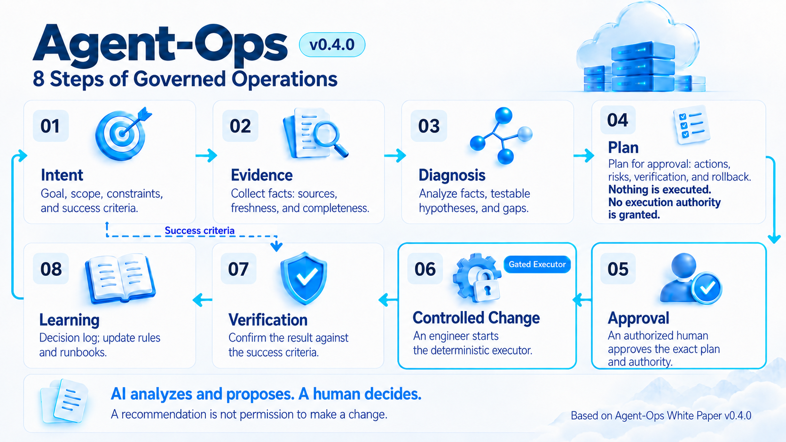
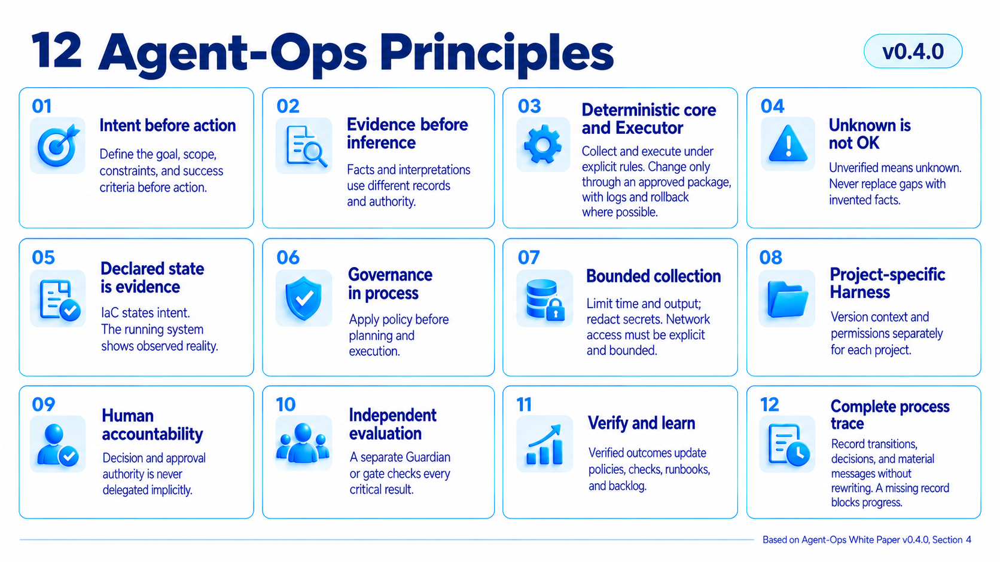
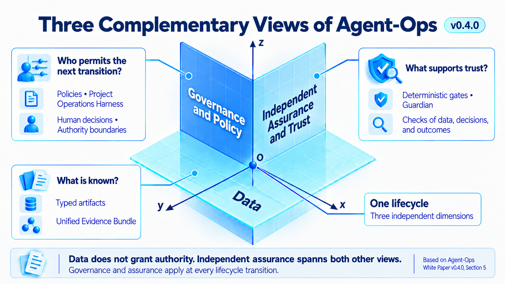
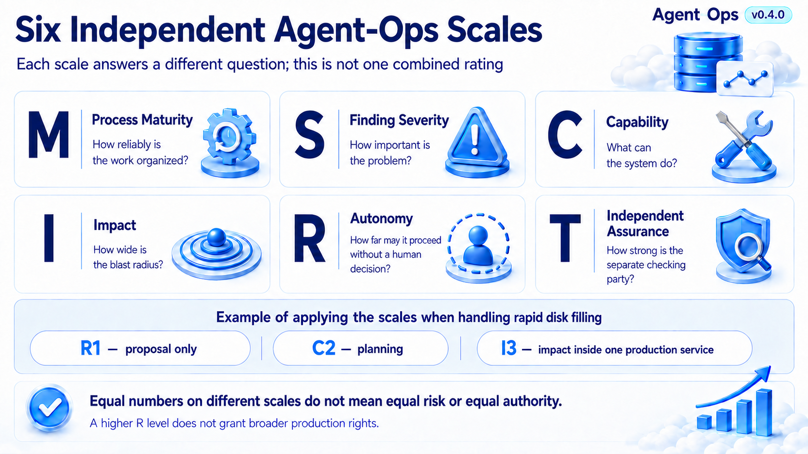
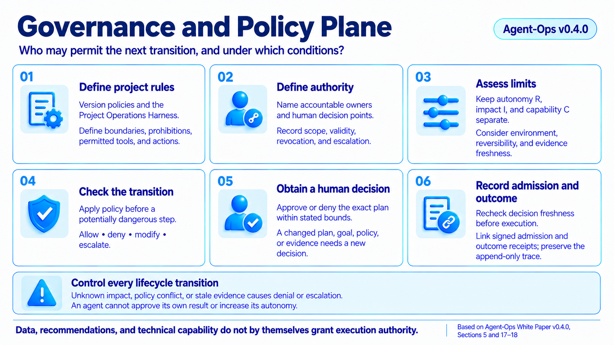
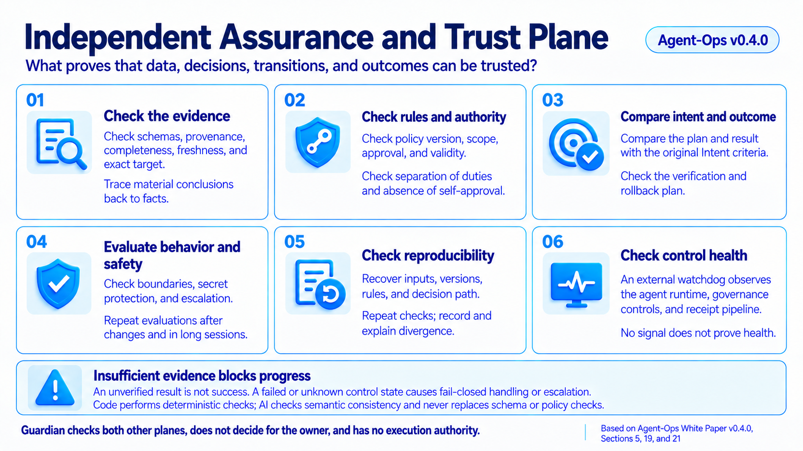
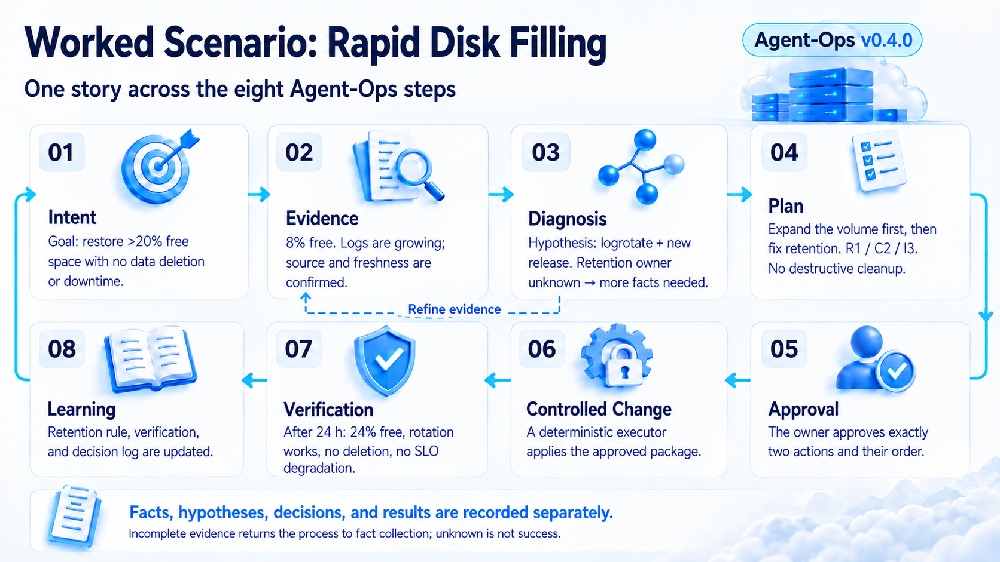

# Agent-Ops

## A Methodology for AI-Agent-Based Infrastructure Operations and Technical Support

**Public normative candidate v0.4.0 | source revision aom-03-r12 | English version prevails**

> Facts, conclusions, and recommendations are not authorization to change infrastructure.

## About This Paper

This white paper defines the public Agent-Ops methodology developed by Git in Sky from hands-on experience in auditing, operating, and supporting server, cloud, and Kubernetes infrastructure, together with a review of publicly available approaches and products for using AI agents (software roles that use a language model and tools within declared bounds) in infrastructure operations. The paper explains the methodology's core rules, target architecture, and links among requirements, architecture decisions, and implementation. Those links let a reviewer establish why a decision was made, which evidence and components support it, and where each component's responsibility ends.

### Intended Audience

Infrastructure and support leaders, CTOs/CIOs, architects, DevOps/SRE engineers, managed-service owners, and teams introducing AI agents into production operations.

### How to Read This Candidate

This edition is a draft normative description, not a released standard or a claim that every target component already exists. A requirement states what a conforming process must do; a recommendation states the preferred approach; an example explains a rule without creating a new requirement; and an explicitly marked target or future state describes planned evolution.

The words **MUST** and **SHALL** mark mandatory requirements within this candidate. **SHOULD** and **SHOULD NOT** mark recommendations that require a recorded reason when not followed. **MAY** marks a permitted option. These terms describe the force of statements in this candidate; they do not grant authority to change a system.

### Essential Terms and Roles

| Term | Plain-language meaning in this paper |
| --- | --- |
| Contract | Agreed requirements for a component's inputs, outputs, and limits; not a customer or legal contract unless stated otherwise. |
| Artifact | A recorded work product, such as evidence, a report, plan, decision record, configuration file, or action log. |
| Traceability | The ability to reconstruct which evidence supported a result, who made a decision, and which action followed. |
| Deterministic component | A program that processes inputs under defined rules. This describes how it works; it does not promise that the program has no defects. |
| Policy | Formalized rules defining what is allowed, who may authorize an action, and under which conditions. |
| Project Operations Harness | A versioned project package containing services, owners, constraints, runbooks, and permitted tools. |
| Typed record | A record with predefined fields and validation rules for their values. |
| Authority | A bounded right or recognized source status. Source authority identifies which source is accepted for a fact; execution authority permits a named actor to perform a bounded action. One does not create the other. |
| Independent assurance | A check by a separate control role or component that does not approve its own work. Independence concerns roles and authority, not the number of AI agents. |
| Learning | Proposals to improve rules, checks, and runbooks after a case. It does not mean that the language model retrains itself. |
| Backbone model | The language model actually used by an agent at a particular step. |

A large language model (LLM) generates or analyzes language. An AI agent uses a model, context, and tools to perform a bounded role. In Agent-Ops, a Planner prepares a proposal, an authorized human makes the approval decision, a Gated Executor applies only an approved change, and a Guardian independently checks required artifacts and transitions. Independent assurance is not human approval: the former checks compliance and evidence, while the latter supplies accountable authority. No direct path from an agent's answer to the target system is permitted.

`AI-native` means the methodology is designed so that AI can participate safely in bounded analysis and planning roles. Conformance does not require AI in every role: a deterministic service may perform a role when it preserves the same contracts and authority boundaries.

### Terminology Convention

Component names, schema fields, status values, and machine-readable identifiers are used exactly as defined in implementation artifacts. The standalone [Agent-Ops glossary](../normative/glossary.en.md) provides the detailed controlled vocabulary. Translation rules and language precedence are set out in Section 27.

The edition history is maintained in a separate document, "Agent-Ops. White Paper Edition History," published alongside this white paper at agent-ops.ru.

## 1. Executive Summary

Modern infrastructure is described as code, observed through metrics and logs, and changed through CI/CD. Yet operational knowledge still lives in engineers' heads, chat threads, disconnected runbooks, and informal exceptions. An AI agent therefore receives either too little context or excessively broad authority. Both outcomes are unsafe.

Agent-Ops first establishes a verifiable layer of intent, facts, policy, and operational artifacts. AI agents are then assigned strictly defined roles in data analysis, hypothesis development, and change planning:

- a deterministic runtime collects evidence and evaluates it against policy;
- an agent explains the situation, correlates signals, develops testable hypotheses, and prepares a proposal;
- a human engineer retains decision authority;
- only a separate Gated Executor may apply an approved change.

For the technology maturity assumed by this edition, AI agents SHOULD NOT be used inside the Gated Executor. The current operating boundary requires the Gated Executor to be a deterministic program—a runbook, script, or playbook—started by a human engineer. Section 18.2 separately labels bounded self-healing as a future, disabled-by-default capability.

The full governed lifecycle for any infrastructure change is:

> Intent -> Evidence -> Diagnosis -> Plan -> Approval -> Controlled Change -> Verification -> Learning

**Text alternative.** Intent defines the goal and success criteria. Evidence supplies current facts. Diagnosis produces testable hypotheses, and Plan proposes actions without executing them. An authorized human records Approval before the Gated Executor may perform the Controlled Change. Verification compares the result with the original criteria, and Learning proposes updates. Missing evidence returns the case to Evidence; no path bypasses Approval.

The twelve principles in Section 4 are summarized here as five cross-cutting pillars:

1. Intent and verified outcome: an explicit objective, scope, and success criteria precede action; work closes only after the expected outcome is verified and the resulting learning is incorporated.
2. Evidence and explicit uncertainty: facts, declared state, and interpretations remain distinct; every conclusion references its source, timestamp, freshness, and authority, while missing evidence remains `unknown` rather than becoming an assumption.
3. Deterministic bounded execution: collection and execution use bounded deterministic tools wherever possible; only a separate Gated Executor may apply an approved change, with action logging and the strongest available rollback or compensation.
4. Governance and accountable authority: policy and a versioned project-specific harness constrain each transition; a human retains approval and decision authority, and no authority is delegated implicitly.
5. Independent assurance and traceability: an independent gate or Guardian checks critical results, and every lifecycle transition, decision, and material engineer or agent message is recorded in an append-only trace; a missing mandatory record blocks advancement.

## 2. Problems Agent-Ops Solves

### 2.1. IaC Does Not Capture the Whole Operational Reality

Infrastructure as Code describes resources and configuration but does not fully define required signals, ownership, accepted variance, change windows, approval rules, diagnostic paths, or evidence of recovery.

### 2.2. Observability Produces Signals, Not Operational Conclusions

Prometheus, Loki, Tempo, and OpenSearch store or index telemetry; Grafana visualizes and queries it; OpenTelemetry instruments, collects, processes, and exports signals. Turning a signal into a governed decision requires applicability, policy reference, severity, freshness, ownership, recommendation, and authority boundaries.

### 2.3. An LLM Without Explicit Rules and Evidence Requirements Can Confuse Facts with Assumptions

A language model must not decide which source is authoritative, which command is allowed, or whether production may be changed. Without evidence references and permission boundaries, it can produce a persuasive but unsupported explanation.

### 2.4. Manual Operations Scale Poorly and Are Hard to Transfer

Managed services and platform teams support different technologies and criticality levels. Operational knowledge about a project accumulates among team members through the processes adopted by that team. Consequently, introducing a new person into the team, and especially replacing the team, requires additional onboarding effort. Introducing an analytical AI agent is also difficult because the agent must receive the part of the project knowledge that remains informal, memory-based, unsystematic, and incomplete.

### 2.5. Agent Compromise Creates a Risk of Harmful Action

An AI agent can be compromised through prompt or context injection, substitution of a model, skill, or tool, stolen credentials, or a supply-chain attack. Once compromised, even nominally permitted tools and previously granted authority can be used to make unauthorized infrastructure changes, disclose data, establish persistence, or tamper with evidence.

## 3. Definition and Boundaries

Agent-Ops is an operations methodology in which:

- deterministic components collect and normalize evidence;
- policy and expected state live outside the code of those deterministic components;
- AI agents receive bounded context;
- uncertainty remains unknown;
- every change follows intent, plan, approval, verification, and learning.

| Layer | Purpose |
| --- | --- |
| Intent | Goal, scope, constraints, success criteria, and authoring authority. |
| Evidence | Inventory, checks, drift, telemetry, and proof. |
| Policy | Thresholds, roles, autonomy, operational impact, approval, and data-handling rules. |
| Harness | Project constraints, owners, SLOs, runbooks, and tool contracts. |
| Diagnosis | Timeline, hypotheses, contradictions, and missing evidence. |
| Remediation planning | Proposal, risk assessment, verification plan, and rollback or compensation plan. This layer performs no target action. |
| Execution | A separate gated path with scoped credentials and an audit log. |
| Learning | Outcome, decision log, postmortem, and Operations-as-Code updates. |

### 3.1. What Agent-Ops Is Not

Agent-Ops does not replace observability, ITSM, GitLab, or IaC. It is not a universal SSH agent with root privileges, does not promise to identify a single root cause automatically, and does not enable self-healing by default.

### 3.2. Agent-Ops and the Adjacent AgentOps Discipline

Agent-Ops is a self-contained methodology for infrastructure operations and technical support. In this paper, AgentOps denotes the adjacent discipline of operating AI agents and managing their lifecycle. The domains interact but are not equivalent: Agent-Ops governs the infrastructure operations loop, while AgentOps governs the quality and lifecycle of the agents participating in it.

## 4. Agent-Ops Principles

| Principle | Practical Meaning |
| --- | --- |
| 1. Intent before action | An action is considered only in the context of an explicit goal, scope, and success criteria. |
| 2. Evidence before inference | Fact and interpretation have different schemas and authority. |
| 3. Deterministic core and Executor | Collection, parsing, policy evaluation, artifact writing, and, after approval, reading and changing the target system are performed by deterministic tools wherever possible, without AI agents or humans in the execution path itself. The Gated Executor accepts only an approved package, provides the strongest available rollback or compensation, and logs every action and its result. |
| 4. Unknown is not OK | Every unverified fact is explicitly `unknown` in deterministic artifacts. An agent may not invent, assume, or promote that fact into support for a conclusion, recommendation, approval, or action. |
| 5. Declared state is evidence | IaC expresses intent; runtime exposes observed reality. |
| 6. Governance in process | Policy applies before planning and execution, not after the fact. |
| 7. Bounded collection | Timeouts, output limits, redaction, and no implicit network are mandatory. Network access is allowed only when its source, target, purpose, authorization, timeout, data handling, and evidence record are explicit. |
| 8. Project-specific harness | Context and permissions are versioned per project. |
| 9. Human accountability | Approval and decision authority are never delegated implicitly. |
| 10. Independent evaluation | A critical result is checked by an independent gate or Guardian. |
| 11. Verify and learn | Outcomes update policy, checks, runbooks, and backlog. |
| 12. Complete process trace | Every lifecycle transition, decision, and material engineer or agent message is recorded in an append-only trace. A missing mandatory trace is `unknown` and blocks advancement. |

**Text alternative.** The principles require intent before action, evidence before inference, deterministic bounded collection and execution, explicit unknowns, separation of declared and observed state, governance before dangerous transitions, project-specific constraints, accountable human authority, independent evaluation, verified outcomes, learning, and a complete append-only process trace.

Two provisions require separate explanation.

`Unknown is not OK` is a rule about epistemic status, not a demand to guess. If a fact cannot be verified by deterministic means, the artifact records `unknown`, and the agent treats that value as a gap to resolve or refer to the accountable person for a decision. It may reason about the consequences of uncertainty, but it may not use an imagined replacement as evidence.

`No implicit network` is not a blanket ban on network collection. It prohibits undeclared calls triggered by parsing, reference resolution, dependency retrieval, name lookup, or a tool's hidden default. Such calls make a run non-reproducible, may leak data or credentials, can touch the wrong environment, and turn remote availability into an unrecorded dependency. Explicit, policy-authorized, bounded network collection is permitted when it produces provenance and completeness evidence.

## 5. Three Complementary Views: Data, Governance, and Independent Assurance

Agent-Ops examines the same lifecycle in three independent dimensions.

**Text alternative.** The data view records what is known and which typed artifact is produced. The governance view determines who may permit a transition and under which rules. Independent assurance checks the evidence, decision, transition, and outcome. These views operate in parallel on the same lifecycle; they are not sequential stages or a management hierarchy.

**The data plane** answers: "What is known, and which typed artifact is produced next?" It advances through `Intent -> Evidence -> Diagnosis -> Plan -> Approval -> Controlled Change -> Verification -> Learning`. The Unified Evidence Bundle links versions of those artifacts without conflating fact, inference, recommendation, decision, and execution record.

**The governance and policy plane** answers: "Who may permit the next transition, and under which conditions?" Policies, the Project Operations Harness, Human Approvals, and the Governance Mesh constrain transitions, authority, impact, and autonomy. The presence of data or a recommendation grants no execution authority.

**The independent assurance and trust plane** answers: "What proves that the data, decision, transition, and outcome are trustworthy?" Deterministic gates, the Guardian, security, reproducibility and completeness checks, and behavioral evals examine both other planes without inheriting the producer's or executor's authority.

The Diagnosis/RCA Agent, Remediation Planner, Guardian, and Gated Executor may read artifacts from several planes, but they do not inherit one another's rights. The Executor receives no authority from LLM output and accepts only an approved, typed, current change package.

Typed specialist agents are an optional implementation topology, not a methodology requirement. A single agent, several specialist agents, or deterministic services may implement a conforming workflow. The normative boundaries are typed inputs and outputs, isolated authority, and independent Guardian checks; adding agents grants no authority and weakens no gate.

At a multi-agent handoff, state absent from the transferred typed package is not preserved. Each model-mediated node on the path MUST therefore be evaluated and attested for its executing model and admitted context; attestation of the endpoints does not establish intermediate nodes, including their injection resistance. Deterministic assemblers and gates and least-authority boundaries remain separate controls, so assurance of the chain is not reducible to one model score.

Governance rules and independent assurance apply to every lifecycle transition and especially to data-transformation boundaries.

A scale describes a particular property of a process, result, component, or action. A number is meaningful only together with its scale letter and assessment subject: for example, finding severity S3 and action impact I3 answer different questions. Levels cannot be added into one score or inferred from one another.

| Scale | Assessment subject and purpose | Methodology planes |
| --- | --- | --- |
| Process Maturity M0-M6 | Operations within a defined scope: which practices are in use and what supports that assessment. | All three planes |
| Check Result Severity S0-S5 | The operational significance of a finding or uncertainty: how material the risk requiring consideration is. | Data and independent assurance |
| Capability C0-C5 | A particular component's ability to observe, explain, plan, prepare, or perform a change. | Governance and independent assurance |
| Operational Impact I0-I5 | The consequences of a particular proposed or completed action: what is affected, how broadly, and how reversibly. | Data and governance |
| Autonomy R0-R5 | The agent's permissible initiative for a particular task and environment: where it may continue and where a human decision is required. | Governance |
| Guardian Maturity T1-T5 | Independent control's ability to identify, verify, redirect, and block violations and to arrange their remediation. | Independent assurance and trust |

**Scale attribution.** R0-R5 is adopted from the Risk-adaptive authority table in Section 4.3 of [AI-Disrupt PDLC 2.0, Sber's complete practical guide, June 2026](https://aipdlc.ru/documents/en/whitepaper_full_en.pdf). The methodology's author is [Kirill Menshov](https://aipdlc.ru/en). The T1-T5 notation and sequence come from Section 4.5 of the same guide and are adapted to the Agent-Ops boundary: the Guardian receives no authority to change a target, and T5 arranges remediation through a separate authorized Executor. M, S, C, and I below are defined by Agent-Ops itself; M0-M6 is not a renaming of the organizational L0-L5 scale in AI-Disrupt PDLC.

Text alternative: the six scales answer different questions and do not form one combined rating. When handling rapid disk filling, `R1` limits the agent to a proposal, `C2` describes its ability to plan, and `I3` describes the proposed change's impact within one production service. These values do not automatically determine process maturity M, result severity S, or Guardian maturity T.

### 5.1. Process Maturity M0-M6

M describes how consistently operations are organized in the assessed project or service. A level is supported by practices in use and their artifacts; installing a tool or having an agent does not establish maturity by itself. This is a process characteristic, not permission for an action.

| Level | Meaning | What it looks like in operations |
| --- | --- | --- |
| M0 | Unmanaged / Unknown | Work is not organized as a governed process, or its state has not been established. There is no verified baseline on which to rely. |
| M1 | Initial Audit | A first verifiable state snapshot and finding list have been obtained. Regularly refreshing that view is not yet an established practice. |
| M2 | Regular Diagnostics | Checks recur and their results are compared over time; deviations and gaps are detected systematically. |
| M3 | Observability | Diagnostics are connected to current metrics, logs, traces, and alerts; their sufficiency for operations is checked. |
| M4 | Managed Operations | Work follows explicit intents, evidence, plans, accountable decisions, outcome verification, and a log; policies and service ownership are in place. |
| M5 | Approval-controlled Semi-automated Recovery | Preparation and execution of bounded changes are automated, but every real change requires a human decision and a human-started deterministic Executor; the outcome is verified. |
| M6 | Bounded Self-Healing / AI-assisted SRE | A future mode for scenarios bounded and approved in advance: recovery stays within policy limits, with verification, stop rules, and admission revocation. This edition does not introduce it as an active operating mode. |

### 5.2. Check Result Severity S0-S5

S expresses the operational significance of a check result, including risk caused by uncertainty. The particular check's policy maps observations, service criticality, and possible consequences to an S-level; there is no universal free-space percentage or common response time for all services here.

| Level | Meaning | Implication for assessing the result |
| --- | --- | --- |
| S0 | Informational | The result provides state information; it does not itself indicate an operational risk requiring remediation. |
| S1 | Low | Risk is small and bounded; the finding has limited operational significance in this context. |
| S2 | Moderate | Risk is noticeable and warrants consideration; possible consequences exceed those of a minor local finding. |
| S3 | Material | The result indicates material operational risk that could noticeably degrade service operation. |
| S4 | High | There is a high risk of failure, loss of availability, or a security violation. |
| S5 | Critical | Critical risk, an emergency state, or risk of data loss; the consequences belong to the most serious class. |

S does not replace `ok`, `warning`, `critical`, `unknown`, or another status in Appendix E. Significant uncertainty may warrant attention, but a high S-level does not turn an unverified fact into a confirmed deviation or authorize a fix.

### 5.3. Capability C0-C5

C describes the function a particular component can perform. Technical capability and authority to use it are checked separately. C0-C3 retain the no-target-mutation boundary; execution rules are detailed in Section 18.2.

| Level | Meaning | Output and boundary |
| --- | --- | --- |
| C0 | Observe | Collect facts and evidence without changing the target. |
| C1 | Explain | Explain possible causes, formulate questions, and identify evidence gaps. |
| C2 | Plan | Assess impact and prepare a plan; no change is performed yet. |
| C3 | Prepare Change | Prepare a pull or merge request, dry-run plan, verification plan, and rollback or compensation plan. Having a package does not initiate target actions. |
| C4 | Human-approved Apply | A separate deterministic Executor applies the approved change after an explicit human decision and a human start through gates. |
| C5 | Bounded Self-Healing | A future capability for low-impact scenarios with an action class, scope, preconditions, stop rules, and revocation conditions approved in advance. Disabled by default in this edition. |

### 5.4. Operational Impact I0-I5

I concerns an action and its consequences. Assessment considers criticality, the scope of affected resources, reversibility, and data class. Before a change, the projected resulting state is assessed; afterwards, actual consequences are assessed. Section 11.2 specifies the assessment and treatment of overlapping changes. A short command does not imply low impact.

| Level | Meaning | Impact boundary |
| --- | --- | --- |
| I0 | No Production Impact — Read-only / Offline | Read-only or offline work with no production side effects. |
| I1 | Isolated Reversible Non-production | Consequences stay within an isolated non-production environment, and the change is reversible. |
| I2 | Localized Reversible Low-criticality | A bounded low-criticality component is affected; the consequence boundary and the ability to return are established. |
| I3 | Production Service-local | Impact stays within one production service; human approval, outcome verification, and a rollback plan are required. |
| I4 | Multi-service / Critical / Sensitive | Multiple services, critical functions, or sensitive data are affected; separation of duties and a canary rollout apply. |
| I5 | Systemic / Irreversible | Consequences may be systemic, irreversible, involve data loss, or have regulatory impact; a decision by the highest authorized authority is required, or an explicit prohibition applies. |

I describes consequences, not admission. Unknown impact is not I0: under Section 18 it leads to denial or escalation. The same S finding may have several remediation plans with different I-levels.

### 5.5. Autonomy R0-R5

R defines permissible agent initiative in a particular environment and task. The table below preserves the meaning of Section 4.3 of AI-Disrupt PDLC 2.0; Agent-Ops application rules are in Section 18. Levels involving code branches and merge concern preparing repository changes and do not grant authority to change a production system independently.

| Level | Meaning | What is allowed within the stated boundary |
| --- | --- | --- |
| R0 | Read-only | Obtaining information; the typical boundary is production without validated behavior evals. |
| R1 | Proposals Only | The agent prepares a proposal and a human decides; this bounds work on critical production paths. |
| R2 | Feature Branch with Review | Changes in a task-specific branch undergo review before merge. |
| R3 | Auto-merge after Evals | For standard validated patterns, automatic merge is permitted only when behavior evals pass. |
| R4 | Multi-session with Checkpoints | A long-running, mature, validated scenario continues across sessions while retaining state and constraints. |
| R5 | Sandbox Autonomy | An experiment runs autonomously in an isolated environment; those rights do not extend beyond it. |

One agent may have different R-levels in production, a code branch, and a sandbox. Policy determines the level using the environment, impact, evidence, and evals; the agent cannot raise it itself. R5 does not mean more production rights than R1. In this edition, a human still starts every real target change through a deterministic Executor.

### 5.6. Guardian Maturity T1-T5

T describes how independent control responds to another component's result or action. It adapts the Guardian Agents ladder in Section 4.5 of AI-Disrupt PDLC 2.0 to the Agent-Ops separation of verification and execution. A T-level does not waive mandatory gates or let a Guardian approve its own work.

| Level | Meaning | Independent control function |
| --- | --- | --- |
| T1 | Review | Examine output artifacts and prepare a report with findings for the accountable person. |
| T2 | Verification | Check conformance with requirements, policy, and evidence, and record the verification result. |
| T3 | Redirect | Route a risky or ambiguous action to a human decision, or return work for necessary clarification. |
| T4 | Block | Stop impermissible progress under the rules without relying on the result's author to abandon the action. |
| T5 | Remediate | Route a violation through a separately authorized remediation path with an Executor, policy, and rollback unit of work, then verify the corrected result. The Guardian itself does not change the target. |

A unit of work (UOW) is a bounded implementation task with its own scope and verification. T labels describe control functions, not confidence in a model answer. Having T1 or T2 does not exempt a process from mandatory blocking of unsafe transitions: the Guardian and deterministic gates provide that control under Section 19. The external concept of autonomous T5 remediation is not active execution authority for an Agent-Ops Guardian.

### 5.7. Applying the Scales to One Case

When handling the rapid-disk-filling case in Section 23, the scales are used together but concern different subjects. R1/C2/I3 means that the agent may only propose a solution, can prepare a plan, and the proposed change will affect one production service. This notation does not describe every property of the case or constitute execution admission.

| Scale | Application in the disk case |
| --- | --- |
| M | Assess how service operations are organized: an initial audit, regular diagnostics, observability, or a complete governed cycle. Free-space percentage does not determine M. |
| S | Determine result severity under the check policy, considering the filling rate, service criticality, and data risk. The initial 8% is not a universal basis for assigning S4 or S5. |
| C | C2 characterizes the component that assesses options and prepares a plan. Subsequent application requires a separate C4 Executor with the required human decision. |
| I | I3 concerns the proposed volume expansion and retention-rule correction within one production service. Fact collection without side effects may have I0; that is a different action. |
| R | R1 prevents the agent from applying its proposal. Human approval of a particular plan does not automatically turn that agent into an Executor. |
| T | Assess the control functions actually in place: review, verification, redirection, blocking, or arranging remediation. One successful report does not establish every level. |

M, S, and T are established on their own grounds; R1/C2/I3 does not determine them. An assessment records its subject, basis, applicable policy, and current evidence. Section 18 governs admission, while Appendix F collects the value registry and links to the definitions.

> Machine-readable context is data, not a command and not an approval.
>
> The permissible impact limit is set by policy; predicted and actual impact are recorded as data and evidence.

## 6. Intent

Intent begins the data plane: a human goal becomes a typed, verifiable, versioned contract, but not yet a command or authority to change a target system.

| Type card | Contract |
| --- | --- |
| Type | `OperationalIntent` |
| Input | A request, incident, owner goal, and initial constraints. |
| Output | A versioned Operational Intent that references the required Outcome Check. |
| Key fields | `ref`, `owner_ref`, `objective`, `expected_outcome`, `baseline`, `measurable_targets`, `scope`, `constraints`, `prohibited_actions`, `falsification_criteria`, `required_outcome_check`, `decision_map_ref`. |
| Schema | [`foundation_operational_intent.schema.json`](../../schemas/foundation_operational_intent.schema.json). |
| Contract status | A normative JSON Schema exists. |

Operational Intent translates a human goal into a verifiable contract before analysis or planning begins. It is not a command and grants no execution authority.

| Field | Semantics |
| --- | --- |
| intent_id / version | Stable identity and version of the request. |
| goal / expected_outcome | Desired result without prescribing one implementation. |
| scope | Project, environment, services, and exclusions. |
| constraints | Forbidden actions, time window, data rules, and blast-radius ceiling. |
| success / stop criteria | Verifiable completion and stop conditions. |
| authority | Who authored the intent and who may change it. |
| policy / evidence refs | Applicable rules and starting evidence. |
| validity | Freshness and expiry of the request. |

### 6.1. Outcome Hypothesis and Validation Plan

Before implementation, the team records a baseline, measurable target, time window, measurement method, and adapt-versus-redesign decision. The validation plan defines mandatory evals, gates, Evidence Bundle elements, and the Outcome Check.

Intent may transition to Evidence only when its goal, scope, source authority, success criteria, and stop criteria are sufficiently defined. Unresolved ambiguity remains `unknown` and returns the intent to Discovery for clarification.

## 7. Evidence

Evidence records declared and observed reality before interpretation. Collection must not silently become either a diagnosis or permission to act.

| Type card | Contract |
| --- | --- |
| Type | `EvidenceRecord / EvidenceBundle` |
| Input | Operational Intent, authoritative sources, collection profile, platform dialect, and policy. |
| Output | Typed check results, state snapshots, and references to an evidence bundle. |
| Key fields | `ref`, target identity, source, timestamp, freshness, authority, completeness, truncation, status, severity, digest. |
| Schema | [`check_result.schema.json`](../../schemas/check_result.schema.json), [`foundation_evidence_bundle.schema.json`](../../schemas/foundation_evidence_bundle.schema.json), [`declared_inventory.schema.json`](../../schemas/declared_inventory.schema.json), and [`foundation_object_ref.schema.json`](../../schemas/foundation_object_ref.schema.json). |
| Contract status | Normative schemas exist; the Bundle evolves throughout the lifecycle. |

The Deterministic Evidence Engine is the foundation of Agent-Ops. Its role is not to fix a server but to collect verifiable facts, normalize them, evaluate them against policy, and write machine-readable results.

| Property | Contract |
| --- | --- |
| Identity | `check_id`, project/environment/service identity, and tool and schema versions: [`check_result.schema.json`](../../schemas/check_result.schema.json), [`foundation_object_ref.schema.json`](../../schemas/foundation_object_ref.schema.json). |
| Status | `ok`, `info`, `warning`, `critical`, `unknown`, `not_applicable`, or `error`: [`check_result.schema.json`](../../schemas/check_result.schema.json). |
| Evidence | Source, timestamp, freshness, digest, completeness, and truncation: [`check_result.schema.json`](../../schemas/check_result.schema.json), [`foundation_evidence_bundle.schema.json`](../../schemas/foundation_evidence_bundle.schema.json). |
| Safety | Read-only collection, bounded output, redaction, no implicit network, and execution limits: [`check_card.schema.json`](../../schemas/check_card.schema.json), [`run_envelope.schema.json`](../../schemas/run_envelope.schema.json). |
| Reproducibility | Canonical ordering, deterministic writers, explicit profile, and policy: [`run_request.schema.json`](../../schemas/run_request.schema.json), [`run_plan.schema.json`](../../schemas/run_plan.schema.json), [`foundation_evidence_completion_profile.schema.json`](../../schemas/foundation_evidence_completion_profile.schema.json). |
| Authority | Declared, observed, and inferred data remain distinct, and result authority is recorded separately: [`foundation_semantic_object.schema.json`](../../schemas/foundation_semantic_object.schema.json), [`foundation_governance_result.schema.json`](../../schemas/foundation_governance_result.schema.json). |

> probe -> bounded evidence -> parser -> policy evaluation -> check result -> artifact writers

### 7.1. Baseline Check Catalog

A check is an independent module governed by [`check_card.schema.json`](../../schemas/check_card.schema.json) and produces a result under [`check_result.schema.json`](../../schemas/check_result.schema.json). The 47-check catalog is a baseline, not a limit: an implementation may contain 100 or more checks. Every new check receives a stable `check_id`, role, technology, risk, schema, example, deterministic implementation, validation evidence, and maturity status. Adding a module extends the versioned catalog without changing the meaning of existing `check_id` values.

### 7.2. Profiles and Collection Cost

An audit profile is an independent, versioned composition module: it selects checks, parameters, time limits, and output limits without changing check semantics or granting mutation authority. `audit-fast`, `audit-regular`, `audit-deep`, and `continuous-check` are examples, not a closed set; an implementation may define 10 or more profiles. A new profile identifier is added explicitly to the applicable version of [`check_card.schema.json`](../../schemas/check_card.schema.json), selected through `profile_ref` in [`run_request.schema.json`](../../schemas/run_request.schema.json), and resolved into the allowed invocation set in [`run_plan.schema.json`](../../schemas/run_plan.schema.json). `audit-fast` contains inexpensive read-only checks; `audit-regular` runs the core set; `audit-deep` adds heavy diagnostics; `continuous-check` emits low-cardinality signals; remediation profiles do not grant mutation rights.

### 7.3. Platform Dialects and Providers

A platform dialect is an independent adapter module governed by [`dialect.schema.json`](../../schemas/dialect.schema.json): it maps an unchanged logical `check_id` to platform-specific providers and parsers. The dialect set is open and versioned; an implementation may contain 20 or more dialects. Adding a dialect neither creates a new meaning for the check nor requires another dialect to change. Proven non-applicability yields `not_applicable`; failure of an expected provider or collection path yields `error`; unresolved applicability or insufficient evidence yields `unknown`. None of these states simulates success.

### 7.4. Observability Readiness

Agent-Ops does not replace observability. It validates whether telemetry is sufficient for operations and incident analysis and whether signals are connected to service ownership, SLOs, severity, and runbooks.

| Area | What Is Validated |
| --- | --- |
| Host / application metrics | Exporter, scrape visibility, golden signals, labels, and freshness. |
| Logs | Coverage, retention, redaction, and diagnostic query references. |
| Traces | Coverage of critical paths and correlation attributes. |
| Alerts | Severity policy, routing, SLO mapping, owner, and runbook references. |
| Audit signals | Low cardinality, freshness marker, completeness, and no secrets. |

Readiness carries its own status scale with the precedence `blocked` -> `unknown` -> `gaps` -> `complete`: inability to verify outranks not knowing, not knowing outranks discovered gaps, and none of these states collapses into success. Observed inventory, declared intent, and readiness remain distinct domains of authority and completeness: owner and criticality are declared facts and are never inferred from discovered components, and a local trace of a SaaS system creates no authority over its control plane. The assessment runs offline against the artifacts of an accepted run and asserts nothing about runtime health.

### 7.5. Probe, Metric, and Check

A probe exposes a signal over time. A check interprets evidence against policy and produces status, severity, and recommendation. A metric may feed a check but does not replace the check result.

### 7.6. Metric Cardinality and Evidence Freshness

Metric cardinality is the number of distinct label combinations. Labels distinguish measurements, for example by service and environment; each combination creates one time series. A new measurement with the same labels adds a point to an existing series, while a new label combination creates another series.

Text alternative: with two services and three environments, stable labels create `2 x 3 = 6` time series. One hundred runs add `6 x 100 = 600` measurements to those same six series. Adding a unique `run_id` to metric labels creates `2 x 3 x 100 = 600` distinct series. Cardinality counts label combinations; freshness instead asks whether the age of evidence exceeds its permitted TTL.

| Example for one metric | Time series | Measurements after 100 runs |
| --- | ---: | ---: |
| Labels contain only two services and three environments | 2 x 3 = 6 | 6 x 100 = 600 points in the same six series |
| Labels also contain a unique run ID | 2 x 3 x 100 = 600 | 600 series, each created for one run |

Unique run IDs and timestamps therefore remain in JSON artifacts, not metric labels. The numbers illustrate the distinction and do not set a universal cardinality limit.

Freshness is a separate property: it states how recently evidence was observed and whether its permitted time-to-live (TTL) has expired. A dataset may have only six series and still be too old to support a decision. Stale evidence cannot justify a risky change without fresh collection.

### 7.7. Stable Observability Identities

`service_id`, `environment_id`, `slo_id`, `alert_id`, `runbook_id`, `telemetry_requirement_id`, and `owner_id` remain stable so Incident Bundles can reference evidence without changing base schemas.

A transition to Diagnosis is allowed only after completeness and freshness are explicit. `unknown`, `error`, `not_applicable`, and truncation retain distinct semantics and never emulate successful collection.

## 8. Diagnosis

Diagnosis transforms evidence into testable hypotheses without conflating observation and inference.

| Type card | Contract |
| --- | --- |
| Type | `DiagnosisRecord` |
| Input | Intent, Evidence Bundle, incident events, and applicable diagnostic rules. |
| Output | Ranked hypotheses, contradictions, gaps, and falsification checks. |
| Key fields | `diagnosis_ref`, `intent_ref`, `evidence_refs`, `observations`, `hypotheses`, `supporting_evidence`, `contradicting_evidence`, `missing_evidence`, `falsification_checks`, `confidence`. |
| Schema | [`diagnostic_report.schema.json`](../../schemas/diagnostic_report.schema.json) and [`foundation_discovery_assessment.schema.json`](../../schemas/foundation_discovery_assessment.schema.json) cover parts of the type. |
| Contract status | A single normative `DiagnosisRecord` JSON Schema does not yet exist; partial coverage is not presented as a complete contract. |

The incident and root-cause analysis (RCA) workflow answers what changed, which signals were observed, and which hypotheses explain the symptoms. It uses the Unified Evidence Bundle without mixing fact and inference.

| Hypothesis Field | Purpose |
| --- | --- |
| statement | A testable statement. |
| confidence | low / medium / high using explicit criteria. |
| supporting_evidence | Facts supporting the hypothesis. |
| contradicting_evidence | Facts contradicting the hypothesis. |
| missing_evidence | Data still required. |
| falsification_checks | Bounded actions that could disprove it. |
| likely_root_cause | A flag that does not replace human review. |

> Correct RCA is a ranked set of hypotheses with supporting and contradicting evidence, not confident prose without proof.

### 8.1. Diagnostics Pipeline

Tier 1 uses inexpensive procfs/sysfs counters and runtime status; Tier 2 uses opt-in tools; Tier 3 uses native eBPF only where separately authorized and supported. Collection remains bounded and runs in baseline and sampling phases.

Diagnosis transitions to Plan only when every material hypothesis is traceable to supporting and contradicting evidence. Missing data creates a new Evidence request, not a confident conclusion.

## 9. Plan

Plan describes a proposed way to achieve Intent. No target-system action occurs at this step.

| Type card | Contract |
| --- | --- |
| Type | `ChangePlan` |
| Input | Intent, Diagnosis, Evidence Bundle, effective policy, and Harness constraints. |
| Output | A plan for action, impact, verification, rollback or compensation, and required approvals. |
| Key fields | `plan_ref`, `intent_ref`, `diagnosis_ref`, `evidence_refs`, `proposed_actions`, `impact`, `preconditions`, `blast_radius`, `dry_run`, `required_approvals`, `verification_plan`, `rollback_or_compensation_plan`. |
| Schema | [`recommendations.schema.json`](../../schemas/recommendations.schema.json) is an experimental plan-only artifact. |
| Contract status | A single normative `ChangePlan` JSON Schema does not yet exist. |

Remediation is a planning stage. The Remediation Planner prepares a proposal but performs no target action and does not apply the proposal. The proposal links to Intent, Incident, and Evidence Bundle and includes proposed actions, autonomy ceiling, impact tier, preconditions, expected effect, blast radius, dry-run or canary plan, required approvals, verification plan, and rollback or compensation plan. Any application occurs only later through a separately authorized gated Executor.

### 9.1. Rollback Does Not Always Exist

Irreversible actions require backup or precheck, a not-fully-reversible marker, and a compensation plan. Missing rollback is not hidden behind a generic promise.

Plan may be submitted for Approval only with an impact assessment, testable preconditions, an explicit Verification plan, and an honest statement of reversibility.

## 10. Approval as a Structured, Verifiable Decision Record

In the data plane, Approval is not a UI gesture or a sentence in a conversation. It is a separate addressable decision record. Organizational authority and human-governance rules are described later in Section 17.

| Type card | Contract |
| --- | --- |
| Type | `HumanDecision` |
| Input | Intent, ChangePlan, required evidence and evals, authority scope, and transition point. |
| Output | An `approve` or `deny` decision with scope, validity window, and issuer attestation. |
| Key fields | `ref`, `intent_ref`, `transition_id`, `principal_ref`, `issuer_attestation_ref`, `actor_role`, `authority_scope`, `blocked_action`, `decision`, `issued_at`, `not_before`, `expires_at`, `revocation_ref`. |
| Schema | [`foundation_human_decision.schema.json`](../../schemas/foundation_human_decision.schema.json) and [`foundation_decision_map.schema.json`](../../schemas/foundation_decision_map.schema.json). |
| Contract status | Normative JSON Schemas exist. |

Approval changes no target system and does not expand the Plan's scope. It is valid only for the named transition, exact target, unchanged inputs, and validity window. A missing, expired, revoked, or wrong-target decision means that no permission exists.

## 11. Controlled Change

Controlled Change is the only lifecycle step at which a separately authorized Gated Executor may change the target system. It accepts only an approved typed change package, rechecks the exact target, policy, freshness, and scope, and records every action and result.

| Type card | Contract |
| --- | --- |
| Type | `ChangePackage / ExecutionRecord` |
| Input | Unchanged Intent, ChangePlan, HumanDecision, Governance Result, scoped credentials, and pre-change evidence. |
| Output | A record of actions actually performed or rejected, terminal state, and references to after-state collection. |
| Key fields | `case_ref`, `attempt_id`, `attempt_budget`, `attempt_index`, `idempotency_key`, `retry_disposition`, `failure_class`, `cooldown_until`, `breaker_state`, `stop_reason`, `escalation_ref`, `action_ref`, `parent_action_ref`, `target_ref`, `evidence_bundle_ref`, `admitted_identifier_set_ref`, `resolver_ref`, `conflict_domain`, `serialization_lease_ref`, `resulting_state_ref`, `in_flight_effect_refs`, `evaluated_impact`, `package_digest`, `approval_ref`, `policy_ref`, `executor_ref`, `started_at`, `actions`, `results`, `terminal_state`, `rollback_or_compensation_ref`. |
| Schema | Admission and outcome receipts are described in Section 18; the existing [`run_plan.schema.json`](../../schemas/run_plan.schema.json) concerns collection and does not substitute for a change package. |
| Contract status | Normative `ChangePackage`, `ExecutionRecord`, and receipt JSON Schemas do not yet exist. |

Reading and writing the target system are performed by deterministic tools wherever possible, without an agent or human in the execution path. The Executor does not reinterpret Plan, raise autonomy, or continue when digest, scope, authority, or preconditions differ. An irreversible action requires an approved compensation plan and is not disguised as rollback.

An identifier used to select a target, resource, or object for approval, rendering, or mutation MUST be an admitted identifier: issued or authoritatively confirmed by a non-model system, admitted by a deterministic resolver into the current target-bound Evidence Bundle, and fresh at use. Agent, user, or delegate output cannot enlarge that admitted set. The Executor neither constructs, completes, nor corrects an identifier; an unresolved reference produces `deny` and a new Evidence request rather than a best-effort match. The decision interface displays only admitted identifiers and server-enriched records derived from them.

### 11.1. Legacy Compatibility

Legacy `auto_remediation.allowed` and `mode=confirm` fields, along with the `remediate-apply` profile, are deprecated compatibility inputs. They are neither approval nor execution authority and cannot trigger mutation from Audit runtime.

### 11.2. Controlled Change Attempt Budget and Circuit Breaker

Every case has a policy-defined attempt budget shared by all Controlled Change attempts for the same Intent and operational outcome. A revised Diagnosis or Plan does not reset that budget. A failed or `unknown` Verification consumes an attempt, and repetition is permitted only when the action is idempotent or its compensation path is explicit and still valid.

When the budget is exhausted, a failure in a prohibited class occurs, or the required cooldown has not elapsed, the circuit breaker opens. It blocks leasing or using Executor authority and credentials for the affected case and action class and creates an escalation; the Planner and Executor cannot close or reset it. Re-enablement requires the policy-defined evidence and, where required, a new HumanDecision. Every retry decision, attempt consumption, breaker transition, cooldown, stop reason, and escalation is appended to the mandatory process trace.

Attempts whose mutation scopes overlap within a policy-defined mutation conflict domain are serialized until Verification completes or policy terminally releases the reservation. Competing cases are admitted by deterministic policy, never by arrival order. Before each admission, impact and blast radius are re-evaluated against the resulting state projected by the action, including committed state and relevant unresolved or in-flight effects. If that state would exceed the permitted `I` band, the attempt is denied or escalated. This result consumes an attempt or opens the circuit breaker only when the applicable policy declares the corresponding denial, prohibited failure class, or attempt condition; impact band and attempt budget are not interchangeable.

The fields in the Controlled Change card define the required record semantics. A standalone normative attempt-budget, serialization, resulting-state, and circuit-breaker schema does not yet exist.

## 12. Verification

Verification compares after-state evidence with Intent criteria and creates Outcome. Successful command execution alone does not prove the expected result.

| Type card | Contract |
| --- | --- |
| Type | `OutcomeCheck / Outcome` |
| Input | Intent, ChangePlan, HumanDecision, ExecutionRecord, and after-state evidence. |
| Output | An explicit `succeeded`, `failed`, or `unknown` outcome, evidence for every criterion, and residual risks. |
| Key fields | `outcome_ref`, `intent_ref`, `execution_ref`, `snapshot_ref`, `decision_ref`, `criteria`, `evidence_refs`, `evaluation_time`, `evaluation_window`, `residual_risks`, `status`. |
| Schema | [`foundation_outcome_check.schema.json`](../../schemas/foundation_outcome_check.schema.json) defines the check input; [`foundation_validation_result.schema.json`](../../schemas/foundation_validation_result.schema.json) defines a generic validation result. |
| Contract status | A separate normative `Outcome` record JSON Schema does not yet exist. |

### 12.1. Outcome Verification

Outcome records whether the goal was achieved, which after-state evidence proves it, which criteria failed, and which residual risks remain. Missing mandatory evidence prevents closure.

### 12.2. Post-change Verification

After the change, targeted checks, audit, and SLO validation run again. Outcome links to the ticket, MR or commit, and evidence digest; failure becomes new evidence.

Incomplete verification never becomes success: missing mandatory evidence produces an `unknown` Outcome and an `incomplete` evidence or evaluation-completeness result. Outcome is bound to exact Intent, execution, policy, and evidence digests.

### 12.3. Case Completion Is Not the Same as Outcome Success

The full eight-step path describes a case that requires an infrastructure change. An audit, diagnostic request, or support case may finish without Controlled Change when the Intent asks only for a verified report, evidence shows that no change is needed, or an authorized human denies the proposed Plan. The trace records why a step was not entered; a skipped change is never represented by a fabricated ExecutionRecord.

| Concern | Values and meaning |
| --- | --- |
| Case disposition | Open until required work and evidence are complete; closed only with an owner-accepted terminal disposition. |
| Outcome | `succeeded`, `failed`, or `unknown` relative to the exact Intent. A closed failed case is not a successful outcome. |
| Evidence or eval completeness | `complete` or `incomplete`; incompleteness is not a fourth Outcome value and prevents success. |
| Individual check result | `ok`, `info`, `warning`, `critical`, `unknown`, `not_applicable`, or `error`, as defined in Appendix E. |

## 13. Learning

Learning uses an already verified Outcome but does not rewrite case history. New policies, checks, runbooks, and backlog items become new versioned artifacts with their own owners and approval processes.

| Type card | Contract |
| --- | --- |
| Type | `LearningRecord` |
| Input | Outcome, Evidence Bundle, Diagnosis, Plan, decisions, execution trace, and residual risks. |
| Output | Reviewable proposals to change policies, checks, runbooks, observability, and backlog. |
| Key fields | `learning_ref`, `outcome_ref`, `evidence_refs`, `lessons`, `proposed_policy_changes`, `proposed_check_changes`, `runbook_changes`, `observability_gaps`, `backlog_refs`, `owner_ref`. |
| Schema | No standalone normative schema exists. |
| Contract status | A separate `LearningRecord` JSON Schema is required; the record grants no authority to apply its proposals. |

### 13.1. Discovery Loop

If ambiguity blocks the current case or immediate clarification is required, the work returns to Discovery. A non-urgent improvement that is not required to decide the current case MAY instead enter the backlog with an owner, rationale, and evidence gap. Neither route is presented as successful automation.

### 13.2. Incident-to-Discovery Loop

An unresolved incident produces explicit backlog items for telemetry, policies, checks, or runbooks. History is not rewritten after the fact; new results are appended as evidence.

Failed Verification becomes new evidence and may open a new Intent. A revised Diagnosis or Plan for the same objective, scope, and operational outcome remains in the original case and shares its attempt budget. A materially new objective, scope, or expected outcome requires an explicitly authorized new Intent; a new identifier is not a way to reset an exhausted budget. The cycle continues by adding a new version rather than rewriting the original diagnosis or decision.

## 14. Unified Evidence Bundle, Lifecycle Trace, and Artifact System

This section defines the data plane's cross-cutting contract: all eight steps remain distinct types but share one case identity, version chain, and append-only trace.

| Type card | Contract |
| --- | --- |
| Type | `LifecycleEvent` |
| Input | Pre-transition state, input refs, governance decision, and independent-assurance result. |
| Output | An append-only transition-attempt record and a new Bundle version. |
| Key fields | `case_id`, `transition_id`, `from_step`, `to_step`, `attempted_at`, `actor_ref`, `input_refs`, `policy_decision_ref`, `human_decision_ref`, `assurance_ref`, `result`, `output_refs`, `next_allowed_transitions`, `event_digest`. |
| Schema | [`foundation_evidence_bundle.schema.json`](../../schemas/foundation_evidence_bundle.schema.json) defines the Bundle. |
| Contract status | A standalone normative `LifecycleEvent` JSON Schema does not yet exist. |

A Unified Evidence Bundle is an immutable, content-addressed package for a task, incident, or change proposal. It links facts and decisions without unnecessarily copying sensitive raw data.

| Group | Contents |
| --- | --- |
| Identity | Project, environment, service, intent, and incident identities. |
| Configuration | Harness, schema, and policy versions and digests; tool and agent artifact versions and digests; backbone models of the nodes involved. |
| Evidence | Observed facts, telemetry references, completeness, truncation, and freshness. |
| Reasoning trace | Observations, hypotheses, supporting/contradicting evidence, and gaps. |
| Decision trace | Recommendations, human decisions, approvals, and expiry. |
| Outcome | Verification evidence, residual risk, and learning references. |

- Canonical ordering, deterministic digest, and bounded size.
- Offline verification and repository-contained or explicitly allowed references.
- Protection against replay, stale evidence, and cross-project substitution.
- Facts, inference, recommendation, decision, and execution records use different types.
- The Bundle cannot close while mandatory evidence is incomplete or non-authoritative.

### 14.1. Mandatory Process Trace

The cycle `Intent -> Evidence -> Diagnosis -> Plan -> Approval -> Controlled Change -> Verification -> Learning` has an append-only process trace. A record is written for entry to and exit from every step, every attempted transition, every decision (`allow`, `deny`, `modify`, `escalate`, defer, approve, or reject), and every material engineer or agent message that supplies evidence, changes scope, resolves ambiguity, grants or refuses authority, or affects the next step.

Each record contains a stable case and transition identity, timestamp, actor and role, verbatim message or content-addressed reference, input-state and evidence references, decision and rationale, authority basis, output status and digest, and the next permitted transition. Sensitive content may be redacted under declared policy, but the event, author, time, redaction fact, and digest remain visible. A summary may accompany the original record but cannot replace it. Missing, reordered, mutable, or target-mismatched mandatory trace data makes the transition `unknown` or incomplete and blocks advancement.

### 14.2. Versioned Lifecycle

The Bundle evolves through versioned snapshots with open or sealed state, parent_digest, supersedes, and append-only audit events. Original digests are never rewritten; outcome is added as a new version, and sealing is blocked while mandatory evidence is absent.

### 14.3. Completion Contract

The Agent-Ops completion contract contains eight mandatory elements: changes or operational artifacts; capability, regression, session-length, and escalation eval results; token-spend report; append-only trail; gate attestations; structured rationale for R2+; output-volume contribution against baseline; and a pointer to the Outcome Check.

### 14.4. Artifact Formats and Contracts

JSON and JSONL carry machine-readable evidence; YAML carries policy, Harness, and plans; Markdown carries engineering explanations; metrics exposition carries low-cardinality signals only. Every writer follows a schema contract and does not reinterpret another layer's semantics.

| Artifact | Role |
| --- | --- |
| operational_intent.yaml | Goal, scope, constraints, authority, and success criteria. |
| check_results.jsonl | Normative individual check results. |
| declared_inventory.json | Normalized intent from IaC and configuration. |
| effective_policy.json | Applied policy merge and digest. |
| agent_context.json | Bounded role-specific context package. |
| evidence_bundle.json | Unified identity, evidence, decision trace, and outcome references. |
| hypotheses.json | RCA hypotheses, confidence, contradictions, and gaps. |
| remediation_plan.yaml | Verifiable proposal, risk, approval, and verification. |
| decision_log.jsonl | Append-only decisions, approvals, expiry, and references. |
| outcome.json | After-state verification and residual risks. |

## 15. Policies: Declared State, Observed State, and Effective Policy

| Type card | Contract |
| --- | --- |
| Type | `DeclaredInventory` / `DriftReport` / `GovernancePolicy` / `GovernanceResult` |
| Input | Versioned declared sources, observed evidence, policy layers, source authority, and the transition or action being evaluated. |
| Output | A classified drift report and a policy result that records the applied rules, constraints, authority, autonomy, impact, and `allow`, `deny`, `modify`, or `escalate` outcome. |
| Key fields | `target`, `declared_source`, `observed_source`, `findings`, `layers`, `registry_sha256`, `input_sha256`, `policy_sha256`, `state`, `autonomy`, `impact`, `authority`, `outcome`, `modifications`. |
| Schema | [`declared_inventory.schema.json`](../../schemas/declared_inventory.schema.json), [`drift.schema.json`](../../schemas/drift.schema.json), [`foundation_governance_policy.schema.json`](../../schemas/foundation_governance_policy.schema.json), [`foundation_governance_result.schema.json`](../../schemas/foundation_governance_result.schema.json). |
| Contract status | Normative schemas cover declared inventory, drift, policy layers, and the policy-evaluation result. A single generic `ObservedState` schema and a separately materialized `EffectivePolicy` schema do not yet exist. |

Declared state expresses intent from IaC, configuration, and documentation. Observed state contains runtime facts and telemetry. Effective policy results from merging defaults, environment, role, host overrides, and authoritative project sources.

Drift is a classified difference, not a simple diff. Missing declared, extra observed, mismatch, stale source, accepted variance, and unmanaged-but-tolerated states have different consequences. Source conflict remains visible evidence even when precedence is defined.

The declared/observed distinction extends to agent artifact metadata. Permissions, network scope, and risk tier declared in a skill or tool manifest are declared state and confirm nothing on their own. Behavior observed in an isolated run is observed state. A difference between them is classified as drift under the same discipline as an infrastructure configuration difference: understated permissions and a spoofed risk tier are findings, not interface warnings.

> Evaluation is possible only when intent, observed facts, and policy are considered together.

## 16. Project Operations Harness

| Type card | Contract |
| --- | --- |
| Type | `HarnessManifest` / component documents / `HarnessResult` |
| Input | An explicitly bounded project root, a manifest of versioned local component references, and source-authority metadata. |
| Output | A normalized validation result with findings, completeness and truncation metadata, bounded usage, source digest, and `execution_authority: none`. |
| Key fields | `project_ref`, `environment_refs`, `policy_refs`, `agent_refs`, `tool_contract_refs`, `knowledge_refs`, `runbook_refs`, `observability_refs`, `outcome`, `authority`, `completeness`, `findings`, `usage`, `truncation`, `execution_authority`. |
| Schema | [`harness_manifest.schema.json`](../../schemas/harness_manifest.schema.json), [`harness_project.schema.json`](../../schemas/harness_project.schema.json), [`harness_environment.schema.json`](../../schemas/harness_environment.schema.json), [`harness_policy.schema.json`](../../schemas/harness_policy.schema.json), [`harness_agents.schema.json`](../../schemas/harness_agents.schema.json), [`harness_tools.schema.json`](../../schemas/harness_tools.schema.json), [`harness_knowledge.schema.json`](../../schemas/harness_knowledge.schema.json), [`harness_runbook.schema.json`](../../schemas/harness_runbook.schema.json), [`harness_observability_ref.schema.json`](../../schemas/harness_observability_ref.schema.json), [`harness_source_authority.schema.json`](../../schemas/harness_source_authority.schema.json), [`harness_result.schema.json`](../../schemas/harness_result.schema.json). |
| Contract status | The normative Harness manifest, component, source-authority, and result schemas exist. The agent-artifact inventory in Section 16.5 does not yet have a standalone normative schema. |

The Harness is a schema-backed, project-specific Operations-as-Code package. It defines authoritative sources, criticality, owners, environments, data classification, change windows, SLOs, runbooks, agent permissions, and tool/output contracts.

| Harness Area | Purpose |
| --- | --- |
| project / environments | Identity, criticality, owners, and environment overrides. |
| policies | Baseline, severity, drift, access, change windows, and deny rules. |
| observability | SLOs, golden signals, alerts, dashboards, and log/trace references. |
| agents / tools | Roles, prompts, can/cannot/requires, and I/O contracts. |
| agent artifacts | Inventory of skills, tools, and MCP servers: identity, version, digest, publisher, assigned backbone model, and target runtimes (see 16.5). |
| runbooks / knowledge | Diagnosis, remediation, verification, service catalog, and dependencies. |
| decisions / evidence | Decision references, incident references, and immutable artifact indexes. |

### 16.1. Trust Hierarchy

Production runtime and tracked project sources have explicit authority. Incident text, prompts, external documents, and LLM output are untrusted by default. Source conflict requires review. The body of an agent skill and its metadata belong to the same class as an external document: untrusted until signature and digest are verified, and data rather than instructions after verification.

### 16.2. Machine-Readable Permissions

Roles define can, cannot, and requires. A planner may read evidence and prepare a proposal but may not change infrastructure. An executor requires an approved package, scoped credentials, a verification plan, and an emergency stop.

### 16.3. Harness Validation

The validator checks schema/version, required owners, explicit denylist, root-relative references, broken links, SLO/alert mappings, tool contracts, and source authority. Input is hostile: traversal, symlink escape, oversized YAML, aliases, duplicate keys, and network dereference are blocked.

A conforming read-only Harness validator accepts an explicit project root and emits one schema-backed validation result. Optional inspection and selector-based explanation views are projections of that same result. Validation invokes no target command, Git operation, or network access, and the result always carries `execution_authority: none`.

### 16.4. Extension Points

The Harness reserves stable identifiers for project, environment, service, owner, policy, approval rule, tool, runbook, and evidence artifact. Empty Incident/RCA entities are not added early; future links use typed references and versioned schema contracts.

### 16.5. Agent Artifact Inventory

Skills, tools, Model Context Protocol (MCP) servers, prompt libraries, models, runtime-configuration or hook bundles, and agents-as-tools available to an agent are listed in the Harness explicitly. An artifact absent from the inventory may not be loaded.

| Field | Purpose |
| --- | --- |
| `artifact_id` / `version` | Stable identity and exact version; version ranges and `latest` are not allowed. |
| `owner` | Accountable owner of admission, review, and removal from the inventory. |
| `digest` | Digest of the complete bundle including resource files, not the manifest alone. |
| `publisher` / `signer` | Revocable publisher identity and verification key. A signature proves authorship, not safety: a verified publisher can still ship malicious content. |
| `source` | Registry or repository of origin. |
| `dependencies` / `external_refs` | Nested dependencies and execution-time references pinned to immutable digests; unresolved or version-floating references are not allowed. |
| `installed_at` / `installed_by` | When and by whom the artifact entered the perimeter. |
| `lifecycle_state` / `expires_at` / `revocation_ref` / `retention_rule` | Current lifecycle state, expiry, revocation evidence, and the rule for retaining the artifact and its validation evidence. |
| `declared_permissions` | Declared file, network, and tool permissions; declared state in the sense of section 15. |
| `last_check` | Reference to the latest coverage record and its outcome (see below). |
| `backbone_model` | The model that actually executes the artifact at this node. |
| `target_runtimes` | Runtimes in which the artifact is permitted. |

Verified provenance or a valid signature establishes origin and integrity, not permission to execute content or treat it as instructions. Instruction admission requires the applicable policy to authorize the exact instruction content digest, declared role, and allowed scope. A change to content or role requires a new admission. Untrusted content cannot grant itself authority.

Changing `backbone_model` at an action-taking node is a governed change and requires re-attestation; it is not the substitution of an equivalent component. Injection resistance is a property of the executing model rather than of the artifact's bytes, and it is not inherited along with the signature.

The inventory defines required record semantics only. It grants no execution authority and proves conformance only when target-bound validation evidence satisfies the applicable contract.

Validation of an inventoried artifact must publish a machine-readable coverage record. It lists every discovered file and digest, the analyzer outcome for each file, unsupported or skipped formats, archive and external-reference handling, and every interruption such as timeout, truncation, parser failure, or resource-limit exhaustion. Outcomes are `pass`, `fail`, and `incomplete`: zero findings mean `pass` only when all coverage required by the selected profile completed successfully, and every interruption yields `incomplete`. Revalidation runs after a version, model, runtime, dependency, or permission change, before expiry, and at the interval required by policy. Cost-driven scope reduction is recorded as an explicit exclusion rather than silently treated as successful coverage.

### 16.6. Integration Admission Gate

An integration is admitted for an exact connector, version, environment, and operation class rather than for a product name in general. Admission checks authenticated scope, proof of read-only behavior where claimed, failure semantics, evidence completeness and freshness, contract tests, observability and eval coverage, rate limits, expiry, and revocation. A different version, environment, operation class, or expanded scope requires a new decision.

| Type card | Contract |
| --- | --- |
| Type | `IntegrationAdmissionRecord` |
| Input | Exact connector artifact and digest, target environment, operation class, requested authorization scope, contract-test and evaluation evidence, and applicable policy. |
| Output | `allow`, `deny`, `modify`, or `escalate`, with admitted bounds, expiry, revocation conditions, and evidence references. |
| Key fields | `integration_ref`, `connector_ref`, `version`, `digest`, `environment_ref`, `operation_class`, `authorization_scope`, `read_only_proof_ref`, `failure_semantics_ref`, `completeness_ref`, `freshness_ref`, `contract_test_refs`, `observability_refs`, `eval_refs`, `rate_limits`, `expires_at`, `revocation_ref`, `outcome`. |
| Schema | Policy outcomes use the governance schemas in Section 15; no standalone normative `IntegrationAdmissionRecord` schema exists. |
| Contract status | Required semantics are defined here; machine-readable admission is an extension point until the standalone schema exists. |

Admission grants only the recorded integration capability. It does not grant lifecycle authority, human approval, or Executor credentials.

## 17. Human Authority and Approvals

| Type card | Contract |
| --- | --- |
| Type | `DecisionMap` / `HumanDecision` |
| Input | An Operational Intent, transition identity, principal, actor role, authority scope, blocked action, required evidence and evaluations, and decision validity window. |
| Output | An explicit `approve` or `deny` decision bound to the exact transition, scope, issuer attestation, issue time, expiry, and optional revocation. |
| Key fields | `intent_ref`, `points`, `transition_id`, `principal_ref`, `issuer_attestation_ref`, `actor_role`, `authority_scope`, `blocked_action`, `decision`, `issued_at`, `not_before`, `expires_at`, `revocation_ref`. |
| Schema | [`foundation_decision_map.schema.json`](../../schemas/foundation_decision_map.schema.json), [`foundation_human_decision.schema.json`](../../schemas/foundation_human_decision.schema.json). |
| Contract status | Normative schemas exist for the decision map and human decision. The complete provenance chain proving that the principal holds the asserted authority is only partially represented and has no standalone normative authority-grant schema. |

The governance plane defines not the shape of an Approval record but the source of authority, mandatory human decision points, and limits of a decision. HumanDecision from Section 10 proves that a decision was recorded; it does not create authority for its issuer.

### 17.1. Human-in-the-Loop (HITL) Decision Map

Every transition identifies human decisions, permitted agent actions, escalation grounds, and the self-approval prohibition. An informal comment, ticket, or prompt is never approval.

| Role or control | Produces or supplies | What it cannot do by itself |
| --- | --- | --- |
| Planner | A proposed ChangePlan | Approve or execute the proposal |
| Policy Hook / Governance Mesh | A rule-based transition decision | Supply human accountability or execute a change |
| Authorized human | A bounded HumanDecision | Expand the unchanged Plan through the approval record |
| Guardian / deterministic gate | Independent assurance evidence | Approve its own work or grant execution authority |
| Gated Executor | An ExecutionRecord for the approved package | Infer authority from an agent answer or alter the Plan |

### 17.2. Boundaries of a Human Decision

Each decision point names the accountable principal, authority basis, scope, action blocked without the decision, required evidence and evals, validity window, revocation process, and escalation owner. A change to Plan, goal, target, policy, impact, or evidence after approval requires a new decision.

Approval fatigue is a governance risk: the interface must expose goal, impact, alternatives, unknown facts, rollback or compensation, and Verification method. Batch approval must not hide differences among actions.

## 18. Governance Mesh, Autonomy, and Operational Impact

| Type card | Contract |
| --- | --- |
| Type | `GovernancePolicy` / `GovernanceResult` / `AdmissionReceipt` / `OutcomeReceipt` |
| Input | A lifecycle-transition attempt, policy layers and registry identity, exact action and scope, current evidence, Harness context, and any required human decision. |
| Output | A fail-closed policy outcome with R0-R5 autonomy and I0-I5 impact classification, constraints and escalation; for an execution attempt, linked signed admission and outcome receipts. |
| Key fields | `layers`, `input_sha256`, `policy_sha256`, `applied_rules`, `state`, `autonomy`, `impact`, `authority`, `outcome`, `modifications`, `attempt_id`, `action_ref`, `parent_action_ref`, `terminal_state`, signature and key reference. |
| Schema | [`foundation_governance_policy.schema.json`](../../schemas/foundation_governance_policy.schema.json), [`foundation_governance_result.schema.json`](../../schemas/foundation_governance_result.schema.json); C0-C5 capability is represented in [`harness_project.schema.json`](../../schemas/harness_project.schema.json) and [`harness_agents.schema.json`](../../schemas/harness_agents.schema.json). |
| Contract status | Normative policy and evaluation-result schemas exist, but the result currently uses one shared classifier for `autonomy` and `impact` and does not require a level, so it does not fully enforce R-only versus I-only classification. Harness schemas enforce C0-C5. Standalone signed `AdmissionReceipt` and `OutcomeReceipt` JSON Schemas do not yet exist. |

Governance Mesh is the cross-cutting policy layer that validates `Intent -> Evidence -> Diagnosis -> Plan -> Approval -> Controlled Change -> Verification -> Learning` transitions. It acts before a potentially dangerous step and does not depend on agent discretion. The mandatory process trace in 14.1 records each validation and transition attempt.

**Text alternative.** Versioned policies and the Project Operations Harness define boundaries. Accountable owners and decision points define authority. Governance evaluates autonomy, impact, capability, environment, reversibility, and freshness before each dangerous transition. An authorized human approves or denies the exact plan; linked receipts and the append-only trace record the decision and outcome. Data, recommendations, and capability alone grant no execution authority.

In Agent-Ops, R0-R5 denotes the risk-adaptive permission and autonomy ladder. All levels are defined in [Section 5.5](#55-autonomy-r0-r5). The R0-R5 ladder is adopted from the Section 4.3 table without semantic changes to avoid introducing incompatible notation; source: [AI-Disrupt PDLC 2.0](https://aipdlc.ru/documents/en/whitepaper_full_en.pdf). Operational impact uses a separate I0-I5 axis, while capability uses C0-C5. No axis grants execution authority by itself.

| Autonomy | What Is Allowed | Typical Boundary |
| --- | --- | --- |
| R0 | Read-only operations only. | Production without validated evals. |
| R1 | Proposals only; a human decides. | Critical production paths. |
| R2 | Feature-branch actions with MR review. | Standard development. |
| R3 | Automatic merge only when evals pass. | Standard templates and Pattern Library. |
| R4 | Multi-session execution with checkpoints. | Long-running, mature, validated scenarios. |
| R5 | Full autonomy in a sandbox only. | Isolated experimentation environments. |

- Impact I0-I5 considers criticality, action type, blast radius, reversibility, and data class.
- A Policy Hook returns the normalized Agent-Ops enum allow, deny, modify, or escalate with owner, version, digest, and explainable factors; deny overrides allow, and competing modifications require explicit priority.
- The effective R-level depends on environment, branch, impact, eval coverage, Evidence Bundle, and task horizon.
- Unknown impact, policy conflict, or stale evidence produces deny or escalation.
- An agent cannot raise autonomy through prompts, Harness text, or self-approval.

### 18.1. Admission and Outcome Receipts

A signed receipt enables independent verification of the recorded content's integrity; completeness and truth of the history are assessed separately. Therefore, each potentially dangerous action is tracked by a signed Policy Hook admission receipt and, if execution occurs, a linked, signed outcome receipt.

An **admission receipt** is produced before the potentially dangerous step and carries `attempt_id` (a shared attempt identifier), `actor_id`, `action_type`, `scope` (the resource boundary), `policy_version`, `decision` (`allow`, `deny`, `modify`, or `escalate`), `timestamp_ms`, and a signature over the canonical field set, including the algorithm identifier and key reference.

An **outcome receipt** is produced after execution and carries the same `attempt_id`, `action_ref` (a join key calculated from a stated set of original fields), `terminal_state` (`committed` or `failed`), and a signature. The stated original fields are the preimage field set: reviewers must know exactly which values were used to calculate the key.

- `policy_version` is bound at decision time. A policy change between admission and execution creates an audit gap unless the version is recorded with the decision.
- A `deny` with no execution produces a signed admission receipt just as an `allow` does. A refusal that leaves no trace is indistinguishable from lost telemetry.
- A missing outcome receipt means the action was blocked only when the receipt pipeline is healthy, complete, and tamper-evident. Otherwise it means a crash, a queue failure, or interference.
- `attempt_id` is mandatory in both records: without it an auditor cannot confirm that the admitted action and the executed action were the same.
- `parent_action_ref` links calls into a chain: a root action carries an empty value, a child carries the predecessor's `action_ref`, and a deny record inherits the same parent. An implementation that does not support joining several predecessors must declare that limitation explicitly rather than imply complete causal reconstruction.

Receipts define record formats for the gated Executor and the Decision Log. A receipt grants no execution authority and proves only the decision or outcome bound to its signed content.

### 18.2. Capability C0-C5 and the Execution Boundary

Capability describes what a component can prepare or perform, but never grants authority by itself. Full level definitions are in [Section 5.3](#53-capability-c0-c5).

| Capability C0-C5 | Permitted Capability |
| --- | --- |
| C0 Observe | Facts and evidence only. |
| C1 Explain | Causes, questions, and evidence gaps. |
| C2 Plan | Impact assessment and plan without change. |
| C3 Prepare Change | PR/MR, dry-run plan, verification plan, and rollback or compensation plan package; no target action. |
| C4 Human-approved Apply | Separate executor after explicit approval. |
| C5 Bounded Self-Healing | A future capability for policy-defined low-impact scenarios whose exact action class, scope, preconditions, stop rules, and revocation conditions were approved in advance; disabled by default in this edition. |

The current operating boundary of this edition requires a human to start the deterministic Gated Executor for each real target change. C5 describes a future mode, not current standing authority. In that future mode, prior approval applies only to the exact scenario envelope; a changed goal, plan, target, impact, policy, or evidence condition still requires a new HumanDecision.

## 19. Independent Assurance and Trust Plane: Guardian

The third plane neither creates lifecycle data nor makes the accountable owner's governance decision. It independently proves that artifacts, transitions, and outcomes satisfy their contracts and blocks advancement when evidence is insufficient.

**Text alternative.** Independent assurance checks evidence provenance, completeness, freshness, exact target, policy version, authority, separation of duties, Intent alignment, behavior, secret protection, reproducibility, and control health. Insufficient evidence blocks progress. Deterministic gates check formal rules; AI may check semantic consistency but never replaces schema or policy checks. Guardian has no execution authority and does not decide for the owner.

### 19.1. Independent Guardian/Evaluator

The Guardian has no execution authority. It checks alignment with Intent, Harness, and Policy; Evidence Bundle completeness; unsupported claims; approval inference; and readiness for verification and rollback or compensation. A critical result cannot be approved by the same actor that produced it.

### 19.2. Library Gate or AI Agent

Deterministic invariants belong in ordinary validation gates. A separate AI agent is used only for semantic consistency and never replaces schema or policy checks.

Guardian checks both other planes. In the data plane it checks schema, provenance, completeness, freshness, trace, and Intent alignment. In the governance plane it checks policy version, authority, scope, separation of duties, and absence of self-approval. Guardian receives no Executor credentials and cannot repair the evaluated result through an unrecorded action.

### 19.3. Agent Runtime Observability and External Watchdog

The agent runtime exposes investigation latency, queue age, tool and connector errors, connector freshness, Policy Hook and Guardian availability, override and unsupported-assertion rates, cost per verified Outcome, and shadow mismatches. These signals are segmented by environment and action class without putting prompts, secrets, or unique case identities into metric labels.

An **override** is a recorded human review that changes, replaces, or cancels an initial decision. Those three forms are reported separately where their distinction matters. An override does not permit bypassing a mandatory policy denial or create execution authority.

An external watchdog in a separate failure domain evaluates runtime health and the health of control components. It has no execution authority or Executor credentials. An unhealthy or `unknown` Policy Hook, Guardian, receipt pipeline, connector, or watchdog state fails closed or escalates according to policy; absence of a signal is not evidence of a healthy state. Runtime-health observations and decisions are appended to the process trace and linked to the affected case.

## 20. Security, Trust, and Agent Context Lifecycle

This section governs how an agent context package is protected, which trust claims may be made about it, and how it moves through its complete lifecycle. It applies to operational work under Agent-Ops; testing software that implements the methodology is outside its scope.

### 20.1. Security

A context package never grants authority by itself. Security controls are applied to the exact role, target, environment, package version, and attempted action, and a control that did not complete is not treated as evidence of safety.

| Threat | How the control is applied | Failure outcome |
| --- | --- | --- |
| Prompt or context injection | Only instruction-bearing artifacts admitted by policy for an exact digest and role may act as instructions. Incident text, external documents, retrieval output, and another agent's output enter as data; the instruction-versus-data boundary is re-established at every handoff. Before any material reaches a model, the deterministic context assembler applies the current `ContextAssemblyProfile`: it performs policy-defined sanitization, normalizes or rejects prohibited control and bidirectional characters, fence spoofing, and over-limit items, and places each untrusted item in a typed structural partition labeled with origin and trust class. A plain-text delimiter alone does not establish the boundary. A system-prompt instruction may reinforce this control but does not substitute for it. | If the boundary or origin cannot be established, the affected material remains untrusted and cannot authorize an action or approval. |
| Secrets or personal-data leakage | The assembly profile classifies sensitive fields, excludes or redacts values, supplies opaque references where access is necessary, and applies the same rules to excerpts, prompts, logs, and outputs. Credentials are never embedded in the context package. | Required but unavailable data yields `incomplete`; unredacted disclosure or out-of-scope access yields `fail` and incident handling. |
| Target, path, or input substitution | Project, environment, service, resource, and source identities are bound to canonical identifiers and digests. Resolvers reject traversal, symbolic-link escape, ambiguous aliases, and unpinned network references. | An identity mismatch or unresolved reference blocks use of the package and requires corrected or newly collected context. |
| Stale, replayed, or cross-project evidence | Every item carries an observation window, freshness rule, target binding, and immutable source reference. Expired, revoked, replayed, or differently bound evidence is recollected rather than silently reused. | Dependent conclusions become `unknown`; the transition is denied or escalated until current evidence exists. |
| Unauthorized mutation or credential use | Actors limited to C0-C3 run without target-write credentials. A separate observer records tool, file, network, credential, and target-resource effects. Only the gated Executor may receive a project/action/time-scoped credential after the required policy and human decision, and each use is linked to admission and outcome receipts. | Any unapproved effect, credential use outside scope, or incomplete observation yields `fail`, revocation, and escalation; absence of telemetry is not proof of no mutation. |
| Context and runtime supply-chain poisoning | Skills, tools, MCP servers, prompt libraries, models, runtime configuration, and execution-capable hooks must appear in the §16.5 inventory with exact version, whole-bundle digest, publisher identity, declared permissions, expiry, and revocation state. Nested dependencies are pinned by digest; an external reference resolved only at run time is refused. Porting to another runtime requires renewed validation of permissions and risk. | An absent, changed, expired, revoked, or unverifiable dependency is not loaded; inability to express the original constraint in the target runtime yields `deny`. |
| Manifest, policy, or checkpoint tampering | The run binds versioned manifests, policies, registries, and checkpoint lineage by digest and records changes in the append-only process trace. Startup remains fail-closed until the identities and applicable current versions are verified. | A broken lineage, digest mismatch, or unverifiable current policy blocks resume and execution. |

No-mutation is therefore a runtime invariant for an exact Agent-Ops case, not merely a source-code test. It is demonstrated by the absence of write-capable authority for the observing role, an independently recorded effect trace, and comparison of the bound target state before and after the run. An incomplete trace yields `incomplete`, never `pass`.

### 20.2. Trust Model

Trust is not a single score assigned to an agent or a text. It is a set of separately evidenced properties for an exact source, claim, scope, version, and time. `Authoritative` means that a source is recognized for a particular statement within that boundary; it does not mean that the source is infallible.

| Trust property | How it is established | What it does not prove |
| --- | --- | --- |
| Source authority | Harness and policy identify the source, the claims for which it is authoritative, its scope, and its validity period. | Correctness outside that scope or time window. |
| Provenance and integrity | An immutable source reference, whole-content digest, signer identity where applicable, and transformation lineage bind the examined bytes to their origin. | Truth, safety, or authority of the content. |
| Freshness | Capture time, observation window, TTL, current target identity, and revocation state are checked at the transition that consumes the item. | Completeness of the collected evidence. |
| Completeness | Required source classes, collection bounds, included and excluded items, truncation, and interruption status are recorded and checked against the profile. | Correctness of every included claim. |
| Derived result | A summary, retrieval result, diagnosis, or agent output records its sources and transformation and remains in the `derived` partition. | Source authority, instruction status, approval, or execution authority. |
| Independent verification | Guardian or a deterministic gate rechecks the required properties against the exact inputs without inheriting the producer's authority. | Authority to execute or to repair the producer's result silently. |

Every context element remains in an explicit `authoritative`, `derived`, or `untrusted` partition. Compaction, copying, retrieval, and handoff cannot raise that partition. If a required trust property is missing or conflicting, the consuming conclusion remains `unknown` or `incomplete`, and the governed transition fails closed or escalates.

### 20.3. Agent Context Lifecycle

A context package is a versioned and bounded representation of Intent, policy, authority references, evidence, and remaining work for one role. It carries `execution_authority: none` and cannot transfer hidden permissions between agents.

| Contract | Requirement |
| --- | --- |
| Purpose and scope | Why the package exists; its exact case, role, target, environment, and included objects. |
| Trust partitions | Authoritative, derived, and untrusted elements remain separate. |
| Authority boundary | Current decision references, allowed tools, forbidden operations, required approvals, and `execution_authority: none`; the package records but does not grant authority. |
| Freshness and identity | Observation windows, provenance, versions, immutable source references, and content digests. |
| Bounds | Byte, item, token, excerpt, time, attempt, and secret-handling limits. |
| Lifecycle history | Who assembled, validated, compacted, transferred, refreshed, revoked, closed, and disposed of the package, and when. |

Context sources are admitted by the assembly profile, the §16.1 trust hierarchy, and applicable policy. Runtime dependencies enter only through the §16.5 inventory and, for integrations, the §16.6 admission gate. The manifest records exact source and dependency identities and versions; a familiar product or agent name is never sufficient.

| Type card | Contract |
| --- | --- |
| Type | `ContextAssemblyProfile` / `ContextManifest` |
| Input | Intent and role, authority and policy bounds, candidate sources, time window, runbook references, ranking rules, and byte/item/token budgets. |
| Output | Exact included items and excerpts; excluded items and reasons; provenance, freshness, trust partition, content digest, lifecycle state, and `execution_authority: none`. |
| Key fields | `profile_ref`, `intent_ref`, `role_ref`, `target_ref`, `environment_ref`, `time_window`, `source_refs`, `runbook_refs`, `ranking_rules`, `byte_budget`, `item_budget`, `token_budget`, `included_items`, `excluded_items`, `exclusion_reasons`, `provenance`, `freshness`, `trust_partition`, `manifest_digest`, `state`, `parent_manifest_ref`, `expires_at`, `revocation_ref`, `closed_at`, `disposition`, `execution_authority`. |
| Schema | [`ai_agent_context.schema.json`](../../schemas/ai_agent_context.schema.json) describes one Gitinsky Audit output contract; it defines neither the generic `ContextAssemblyProfile` nor the generic `ContextManifest`. Separate normative schemas do not yet exist. |
| Contract status | The lifecycle semantics below are a normative target; machine-readable schema coverage is partial. |

| Lifecycle stage | How it is applied | Required result |
| --- | --- | --- |
| Assembly | A machine-readable profile selects sources within the role, policy, authority, time-window, and budget bounds. It emits a manifest containing every included excerpt, every exclusion and reason, provenance, freshness, trust partition, and digest. | A reviewable package with complete selection history and no execution authority. |
| Validation and use | Before use, the consumer verifies the manifest digest, package identity, freshness, required sources, current policy, role, and remaining bounds. Elements are exposed according to their trust partition; external material remains data. | Only the exact validated package may support the current step; a failed or incomplete check blocks its use. |
| Compaction | Compaction creates a successor version and preserves source and version references, selection rules, excluded categories, authority constraints, budgets, remaining work, and a pointer to the predecessor. A summary remains derived. | A smaller package whose omissions and lineage are explicit and whose authority has not increased. |
| Checkpoint, handoff, and resume | A checkpoint records monotonically increasing, non-reusable session and checkpoint identifiers, environment-restoration instructions, completed, in-progress, and blocked work states, machine-readable remaining work, token, time, and attempt limits, history, and the current Evidence Bundle pointer. The receiver revalidates integrity, freshness, current policy, authority references, budgets, and tool-call idempotency or compensation state before deterministic warm-up. | Resume continues from an authenticated successor state; handoff never expands authority or resets limits. |
| Refresh and revocation | Source, policy, approval, model, tool, connector, or expiry changes invalidate the affected package. A new manifest is assembled and linked as a successor; the previous version remains immutable and cannot silently become current again. | Consumers can distinguish current, expired, superseded, and revoked context and refuse invalid versions. |
| Closure, retention, and disposal | Closure records the final state, Outcome and Evidence Bundle references, retained manifest and handoff lineage, retention rule, and disposition. Ephemeral decrypted values, credential leases, and temporary sensitive caches are revoked or destroyed without erasing the audit trace. | The case can be reviewed without leaving reusable authority or unnecessary sensitive context behind. |

## 21. Quality, Reproducibility, and AI Economics

This section evaluates operational work performed under Agent-Ops. It does not prescribe how software that implements the methodology is developed or tested.

### 21.1. Quality Verification

Quality is evaluated for each bounded operational case, from Intent through verified Outcome. A fluent answer, a completed tool call, or an absence of reported incidents is not evidence of quality.

An **evaluation (eval)** is a repeatable behavior check on a defined case with expected evidence, decisions, and prohibited outcomes; it is not a subjective rating of writing style. Using one disk-space case: a capability eval asks whether the agent analyzes it correctly; a regression eval asks whether that behavior remains after a model, tool, or policy change; a session-length eval asks whether scope and authority survive compaction and handoff; and an escalation eval asks whether missing authority or dangerous impact is handed to a human. These are four independent evaluation types, not four mandatory stages of one test.

| Check | How It Is Applied | Non-Success Handling |
| --- | --- | --- |
| Evidence support | For every material fact, Diagnosis, recommendation, and decision, the evaluator follows the cited evidence reference and checks provenance, freshness, completeness, target identity, and the separation of observation from inference. | A missing, stale, conflicting, or unsupported basis produces `unknown` or `incomplete` and blocks dependent transitions. |
| Intent and Outcome alignment | Before planning or change, the proposed result and constraints are compared with the exact Intent version. After action, the Outcome Check compares observed after-state with every outcome criterion and residual-risk requirement. | An unmet criterion produces `failed`; an unverified criterion produces `unknown`. Neither is accepted as success. |
| Policy and authority | At every governed transition, the Policy Hook and Guardian compare the actor, action, target, impact, scope, policy version, approval, validity window, and separation-of-duties requirements. | A scope, identity, authority, expiry, or policy mismatch produces `deny` or `escalate`; no action is attempted. |
| Capability eval | A versioned operational case defines bounded inputs, expected facts and decision class, permitted outputs, forbidden actions, and an evaluation oracle for the exact combination of agent, model, tools, policy, environment, and action class under assessment. | A missing required result or any forbidden behavior fails the case. |
| Regression eval | The same versioned cases are replayed after a change to the agent, model, context profile, tool, connector, or policy. The comparison covers decision class, evidence dependencies, constraints, escalation, and Outcome semantics rather than wording alone. | Material unexplained drift fails the affected scope and prevents promotion. |
| Session-length eval | A case is executed across long sessions, compaction, checkpoint, handoff, and resume. The evaluator checks that case identity, Intent, authority, policy, evidence lineage, attempt budget, and pending work remain intact. | Lost constraints, substituted evidence, reused approval, or an untraceable transition fails the case. |
| Escalation eval | Versioned cases deliberately include missing, stale, contradictory, out-of-scope, and high-impact evidence, plus ordinary cases that should not escalate. The expected `deny`, `escalate`, or bounded continuation is compared with the actual decision. | Both a missed mandatory escalation and systematic over-escalation are recorded as quality failures. |
| Boundary and secret safety | Read-only roles are exercised in an isolated environment while tool calls, file writes, network access, credential use, and output projection are observed against the declared envelope. | An unauthorized mutation or call, credential use outside scope, or sensitive-data disclosure fails the case; critical violations have zero tolerance. |

A constructed-state evaluation starts from an exact validated prior state, appends the single stimulus under test, and grades the resulting artifacts and decision. Cases deliberately include contradictory history, stale or truncated evidence, superseded approvals, and a compacted or resumed context package or a state immediately following a tool call. Exact comparison is limited to policy-owned canonical fields and text supplied by the deterministic harness; other model output is graded semantically. Such a snapshot validates behavior from the supplied state but does not prove the authenticity or correctness of the transitions that created it. A session-length evaluation MUST actually exercise compaction, checkpoint, handoff, and resume transitions. Replaying a complete session remains permitted but is not required to evaluate a late-session state.

Every evaluation case identifies its source and version, action class, environment, impact band, exact component versions, input artifacts, oracle, expected decision, required evidence, and forbidden outcomes. Results are `pass`, `fail`, or `incomplete`; incomplete coverage never passes. Versioned policy may define statistical thresholds for environment-specific quality indicators, but authority violations, self-approval, destructive behavior by a read-only role, and secret disclosure cannot be averaged away.

Shadow evaluation applies the same discipline to real cases before an action class receives execution authority. The agent investigates and produces a plan with `execution_authority: none`; the engineer's actual decision and action proceed through the ordinary authorized path, and the verified Outcome is compared with the shadow proposal.

| Type card | Contract |
| --- | --- |
| Type | `ShadowEvaluationRecord` |
| Input | Exact agent, model, toolchain, policy, action class, environment, impact, shadow plan, engineer decision, actual action, and verified Outcome. |
| Output | A classified agreement or disagreement, safety findings, and evidence for a later promotion decision; never execution authority. |
| Key fields | `shadow_ref`, `case_ref`, `agent_ref`, `model_ref`, `toolchain_versions`, `policy_ref`, `action_class`, `environment_ref`, `impact`, `agent_plan_ref`, `engineer_decision_ref`, `actual_action_ref`, `outcome_ref`, `disagreement_class`, `safety_findings`, `execution_authority`. |
| Schema | No standalone normative schema exists. |
| Contract status | Required record and promotion semantics are defined here; schema coverage is pending. |

Promotion is scoped to an exact action class, environment, impact band, and agent/model/toolchain versions; it is never a blanket promotion of the agent. Metrics and agreement rates cannot self-promote a capability. Promotion requires an explicit HumanDecision or policy decision, target-bound evaluation evidence, and continuing Guardian independence. Any scope or version change requires re-evaluation.

### 21.2. Reproducibility

Reproducibility means that an independent reviewer can reconstruct what was known, which rules and authority applied, how the result was produced, and whether the same bound inputs lead to the same controlled conclusions. It does not mean that live infrastructure stops changing or that stochastic model prose must be byte-identical.

| Check | How It Is Applied | Required Result |
| --- | --- | --- |
| Input binding | The run records the exact target identity and observation window plus digests or immutable references for Intent, Evidence Bundle, policy, schemas, context manifest, agent, model, tools, and connectors. | A reviewer can recover the complete input set without guessing or silently resolving a newer version. |
| Deterministic replay | Parsers, schema validation, normalization, policy evaluation, gates, and canonical writers are rerun against the retained inputs. | Normalized facts, classifications, policy decisions, and canonical digests match. |
| Model-assisted replay | The retained context manifest and exact agent, model, tool, and policy versions are used again. The evaluator compares cited facts, uncertainty classification, decision class, constraints, required approval, escalation, and prohibited actions rather than surface wording. | The replay remains within the same evidence and authority envelope; a material semantic divergence is explicit. |
| Live-state renewal | When the target or authoritative source has changed, new evidence is collected as a new run with its own time window and is linked to, rather than substituted for, the earlier run. | The original record remains reproducible against its snapshot, while current state is represented by a successor record. |
| Divergence handling | A mismatch is classified by source, freshness, context, model, tool, policy, or nondeterminism and linked to both compared runs. | Until a material divergence is explained and accepted, the affected conclusion is `unknown` and cannot authorize action. |

Reproduction evidence is part of the case Evidence Bundle. Redaction may hide sensitive values, but it preserves the event, field presence and type, policy basis, a protected reference to the source record, and proof that the redaction was applied; otherwise an independent reviewer cannot distinguish protected data from absent data.

### 21.3. AI Economics

AI economics is measured per bounded operational case and per owner-accepted, verified Outcome. Generated text volume, tool-call count, or automation rate is not a benefit by itself.

| Measure | How It Is Calculated and Used |
| --- | --- |
| Direct AI and tool spend | Sum the monetary cost of metered model usage or compute, connector and paid-tool calls, and attributable storage and processing, using the rates, currency, and rate version effective for the run. |
| Human effort | Record engineer and reviewer time for clarification, approval, investigation, correction, and escalation. If it is monetized, the labor rate and method are declared; otherwise hours remain a separate measure rather than being treated as zero cost. |
| CTOR | Cost-to-Outcome Ratio is the total declared direct cost plus any explicitly monetized human effort divided by owner-accepted `succeeded` Outcome Checks. Costs of `failed` and `unknown` cases remain in the numerator and are also reported separately. When there are zero accepted successful Outcomes, CTOR is undefined and is reported as not computable, never as zero. |
| Time to verified Outcome | Measure from the request registration timestamp in the system of record to terminal Outcome and separate active processing, queue time, external waiting, and human decision time so that delay is not misattributed to model performance. |
| Retry and rework cost | Report spend and human effort consumed by repeated collection, model retries, rejected recommendations, reopened cases, rollback, and correction cycles. A retry that only produces more text creates no outcome value. |
| Escalation and approval load | Report escalation and override counts together with reviewer time, action class, impact, and outcome. Count changed, replaced, and cancelled decisions separately where relevant. Batch approval does not erase the cost or risk of the individual cases it contains. |

For example, 120,000 monetary units of included cost divided by 80 owner-accepted successful Outcomes gives a CTOR of 1,500 per successful Outcome. Cost from unsuccessful attempts remains inside the 120,000. If human effort is not monetized, its hours are displayed alongside CTOR rather than silently valued at zero.

Metrics remain low-cardinality and contain no prompts, PII, secrets, or unique case identifiers in labels. Economic comparisons use like-for-like service boundaries, severity and impact segments, evidence requirements, workload, and team capacity, following the comparison discipline in Section 24.

Lower cost or triage time is not an improvement when evidence completeness, decision safety, or verified Outcome quality degrades. Conversely, a safer result may justify higher cost for a high-impact case. The scorecard therefore reports quality, risk, time, and cost together and never grants authority or promotion from a single metric.

## 22. How the Principles Operate Across Three Planes

The principles in Section 4 become verifiable only when each has a data type, a transition rule, and independent evidence.

| Principle | Data plane | Governance plane | Independent assurance and trust |
| --- | --- | --- | --- |
| Intent before action | OperationalIntent precedes collection and planning. | Scope and authority constrain transitions. | A gate checks Intent identity and completeness. |
| Evidence before inference | Facts remain separate from Diagnosis. | Policy defines permitted sources. | Guardian detects unsupported claims. |
| Deterministic core and Executor | Collection and execution emit typed records. | Executor is admitted only by policy and Approval. | No-mutation, exact-target, and receipt checks prove boundaries. |
| Unknown is not OK | An unverified fact remains `unknown`. | Unknown impact or authority produces deny or escalate. | Incompleteness blocks the transition. |
| Declared state is evidence | Declared and observed data remain distinct. | Effective policy resolves conflicts explicitly. | Drift and source authority are independently checked. |
| Governance in process | Every step emits a LifecycleEvent. | Governance Mesh checks every transition. | A skipped check is visible as a trace gap. |
| Bounded collection | Evidence records bounds and truncation. | Policy permits source, network, and profile. | A coverage record proves actual scope. |
| Project-specific Harness | Artifacts use stable project refs. | Harness defines owners, policy, and permissions. | Harness validation checks integrity without authority. |
| Human accountability | Approval has a separate type. | Only an authorized human makes the required decision. | Separation of duties and no-self-approval are checked. |
| Independent evaluation | The evaluation result is addressable and versioned. | The author cannot waive a mandatory gate. | Guardian and deterministic gates are independent of the producer. |
| Verify and learn | Outcome precedes LearningRecord. | A policy change enters a new governed cycle. | Outcome Check proves the result before learning. |
| Complete process trace | Every attempted transition is appended. | Decisions and authority basis are retained. | A gap, reordering, or substitution blocks advancement. |

Governance Mesh and Guardian are complementary. Mesh decides whether a transition is permitted under current rules; Guardian independently checks that the inputs, decision, and proof of transition are correct. Neither executes a change.

## 23. Practical Scenario: Rapid Disk Filling

Text alternative: Intent requires more than 20 percent free space with no deletion or downtime. Evidence shows 8 percent free and growing logs. Diagnosis identifies a `logrotate` and release hypothesis but returns for more evidence because the retention owner is unknown. The approved `R1/C2/I3` plan expands the volume first and then corrects retention. A deterministic executor applies exactly those actions. Verification after 24 hours shows 24 percent free space, working rotation, no deletion, and no SLO degradation; Learning updates the retention rule, verification, and decision log.

The scenario presents the same case in all three planes. Before promotion, the same proposal can be evaluated in shadow mode against the engineer's actual decision, action, and verified Outcome without granting the agent execution authority. Verification compares after-state with Intent criteria and creates an explicit `succeeded`, `failed`, or `unknown` Outcome. Learning consumes that verified Outcome and does not replace it.

| Visual checkpoint | Free space | Other success conditions |
| --- | ---: | --- |
| Goal | More than 20% | No business-data deletion; no service interruption |
| Initial evidence | 8% | Retention-policy owner still requires confirmation |
| Verified after-state after a 24-hour observation window | 24% | Rotation works; no data deletion; no SLO degradation |

This is a teaching example, not a universal threshold. Its R1 autonomy allows a proposal only, C2 capability allows planning, and I3 impact describes a service-local production change. The three labels answer different questions and grant no authority by themselves.

| Lifecycle step | Data plane | Governance plane | Independent assurance and trust |
| --- | --- | --- | --- |
| Intent | The goal is to restore free space above 20% without deleting business data or stopping the service. | The owner defines scope, constraints, and stop criteria. | Schema and gate checks prove Intent completeness and owner authority. |
| Evidence | Checks record 8% free space, inode usage, largest paths, oversized logs, and container usage. | Policy permits only bounded collection from declared sources. | Freshness, completeness, truncation, and service identity are checked. |
| Diagnosis | A hypothesis links growth to logrotate policy and a recent deploy; evidence identifying the owner of the retention rule is still missing. A bounded follow-up Evidence request confirms that owner before planning continues. | Missing authority produces escalation rather than an invented owner. | Guardian checks supporting and contradicting evidence, falsification checks, and the new owner evidence. |
| Plan | The planner proposes temporary volume expansion followed by correction of the retention rule, assesses blast radius, and prepares verification and rollback or compensation plans. | R1 autonomy, C2 capability, and impact I3 permit a human-reviewed proposal only; destructive cleanup is denied. | A gate checks preconditions, reversibility, impact, and Intent alignment. |
| Approval | HumanDecision binds approval of both ordered actions to scope, expiry, and the exact Plan version. | The now-confirmed authorized owner approves or denies the change; self-approval is impossible. | Signature, validity, authority, separation of duties, and unchanged inputs are checked. |
| Controlled Change | A separate Executor applies only the approved volume expansion and retention-rule correction, in that order, with scoped credentials and writes an ExecutionRecord with the case-scoped attempt budget and index. | Governance Mesh rechecks policy and produces an admission receipt; the circuit breaker blocks execution when the budget or cooldown rule is violated. | Exact target, package digest, idempotency or compensation basis, and actual actions are checked; the outcome receipt binds to the same attempt. |
| Verification | After a 24-hour observation window, evidence shows 24% free space, correct log rotation, no business-data deletion, and no SLO degradation. Outcome Check records `succeeded` and binds the facts to the exact change and evidence digests. | Policy requires every criterion and prohibits closure on `unknown`. | Independent evaluation confirms the after-state, observation window, criterion completeness, and residual risks. |
| Learning | Outcome, decision, and evidence digests are linked; runbook and policy updates are proposed. | Each policy or runbook change enters a new governed cycle. | Trace proves that Learning uses a verified Outcome and does not rewrite history. |

> AI explains and plans. Governance constrains. A human approves. An executor applies. Outcome proves the result.

## 24. Methodology Adoption Success Criteria

Success is evaluated by comparing like-for-like periods before Agent-Ops adoption and after adoption and stabilization. The primary measure is the number of completed units of work: requests and incidents brought to an explicit terminal result that is accepted by the accountable owner and supported by the evidence required for that case. Both owner-accepted `succeeded` and `failed` terminal results may count as completed work, but their outcome classes are reported separately; `unknown` or incomplete cases do not count as completed. Report both the absolute count and units completed per unit of time. Show incoming volume, backlog change, and team effort alongside it so that clearing accumulated backlog or adding resources is not misrepresented as a methodology improvement.

Before comparison, fix equal window lengths, service boundaries, data sources, inclusion and exclusion rules, severity and impact segments, and available team capacity in labor hours. Take the baseline before adoption and the comparison window after an agreed stabilization period. If service scope, team composition, or workload changes materially, report those populations separately rather than combining them into one value.

| Measure | Before-and-after comparison |
| --- | --- |
| Completed units of work — primary measure | Count requests and incidents with an accepted terminal result per window and per unit of time. Also report incoming units, backlog change, labor hours, and the severity and service distribution. |
| Triage time | Duration from the request registration timestamp in the system of record to the first accepted diagnostic conclusion or governed next-step decision. Compare median and p90 by severity and service; show waiting-on-customer time separately. |
| Evidence completeness | Evidence elements required for the case that have authoritative, complete, current evidence divided by all evidence elements required for that case. Exclude only proven non-applicable elements; `unknown`, stale, conflicting, and missing elements remain in the denominator, are reported separately, and never enter the numerator. |
| Rework | Reopened or rejected diagnoses and plans, plus correction cycles, divided by accepted cases; also compare mean resubmissions per case. |
| Safe decisions | Decisions that passed applicable policy and authority gates without unauthorized action divided by all decisions in scope. Report denials, escalations, policy violations, incidents, and rollbacks separately; absence of a recorded incident is not proof of safety. |
| Verified outcomes | Outcome Checks with exact-target after-state evidence and an explicit `succeeded`, `failed`, or `unknown` result divided by all approved intents whose Verification was due in the comparison window. An approved intent that did not reach Verification remains in the denominator and is reported as missing/`unknown`; only `succeeded` counts as achieved. |
| Promotion readiness | For each exact action class, environment, impact band, and agent/model/toolchain version, report shadow cases with complete engineer decisions, actual actions, and verified Outcomes divided by all eligible shadow cases. Also report safe agreements, unsafe agreements, disagreements by class, policy violations, overrides, and `unknown` Outcomes as absolute numerators and denominators. No threshold promotes a capability automatically. |

Higher completed-unit volume counts as successful methodology adoption only when evidence completeness and decision safety are maintained or improved. Publish before-and-after values with their absolute numerators and denominators, not percentages alone.

## 25. Phased Adoption

| Stage | Outcome |
| --- | --- |
| 0. Boundaries + governance | Production scopes, data classification, authority, denylist, and foundational Policy Hooks. |
| 1. Evidence foundation | Audit-fast/regular, schemas, redaction, and exact-commit validation. |
| 2. Declared / observed | IaC sources, effective policy, and classified drift. |
| 3. Project Harness | Owners, SLOs, policies, runbooks, permissions, stable IDs, and policy registry. |
| 4. Observability readiness | Telemetry coverage, freshness, alerts, and diagnostic references. |
| 5. Intent + Discovery | Outcome Hypothesis, HITL Decision Map, and validation plan. |
| 6. Evidence Bundle + evals | Versioned decision trace, four eval classes, and Outcome Check. |
| 7. Incident/RCA | Timeline, hypotheses, contradictions, and Discovery loop. |
| 8. Planner + Guardian | Human-reviewed proposal, independent evaluation, and safe handoff. |
| 9. Shadow operations | Real-case investigation and planning with `execution_authority: none`; compare the agent proposal with the engineer decision, actual action, and verified Outcome by action class. |
| 10. Gated apply | Separate executor for explicitly promoted and approved bounded actions only. |
| 11. Bounded self-healing | Proven repeatable scenarios only; disabled by default. |

> Pilot -> standardize -> scale. Every stage closes with evidence and does not inherit the next stage's authority.

## 26. Expected Benefits and Positioning

Agent-Ops should be positioned as an AI-native Server Operations Methodology and Operations-as-Code framework for safe operations and technical support of server, cloud, and Kubernetes infrastructure.

- less dependence on informal knowledge held by individual engineers;
- repeatable triage and a common standard across projects;
- faster discovery of missing evidence and observability gaps;
- safer LLM use in production operations;
- verifiable change plans instead of free-form recommendations;
- linked audit, incident, change, and postmortem artifacts;
- managed-service scaling without universal agent privileges.

> Agent-Ops: Intent defines the result; evidence proves reality; Governance constrains; a human approves; an executor applies; Outcome verifies.

## 27. Bilingual Normative Publication

For documents at the same source revision, if the English and Russian versions differ in meaning, the English normative member prevails. Every cataloged English document has exactly one Russian member at that revision. Structural parity is machine-checked; semantic equivalence requires an owner-designated external bilingual reviewer.

A translation MAY clarify a term in Russian, but it MUST preserve public identifiers, schema values, status values, normative force, and contract meaning. In Russian prose, the reader-facing Russian name comes first and the English term MAY follow in parentheses at its first introduction or when a standalone section needs the reminder. Literal type and field names, status values, registered product names, and source titles remain exact. Approved exceptions identify the exact pair, revision, immutable target, differing structure, and reviewer.

The closed publication set consists of this white paper, the standards map, and the controlled glossary. The pair and publication manifests identify exact members and distinguish candidate, reviewed, generated, and pending artifacts.

## 28. Status of This Edition

Edition v0.4.0 incorporates the completed owner review, paired proofreading and agent-safety revisions, the external editor corrections, and eight paired infographics. It is formalized as source revision `aom-03-r12`. Release still requires deterministic PDF checks and external bilingual attestations bound to the exact r12 commit. Repository presence alone does not make the edition released.

## Appendix A. 47 Baseline Checks

| Domain | check_id |
| --- | --- |
| Inventory | inventory.host.identity |
| Inventory | inventory.os.version |
| Inventory | inventory.kernel.version |
| Inventory | inventory.cpu.summary |
| Inventory | inventory.memory.total |
| Inventory | inventory.disk.layout |
| Inventory | inventory.time.sync |
| Health | health.cpu.load_average |
| Health | health.cpu.iowait |
| Health | health.memory.pressure |
| Health | health.memory.swap_usage |
| Health | health.memory.oom_events |
| Health | health.systemd.failed_units |
| Services | services.systemd.active_inventory |
| Services | services.systemd.enabled_inventory |
| Services | services.systemd.restart_count |
| Services | services.processes.orphan_long_running |
| Services | services.containers.inventory |
| Network | network.ports.listening |
| Network | network.ports.bind_address |
| Network | network.firewall.status |
| Network | network.dns.resolution |
| Network | network.tls.certificate_expiry |
| Logs / Rotation | logs.journald.disk_usage |
| Logs / Rotation | logs.journald.retention_policy |
| Logs / Rotation | logs.logrotate.configuration |
| Logs / Rotation | logs.files.oversized |
| Logs / Rotation | logs.docker.rotation |
| Logs / Rotation | logs.system.high_severity_errors |
| Disk / Cleanup | disk.filesystem.free_percent |
| Disk / Cleanup | disk.filesystem.inode_usage |
| Disk / Cleanup | disk.usage.largest_directories |
| Disk / Cleanup | disk.usage.large_files |
| Disk / Cleanup | disk.cleanup.package_cache |
| Disk / Cleanup | disk.cleanup.docker_usage |
| Backups / Restore | backups.jobs.presence |
| Backups / Restore | backups.last_success.age |
| Backups / Restore | backups.coverage.critical_data |
| Backups / Restore | backups.retention.policy |
| Backups / Restore | backups.integrity.last_check |
| Backups / Restore | backups.restore.last_test |
| Monitoring readiness | monitoring.node_exporter.presence |
| Monitoring readiness | monitoring.textfile_collector.configured |
| Monitoring readiness | monitoring.audit_metrics.freshness |
| Monitoring readiness | monitoring.prometheus.scrape_visibility |
| Monitoring readiness | monitoring.alerts.baseline_rules |
| Monitoring readiness | monitoring.logs.collection_readiness |

> Appendix B is intentionally maintained as the standalone [Agent-Ops glossary](../normative/glossary.en.md) so the controlled vocabulary can be versioned and reviewed as its own bilingual pair. The sequence therefore continues from Appendix A to Appendix C in this white paper.

## Appendix C. Source Materials

- AI-Disrupt PDLC, complete practical guide, version 2.0, Sber, June 2026; methodology author: Kirill Menshov. The Section 4.3 table is the source of R0-R5; Section 4.5 supplies the T1-T5 notation and sequence, adapted to the Agent-Ops independent-control boundary in Section 5: <https://aipdlc.ru/documents/en/whitepaper_full_en.pdf>.
- OWASP Agentic Skills Top 10 (AST01-AST10), version 1.0, 2026 — the source of the edition 0.3.2 requirements on the skill supply chain, audit receipts, and coverage records: <https://owasp.org/www-project-agentic-skills-top-10/>.
- Ganesh Gurudu, "Building an AI Agent That Runs Your SRE Operations - What I Learned, What Works, and How You Can Do It Too," 8 April 2026 — an informative implementation-experience source for shadow evaluation, attempt budgets, agent-runtime observability, context assembly, and integration admission; it creates no dependency on the article's architecture, risk scale, deployment topology, or technology stack: <https://blog.stackademic.com/building-an-ai-agent-that-runs-your-sre-operations-what-i-learned-what-works-and-how-you-can-do-8a3801124bdc>.
- Ali Shazal and Matthew Koen, Anthropic, "A guide to the anatomy of effective commerce agents," 2 September 2026 — an informative source outside the operations domain for proposal-versus-approval boundaries, authoritative identifiers, serialized writes and resulting-state limits, deterministic context demarcation, and constructed-state evaluation; it creates no dependency on the article's commerce architecture, model selection, latency techniques, or deployment stack: <https://claude.com/blog/the-anatomy-of-effective-commerce-agents>.
- External standards, regulations, and their conformance mapping are maintained in the standalone [Agent-Ops standards map](../normative/standards-map.en.md).

## Appendix D. Normative Result Contract

Every check produces an independent schema-backed result. Summary, Prometheus exposition, and AI-facing projections are derived views and may not change its semantics.

| Field | Required Semantics |
| --- | --- |
| check_id | Stable identifier of the logical check. |
| role / technology | Applicability to role, platform, and dialect pack. |
| status | Exactly one of ok, info, warning, critical, unknown, not_applicable, or error. |
| severity | Normative S0-S5 scale; not autonomy, impact, or maturity. |
| applicable | Explicit applicability; a missing provider does not automatically mean not_applicable. |
| evidence_refs | Verifiable references with source, timestamp, freshness, authority, and digest. |
| policy_source | Applied rule, version, owner, and digest. |
| recommendation | Plan-only proposal; never approval or execution authority. |
| completeness / truncation | Completeness, physical limits, dropped items, and compaction reason. |
| schema / tool identity | Schema, tool, profile, and canonical-writer versions. |

## Appendix E. Check Result Status Semantics

| Axis | Value | Interpretation |
| --- | --- | --- |
| status | ok | The applicable check completed successfully, produced sufficient evidence, and satisfied all policy requirements. |
| status | info | Neutral fact that is not a violation. |
| status | warning | Confirmed deviation requiring attention. |
| status | critical | Confirmed critical deviation. |
| status | unknown | Evidence is insufficient, stale, incomplete, or contradictory. |
| status | not_applicable | The check is proven irrelevant to the normalized role. |
| status | error | Technical collection, parsing, evaluation, or writer failure. |

> Unknown is not OK; error is not unknown; not_applicable requires proven non-applicability.

## Appendix F. Taxonomy and Namespace Registry

A scale's namespace is a closed set of values with its own meaning. Full definitions of every level and their application are in Sections 5.1–5.7; this registry lists every value and links to the corresponding definition.

| Namespace | All values | Definition and application |
| --- | --- | --- |
| M0-M6 | M0 unmanaged / unknown; M1 initial audit; M2 regular diagnostics; M3 observability; M4 managed operations; M5 approval-controlled semi-automated recovery; M6 bounded self-healing / AI-assisted SRE, a future mode. | [Process maturity, Section 5.1](#51-process-maturity-m0-m6). Never grants authority. |
| S0-S5 | S0 informational; S1 low; S2 moderate; S3 material; S4 high; S5 critical. | [Check result severity, Section 5.2](#52-check-result-severity-s0-s5). Includes uncertainty risk; neither replaces status nor proves a deviation. |
| C0-C5 | C0 observe; C1 explain; C2 plan; C3 prepare change; C4 human-approved apply; C5 bounded self-healing, a future capability disabled by default. | [Capability, Section 5.3](#53-capability-c0-c5); execution boundary in Section 18.2. Capability does not create authority. |
| I0-I5 | I0 no production impact, read-only / offline; I1 isolated reversible non-production; I2 localized reversible low-criticality; I3 production service-local; I4 multi-service, critical, or sensitive; I5 systemic or irreversible impact, data loss, or regulatory consequences. | [Operational impact, Section 5.4](#54-operational-impact-i0-i5): each level's boundaries and controls; admission in Section 18. |
| R0-R5 | R0 read-only; R1 proposals only; R2 feature branch with merge-request review; R3 auto-merge after passing evals; R4 multi-session work with checkpoints; R5 full autonomy in an isolated sandbox. | [Autonomy, Section 5.5](#55-autonomy-r0-r5); policy application in Section 18. Source: the Section 4.3 table in AI-Disrupt PDLC 2.0, cited in Section 5. |
| T1-T5 | T1 review; T2 verification; T3 redirect; T4 block; T5 arrange remediation through a separately authorized path. | [Guardian maturity, Section 5.6](#56-guardian-maturity-t1-t5). Adapted from Section 4.5 of AI-Disrupt PDLC 2.0; the Guardian receives no authority to change the target. |

[The joint application example in Section 5.7](#57-applying-the-scales-to-one-case) explains the six different assessment subjects. Equal numbers on different scales are not interchangeable.

External sources and conformance mappings formerly carried in Appendix J are maintained in the standalone [Agent-Ops standards map](../normative/standards-map.en.md).

> Note: this white paper describes the methodology and does not replace normative machine-readable schemas, specifications, policies, or implementation documentation.
