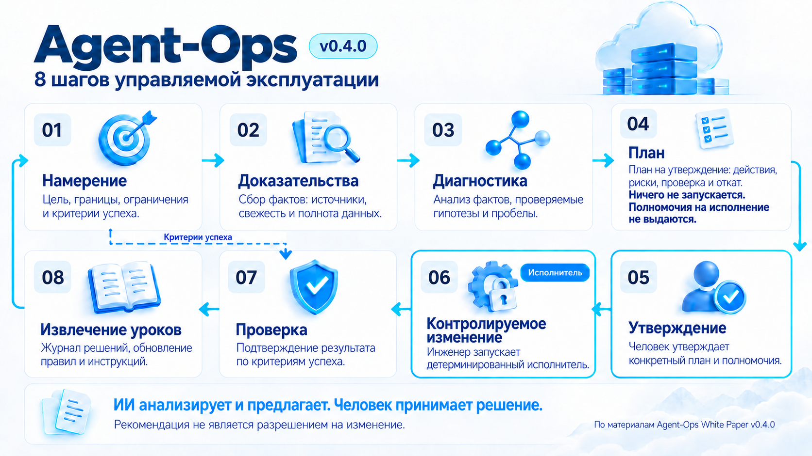
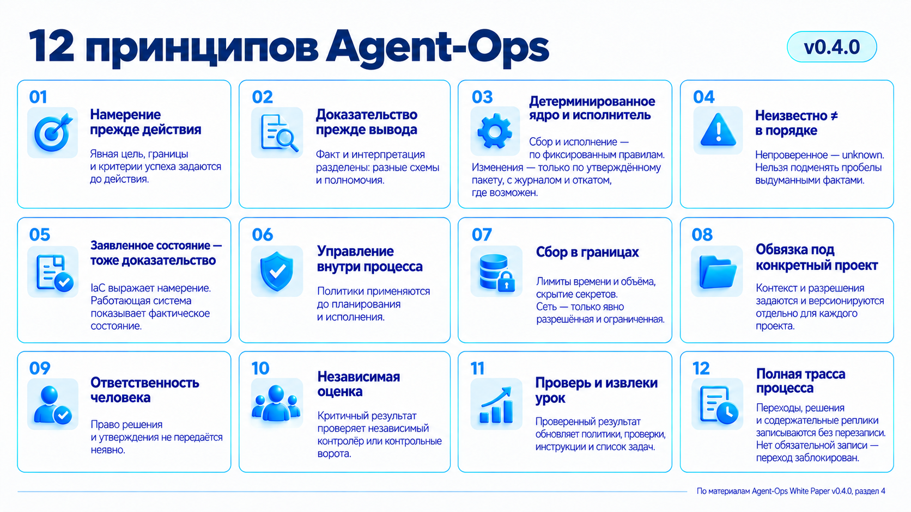
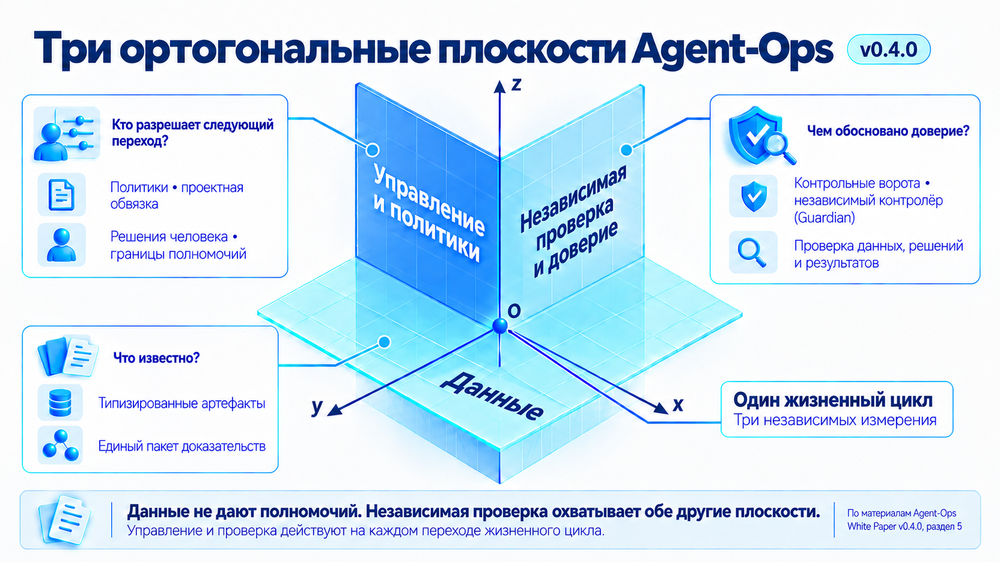
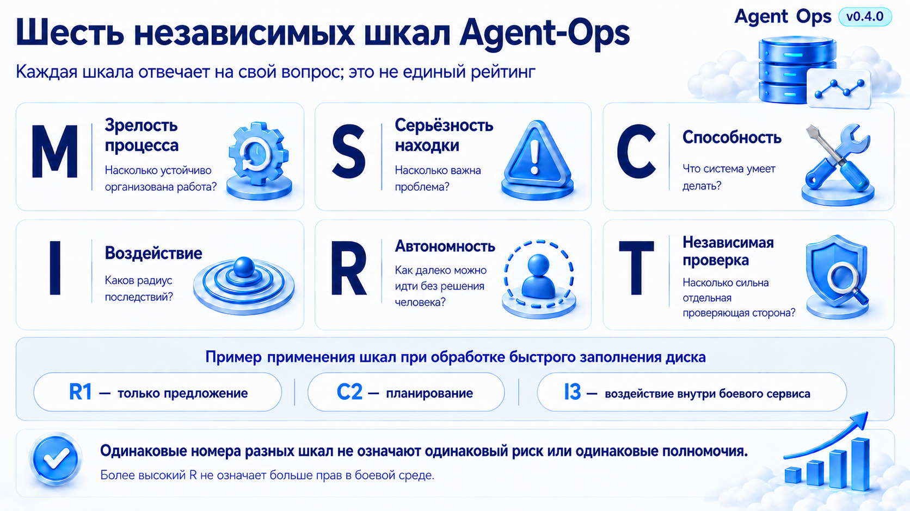
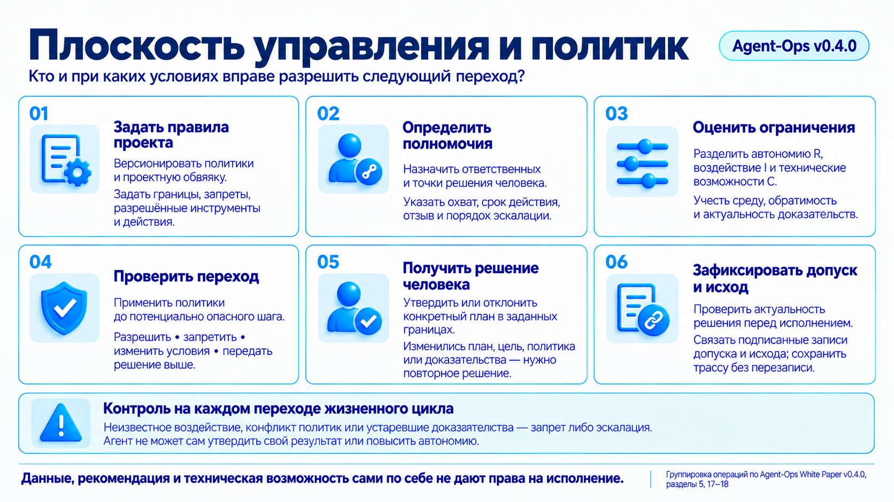
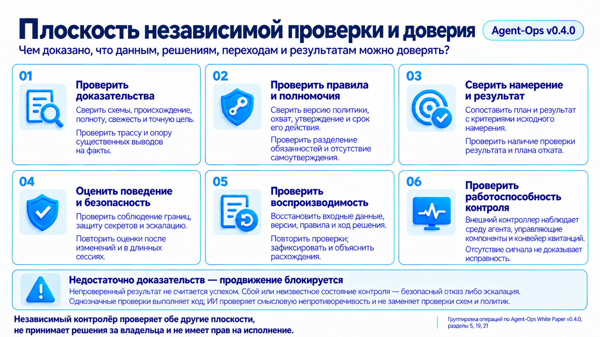
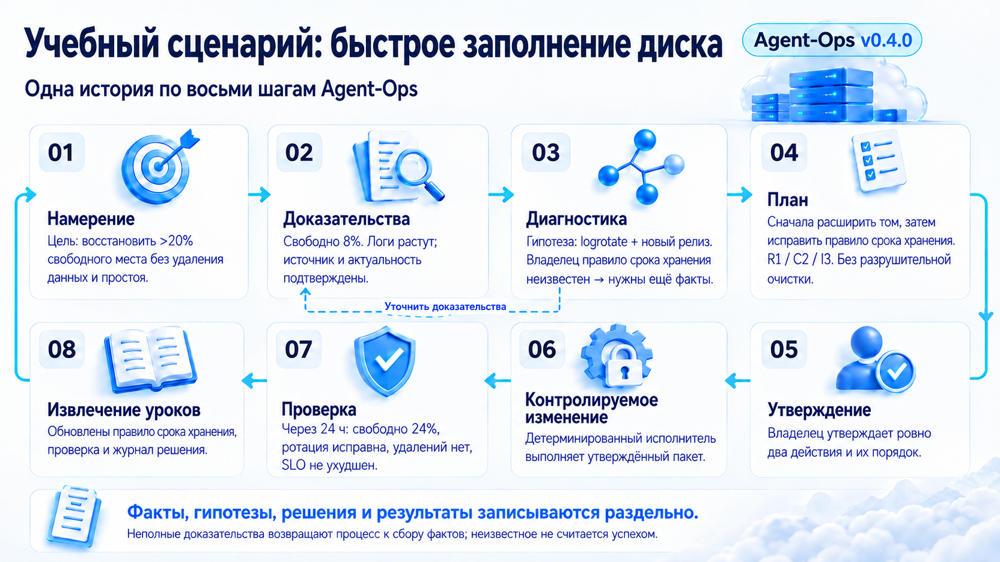

# Agent-Ops

## Методология ИИ-агентной эксплуатации и технической поддержки инфраструктуры

**Публичный нормативный кандидат v0.4.0 | исходная ревизия aom-03-r12 | приоритет английской версии**

При расхождениях между русской и английской версиями одной исходной ревизии приоритет имеет английская версия.

> Факты, выводы и рекомендации не являются разрешением на изменение инфраструктуры.

## О документе

Этот аналитический документ (white paper) формулирует публичную версию методологии Agent-Ops. Она разработана Git in Sky на основе практики аудита, эксплуатации и технической поддержки серверной, облачной и Kubernetes-инфраструктуры, а также обзора опубликованных подходов и продуктов для применения ИИ-агентов в эксплуатации инфраструктуры. Документ описывает основные правила методологии, целевую архитектуру и связи между требованиями, архитектурными решениями и реализацией. Эти связи позволяют проверить, почему принято решение, какие данные и компоненты с ним связаны и где заканчивается ответственность каждого компонента.

### Целевая аудитория

Руководители инфраструктуры и технической поддержки, технические директора и директора по информационным технологиям (CTO/CIO), архитекторы, инженеры по автоматизации разработки и эксплуатации (DevOps), инженеры по надёжности сервисов (SRE), владельцы услуг управляемой эксплуатации (managed services) и команды, внедряющие ИИ-агентов в эксплуатацию боевых сред.

### Как читать этот кандидат

Эта редакция — проект нормативного описания, а не выпущенный стандарт и не утверждение, что все целевые компоненты уже существуют. Требование описывает обязательное свойство соответствующего процесса; рекомендация указывает предпочтительный подход; пример поясняет правило, но не создаёт нового требования; явно помеченное целевое или будущее состояние описывает направление развития.

Слова **ДОЛЖЕН** и **ОБЯЗАН** обозначают обязательное требование в рамках этого кандидата. **СЛЕДУЕТ** и **НЕ СЛЕДУЕТ** обозначают рекомендацию, отступление от которой требует зафиксированного обоснования. **МОЖЕТ** обозначает допустимый вариант. Эти слова задают силу формулировки, но не предоставляют полномочий на изменение системы.

### Базовые термины и роли

| Термин | Понятное объяснение в этом документе |
| --- | --- |
| Контракт | Согласованные требования к входным данным, результату и ограничениям компонента; здесь это не договор с заказчиком. |
| Артефакт | Зафиксированный результат работы: доказательство, отчёт, план, запись решения, файл настроек или журнал действий. |
| Прослеживаемость, или трассируемость | Возможность по результату восстановить, на каких данных он основан, кто принял решение и какое действие было выполнено. |
| Детерминированный компонент | Программа, обрабатывающая входные данные по заданным правилам. Это способ работы, а не обещание отсутствия ошибок. |
| Политика | Формализованные правила: что допустимо, кто вправе разрешить действие и при каких условиях. |
| Проектная эксплуатационная обвязка (Project Operations Harness) | Версионируемый комплект сведений о конкретном проекте: сервисы, владельцы, ограничения, инструкции и разрешённые инструменты. |
| Типизированная запись | Запись с заранее заданными полями и правилами проверки их значений. |
| Полномочия и авторитетность источника | Полномочия на исполнение разрешают названному субъекту ограниченное действие. Авторитетность источника показывает, для какого факта этот источник признан. Одно не создаёт другого. |
| Независимая проверка | Проверка отдельной контрольной ролью или компонентом, которые не утверждают собственную работу. Независимость определяется ролями и полномочиями, а не числом ИИ-агентов. |
| Извлечение уроков (Learning) | Подготовка предложений по улучшению правил, проверок и инструкций; оно не означает самообучения языковой модели. |
| Базовая модель (backbone model) | Языковая модель, которую агент фактически использует на конкретном шаге. |

Большая языковая модель (LLM) создаёт или анализирует текст. ИИ-агент использует модель, контекст и инструменты в границах одной роли. В Agent-Ops планировщик готовит предложение, уполномоченный человек принимает решение, исполнитель через контрольные ворота (Gated Executor) применяет только одобренное изменение, а независимый контролёр (Guardian) проверяет обязательные артефакты и переходы. Независимая проверка не равна одобрению человека: первая проверяет соблюдение правил и качество доказательств, второе даёт ответственное полномочие. Прямой путь от ответа агента к изменению целевой системы запрещён.

Методология, изначально построенная вокруг ИИ (AI-native), учитывает его безопасное участие в ограниченных ролях анализа и планирования. Соответствие методологии не требует ИИ в каждой роли: детерминированный сервис может выполнять роль, если сохраняет те же контракты и границы полномочий.

### Соглашение о терминологии

Имена компонентов, полей схем, статусов и машиночитаемых идентификаторов приводятся точно так, как они заданы в артефактах реализации. Подробный управляемый словарь приведён в самостоятельном [глоссарии Agent-Ops](../normative/glossary.ru.md). Правила перевода и приоритета языков заданы в §27.

История редакций вынесена в отдельный документ «Agent-Ops. История редакций white paper», публикуемый вместе с этим аналитическим документом на agent-ops.ru.

## 1. Краткое резюме

Современная инфраструктура описывается кодом, наблюдается через метрики и логи и изменяется через конвейер непрерывной сборки и поставки (continuous integration / continuous delivery, CI/CD). Однако эксплуатационное знание по-прежнему часто остаётся в головах инженеров, чатах, разрозненных пошаговых инструкциях по типовым эксплуатационным действиям (runbooks) и неформальных исключениях. ИИ-агент получает либо слишком мало контекста, либо слишком широкие полномочия. Оба варианта опасны.

Agent-Ops предлагает сначала создать проверяемый контур намерений, фактов, политик и операционных артефактов, а затем назначать ИИ-агентам строго определённые роли на этапах анализа данных, построения гипотез и планирования изменений:

- детерминированная среда исполнения (runtime) собирает проверяемые доказательства (evidence) и оценивает их по формализованным правилам и порогам политики (policy);
- агент объясняет ситуацию, сопоставляет сигналы, формирует проверяемые гипотезы и готовит предложение;
- человек (инженер) сохраняет право принятия решения и полномочия (authority);
- применение утверждённого изменения выполняет только отдельный исполнитель через контрольные ворота.

При уровне зрелости технологий, принятом в этой редакции, ИИ-агентов НЕ СЛЕДУЕТ использовать внутри исполнителя через контрольные ворота (Gated Executor). Текущая граница методологии требует, чтобы этот исполнитель был детерминированной программой — эксплуатационной инструкцией (runbook), скриптом (script) или формализованным сценарием (playbook), — которую запускает инженер. Ограниченное самовосстановление отдельно обозначено в §18.2 как будущая техническая возможность, выключенная по умолчанию.

Полный управляемый жизненный цикл любого изменения ИТ-инфраструктуры имеет вид:

> Намерение -> Доказательства -> Диагностика -> План -> Утверждение -> Контролируемое изменение -> Проверка -> Извлечение уроков
>
> (Intent -> Evidence -> Diagnosis -> Plan -> Approval -> Controlled Change -> Verification -> Learning)

**Текстовое пояснение.** Намерение задаёт цель и критерии успеха. Доказательства дают актуальные факты. Диагностика формирует проверяемые гипотезы, а план предлагает действия, но не исполняет их. До контролируемого изменения уполномоченный человек фиксирует одобрение. Проверка сравнивает результат с исходными критериями, а извлечение уроков готовит улучшения. Недостающие доказательства возвращают случай к сбору; пути в обход одобрения нет.

Двенадцать принципов из раздела 4 сведены здесь к пяти сквозным опорам:

1. Намерение и подтверждённый результат (Intent and verified outcome): действие предваряют явная цель, охват, границы и критерии успеха; работа завершается только после проверки ожидаемого результата и использования извлечённых уроков.
2. Доказательства и явно зафиксированная неопределённость (Evidence and explicit uncertainty): факты, заявленное состояние и интерпретации не смешиваются; каждый вывод ссылается на источник, отметку времени, степень свежести данных и полномочие источника, а отсутствие доказательств остаётся `unknown` (явным статусом «неизвестно») и не превращается в предположение.
3. Детерминированное исполнение в заданных границах (Deterministic bounded execution): сбор данных и исполнение по возможности выполняются ограниченными детерминированными инструментами; утверждённое изменение может применить только отдельный исполнитель через контрольные ворота, который журналирует действия и обеспечивает максимально возможный откат или компенсирующее действие.
4. Управление и ответственность за полномочия (Governance and accountable authority): политики и версионируемая проектная эксплуатационная обвязка ограничивают каждый переход; человек сохраняет право утверждения и принятия решения, а полномочия не передаются неявно.
5. Независимая проверка и прослеживаемость (Independent assurance and traceability): критичные результаты проверяют независимые контрольные ворота (gate) или независимый контролёр, а каждый переход жизненного цикла, решение и содержательная реплика инженера или агента фиксируются в добавляемой без перезаписи трассе; отсутствие обязательной записи блокирует продвижение.

## 2. Проблемы, которые решает Agent-Ops

### 2.1. Описание инфраструктуры кодом (IaC) не содержит всей эксплуатационной реальности

Описание инфраструктуры кодом (Infrastructure as Code) задаёт ресурсы и конфигурацию, но не определяет полностью обязательные сигналы, владельцев, допустимые отклонения, разрешённые окна изменений (change windows), правила утверждения (approval rules), диагностические маршруты и доказательства восстановления.

### 2.2. Наблюдаемость (Observability) даёт сигналы, но не формирует операционный вывод

Prometheus, Loki, Tempo и OpenSearch хранят или индексируют телеметрию (telemetry) — метрики, логи и трассировки, поступающие из работающих систем; Grafana визуализирует и запрашивает её; OpenTelemetry инструментирует, собирает, обрабатывает и экспортирует сигналы. Чтобы превратить сигнал в управляемое решение, нужны применимость, ссылка на конкретное правило (policy reference), степень серьёзности (severity), актуальность данных (freshness), ответственный владелец (owner), рекомендация без права её применить (recommendation) и ограничение полномочий.

### 2.3. Языковая модель (LLM) без контракта смешивает факт и предположение

Языковая модель не должна самостоятельно выбирать авторитетный источник, разрешённую команду или право изменения боевой среды (production). Без ссылок на доказательства (evidence references) и явных границ полномочий (permission boundaries) агент способен создать убедительное, но неподтверждённое объяснение.

### 2.4. Ручная эксплуатация плохо масштабируется и передаётся

Команды управляемых услуг и платформенные команды обслуживают разные технологии и уровни критичности. Накопление эксплуатационных знаний о проекте происходит у членов команды в соответствии с процессами, принятыми в этой команде. Из-за этого введение нового человека в команду, не говоря о её замене, требует дополнительных затрат на погружение. Введение в команду аналитического ИИ-агента затруднено из-за необходимости передать ему ту часть информации о проекте, которая не формализована, хранится в памяти, передаётся бессистемно и содержит белые пятна.

### 2.5. Компрометация агента создаёт риск вредных действий

ИИ-агент может быть скомпрометирован через внедрение вредоносных инструкций в запрос или контекст, подмену модели, навыка или инструмента, кражу учётных данных либо атаку на цепочку поставки. После этого даже формально допустимые инструменты и ранее выданные полномочия могут быть использованы для несанкционированного изменения инфраструктуры, раскрытия данных, закрепления в среде или искажения доказательств.

## 3. Определение и границы методологии

Agent-Ops — методология организации эксплуатации, в которой:

- детерминированные компоненты собирают и нормализуют доказательства (evidence);
- политики и целевое состояние (expected state) находятся вне кода этих компонентов;
- ИИ-агенты получают ограниченный по составу и объёму контекст (bounded context);
- неопределённость сохраняется как явный статус `unknown` («неизвестно»);
- изменение проходит через намерение, план, решение об утверждении, проверку результата и извлечение уроков.

| Контур | Назначение |
| --- | --- |
| Намерение (Intent) | Цель, охват и границы, ограничения, критерии успеха и признанный источник постановки. |
| Доказательства (Evidence) | Инвентаризация, проверки, расхождение фактического состояния с заявленным (drift), телеметрия и подтверждающие записи. |
| Политики (Policy) | Пороги, роли, автономность, масштаб операционного воздействия, правила утверждения и обращения с данными. |
| Проектная обвязка (Harness) | Ограничения проекта, владельцы, цели качества сервиса (SLO), эксплуатационные инструкции и контракты инструментов. |
| Диагностика (Diagnosis) | Хронология событий, гипотезы, противоречия и отсутствующие доказательства. |
| План устранения (Remediation) | Предложение по изменению, оценка риска, план проверки результата и план отката либо компенсации. На этом этапе никаких действий с целевой системой не производится. |
| Исполнение (Execution) | Отдельный контур за контрольными воротами с учётными данными, ограниченными по области и сроку, и журналом аудита. |
| Извлечение уроков (Learning) | Результат, журнал решений, разбор инцидента после закрытия и обновление эксплуатационных правил, хранимых как код (Operations-as-Code). |

### 3.1. Чем Agent-Ops не является

Agent-Ops не заменяет наблюдаемость (observability), управление ИТ-услугами (ITSM), GitLab или описание инфраструктуры кодом (IaC); не является универсальным агентом удалённого доступа с правами администратора; не обещает автоматически устанавливать единственную корневую причину; не запускает автоматическое самовосстановление (self-healing) по умолчанию.

### 3.2. Agent-Ops и смежная дисциплина AgentOps

Agent-Ops — самостоятельная методология эксплуатации и технической поддержки инфраструктуры. В этом документе AgentOps означает смежную дисциплину эксплуатации и управления жизненным циклом самих ИИ-агентов. Эти области взаимодействуют, но не эквивалентны: Agent-Ops управляет операционным контуром инфраструктуры, а AgentOps — качеством и жизненным циклом участвующих в нём агентов.

## 4. Принципы Agent-Ops

| Принцип | Практический смысл |
| --- | --- |
| 1. Намерение прежде действия (Intent before action) | Действие рассматривается только в контексте явной цели, охвата и критериев успеха. |
| 2. Доказательство прежде вывода (Evidence before inference) | Факт и интерпретация имеют разные схемы и основания доверия. |
| 3. Детерминированное ядро и исполнитель (Deterministic core and Executor) | Сбор, разбор вывода команд, применение правил, запись артефактов, а после утверждения — чтение и изменение целевой системы по возможности выполняются детерминированными инструментами. Исполнитель через контрольные ворота принимает только утверждённый пакет, обеспечивает максимально возможный откат или компенсацию и журналирует каждое действие и результат. |
| 4. Неизвестно ≠ в порядке (Unknown is not OK) | Каждый непроверенный факт явно записывается как `unknown`. Агент не вправе превращать выдуманный или предположенный факт в опору для вывода, рекомендации, решения или действия. |
| 5. Заявленное состояние — тоже доказательство (Declared state is evidence) | Описание инфраструктуры кодом выражает намерение, а работающая система показывает наблюдаемую реальность. |
| 6. Управление внутри процесса (Governance in process) | Политика применяется до планирования и исполнения, а не постфактум. |
| 7. Сбор в границах (Bounded collection) | Предельное время и объём вывода, сокрытие чувствительных данных и запрет неявной сети обязательны. Сетевой доступ разрешён только при явно заданных источнике, цели, назначении, полномочии, сроке, правилах обработки данных и записи доказательства. |
| 8. Обвязка под конкретный проект (Project-specific harness) | Контекст и разрешения версионируются для каждого проекта. |
| 9. Ответственность человека (Human accountability) | Одобрение изменения и право принимать решение не делегируются неявно. |
| 10. Независимая оценка (Independent evaluation) | Критичный результат проверяют независимые контрольные ворота или независимый контролёр. |
| 11. Проверь и извлеки урок (Verify and learn) | Проверенный результат порождает предложения по изменению политик, проверок, инструкций и перечня задач. |
| 12. Полная трасса процесса (Complete process trace) | Каждый переход жизненного цикла, решение и содержательная реплика инженера или агента фиксируются в добавляемой без перезаписи трассе. Отсутствие обязательной записи означает `unknown` и блокирует продвижение. |

Текстовая альтернатива: двенадцать карточек показывают, что намерение предшествует действию, доказательство — выводу, сбор и исполнение опираются на детерминированные компоненты, неизвестное не считается нормой, управление встроено в процесс, сбор ограничен, обвязка привязана к проекту, решение остаётся за человеком, критичный результат проверяется независимо, а каждый переход записывается и используется для извлечения уроков.

Два положения требуют отдельного пояснения.

Правило «Неизвестно ≠ в порядке» (Unknown is not OK) относится к уровню знания и не требует угадывать ответ. Если факт невозможно проверить детерминированными средствами, в артефакте фиксируется `unknown`, а агент рассматривает это значение как пробел, который надо либо устранить, либо передать ответственному лицу для решения. Агент может анализировать последствия неопределённости, но не вправе подставлять воображаемый факт вместо доказательства.

Запрет неявной сети (No implicit network) не является полным запретом сетевого сбора. Запрещены необъявленные сетевые обращения, которые могут возникать при разборе данных, разрешении ссылок, загрузке зависимостей, определении сетевых имён или из-за скрытого поведения инструмента по умолчанию. Такие обращения делают прогон невоспроизводимым, могут привести к раскрытию данных или учётных данных, быть направлены не в ту среду и превращают доступность удалённого ресурса в незаписанную зависимость. Явный, разрешённый политикой и ограниченный сетевой сбор допустим, если он формирует доказательство происхождения и полноты.

## 5. Три стороны управления работой: данные, правила и независимая проверка

Agent-Ops рассматривает один и тот же жизненный цикл в трёх независимых измерениях. Далее они называются тремя ортогональными плоскостями: ни одна из них не заменяет две другие.

Текстовая альтернатива: плоскость данных отвечает, что известно и каким артефактом это представлено; плоскость управления и политик определяет, кто и при каких условиях разрешает переход; плоскость независимой проверки и доверия устанавливает, чем подтверждены данные, решения, переходы и результаты. Данные не предоставляют полномочий, а проверяющая сторона не принимает решение вместо владельца.

**Плоскость данных** отвечает на вопрос «какие сведения известны и какой типизированный артефакт возникает дальше?». В ней последовательно развиваются намерение, доказательства, диагностика, план, утверждение, контролируемое изменение, проверка результата и извлечение уроков. Единый пакет доказательств (Unified Evidence Bundle) связывает версии этих артефактов, не смешивая факт, вывод, рекомендацию, решение и запись исполнения.

**Плоскость управления и политик** отвечает на вопрос «кто и при каких условиях вправе разрешить следующий переход?». Политики, проектная эксплуатационная обвязка, решения человека (Human Approvals) и сквозной слой управляющих правил (Governance Mesh) ограничивают переходы, полномочия, воздействие и автономию. Наличие данных или рекомендации само по себе не предоставляет полномочий на исполнение (execution authority).

**Плоскость независимой проверки и доверия** отвечает на вопрос «чем доказано, что данные, решение, переход и результат заслуживают доверия?». Детерминированные контрольные ворота, независимый контролёр, проверки безопасности, воспроизводимости и полноты, а также оценки поведения (evals) проверяют обе другие плоскости, не наследуя полномочий автора или исполнителя.

Агент диагностики и анализа корневых причин (Diagnosis/RCA Agent), планировщик устранения (Remediation Planner), независимый контролёр и исполнитель через контрольные ворота могут читать артефакты нескольких плоскостей, но не наследуют права друг друга. Исполнитель не получает полномочия из ответа языковой модели и принимает только утверждённый, типизированный и актуальный пакет изменения (change package).

Типизированные агенты-специалисты — необязательная топология реализации, а не требование методологии. Соответствующий методологии процесс может быть реализован одним агентом, несколькими агентами-специалистами или детерминированными сервисами. Нормативны типизированные входы и выходы, изоляция полномочий и проверка независимого контролёра; добавление агентов не предоставляет полномочий и не ослабляет ни одни контрольные ворота.

При передаче между несколькими агентами состояние, отсутствующее в переданном типизированном пакете, не сохраняется. Поэтому каждый узел пути, в котором участвует модель, ДОЛЖЕН отдельно проходить оценку и аттестацию применительно к фактически исполняющей модели и допущенному контексту; аттестация конечных точек не подтверждает промежуточные узлы, включая их устойчивость к инъекции. Детерминированные сборщики и контрольные ворота, а также границы минимальных полномочий остаются самостоятельными контролями, поэтому подтверждение надёжности цепочки нельзя свести к одной оценке модели.

Правила управления и независимые проверки применяются к каждому переходу жизненного цикла и особенно к границам преобразования данных.

Шкала описывает определённое свойство процесса, результата, компонента или действия. Число имеет смысл только вместе с буквой шкалы и объектом оценки: например, серьёзность находки S3 и воздействие действия I3 отвечают на разные вопросы. Уровни нельзя складывать в общий балл или выводить один из другого.

| Шкала | Что оценивается и для чего | Плоскости методологии |
| --- | --- | --- |
| Зрелость процесса (Process Maturity) M0-M6 | Организация эксплуатации в заданном охвате: какие практики уже действуют и чем подтверждены. | Все три плоскости |
| Серьёзность результата проверки (Severity) S0-S5 | Эксплуатационная значимость находки или неопределённости: насколько существенен риск, который требует рассмотрения. | Данные и независимая проверка |
| Техническая возможность (Capability) C0-C5 | Способность конкретного компонента наблюдать, объяснять, планировать, готовить или выполнять изменение. | Управление и независимая проверка |
| Операционное воздействие (Operational Impact) I0-I5 | Последствия конкретного предлагаемого или выполненного действия: что затронуто, насколько широко и обратимо. | Данные и управление |
| Автономность (Autonomy) R0-R5 | Допустимая инициатива агента для конкретной задачи и среды: где он может продолжать работу и где требуется решение человека. | Управление |
| Возможности независимого контролёра (Guardian maturity) T1-T5 | Способность независимого контроля выявлять, проверять, перенаправлять и блокировать нарушения, а также организовывать их устранение. | Независимая проверка и доверие |

**Происхождение шкал.** Лестница R0-R5 заимствована из таблицы «Риск-адаптивные полномочия» в §4.3 [AI-Disrupt PDLC 2.0 — полного руководства Сбера, июнь 2026 года](https://aipdlc.ru/documents/ru/whitepaper_full_ru.pdf). Автор методологии — [Кирилл Меньшов](https://aipdlc.ru/ru). Обозначения и последовательность T1-T5 взяты из §4.5 того же руководства и адаптированы к границе Agent-Ops: независимый контролёр не получает полномочий на изменение цели, а T5 организует исправление через отдельного уполномоченного исполнителя. Шкалы M, S, C и I ниже заданы самой методологией Agent-Ops; M0-M6 не является переименованием организационной шкалы L0-L5 из AI-Disrupt PDLC.

Текстовая альтернатива: шесть шкал отвечают на разные вопросы и не образуют единый рейтинг. В примере обработки быстрого заполнения диска `R1` ограничивает агента подготовкой предложения, `C2` описывает способность планировать, а `I3` — воздействие предлагаемого изменения внутри одного боевого сервиса. Эти значения не определяют автоматически зрелость процесса M, серьёзность результата S или возможности контролёра T.

### 5.1. Зрелость процесса M0-M6

Шкала M показывает, насколько устойчиво организована эксплуатация в оцениваемом проекте или сервисе. Уровень подтверждается действующими практиками и их артефактами; установка инструмента или наличие отдельного агента сами по себе не доказывают зрелость. Это характеристика процесса, а не разрешение на действие.

| Уровень | Значение | Как проявляется в эксплуатации |
| --- | --- | --- |
| M0 | Неуправляемый процесс / неизвестное состояние (Unmanaged / Unknown) | Работа не оформлена как управляемый процесс либо его состояние не установлено. Нет подтверждённой опорной картины, на которую можно положиться. |
| M1 | Разовый аудит (Initial Audit) | Получен первый проверяемый снимок состояния и список находок. Регулярное обновление этой картины ещё не является устойчивой практикой. |
| M2 | Регулярная диагностика (Regular Diagnostics) | Проверки повторяются, результаты сопоставляются во времени; отклонения и пробелы обнаруживаются систематически. |
| M3 | Выстроенная наблюдаемость (Observability) | Диагностика связана с актуальными метриками, логами, трассировками и оповещениями; проверяется достаточность этих сигналов для эксплуатации. |
| M4 | Управляемая эксплуатация (Managed Operations) | Работа проходит через явные намерения, доказательства, планы, решения ответственных лиц, проверку результата и журнал; действуют политики и владельцы сервисов. |
| M5 | Полуавтоматическое восстановление под утверждением человека (Approval-controlled Semi-automated Recovery) | Подготовка и исполнение ограниченных изменений автоматизированы, но каждое реальное изменение требует решения человека и запуска им детерминированного исполнителя; результат проверяется. |
| M6 | Ограниченное самовосстановление и поддержка надёжности с участием ИИ (Bounded Self-Healing / AI-assisted SRE) | Будущий режим для заранее ограниченных и одобренных сценариев: восстановление выполняется в заданных политикой границах с проверкой, остановкой и отзывом допуска. Эта редакция не вводит его как действующий режим. |

### 5.2. Серьёзность результата проверки S0-S5

Шкала S выражает эксплуатационную значимость результата проверки, включая риск из-за неопределённости. Политика конкретной проверки связывает наблюдения, критичность сервиса и возможные последствия с уровнем S; универсального процента свободного места или единого срока реакции для всех сервисов здесь нет.

| Уровень | Значение | Что означает для оценки результата |
| --- | --- | --- |
| S0 | Информационная (Informational) | Результат даёт сведения о состоянии; сам по себе не указывает на эксплуатационный риск, требующий устранения. |
| S1 | Низкая (Low) | Риск мал и ограничен; находка имеет небольшую эксплуатационную значимость в данном контексте. |
| S2 | Умеренная (Moderate) | Риск заметен и требует рассмотрения; возможные последствия существеннее локальной малозначимой находки. |
| S3 | Значимая (Material) | Результат указывает на существенный эксплуатационный риск, способный заметно ухудшить работу сервиса. |
| S4 | Высокая (High) | Есть высокий риск отказа, потери доступности или нарушения безопасности. |
| S5 | Критическая (Critical) | Критический риск, аварийное состояние или риск потери данных; последствия относятся к наиболее серьёзному классу. |

S не заменяет статус `ok`, `warning`, `critical`, `unknown` или другой статус из приложения E. Например, серьёзная неопределённость может требовать внимания, но высокая S не превращает непроверенный факт в подтверждённое отклонение и не разрешает исправление.

### 5.3. Техническая возможность C0-C5

Шкала C описывает функцию, которую способен выполнять конкретный компонент. Техническая возможность и полномочие на её использование проверяются отдельно. Для C0-C3 сохраняется граница без изменения целевой системы; правила исполнения раскрыты в §18.2.

| Уровень | Значение | Результат и граница |
| --- | --- | --- |
| C0 | Наблюдать (Observe) | Собрать факты и доказательства без изменения цели. |
| C1 | Объяснять (Explain) | Объяснить возможные причины, сформулировать вопросы и указать пробелы в доказательствах. |
| C2 | Планировать (Plan) | Оценить воздействие и подготовить план; изменение ещё не выполняется. |
| C3 | Готовить изменение (Prepare Change) | Подготовить запрос на слияние, план пробного прогона, проверки и отката либо компенсации. Наличие пакета не запускает действий с целью. |
| C4 | Применять после одобрения человеком (Human-approved Apply) | Отдельный детерминированный исполнитель применяет утверждённое изменение после явного решения и запуска человеком через контрольные ворота. |
| C5 | Ограниченное самовосстановление (Bounded Self-Healing) | Будущая возможность для сценариев малого воздействия с заранее одобренными классом действий, охватом, предусловиями, правилами остановки и отзыва. В этой редакции выключена по умолчанию. |

### 5.4. Операционное воздействие I0-I5

Шкала I относится к действию и его последствиям. Оцениваются критичность, охват затрагиваемых ресурсов, обратимость и класс данных. До изменения оценивается прогнозируемое результирующее состояние, после — фактические последствия; порядок проверки и учёта пересекающихся изменений задан в §11.2. Короткая команда не означает малого воздействия.

| Уровень | Значение | Граница воздействия |
| --- | --- | --- |
| I0 | Без воздействия на боевую среду (Read-only / Offline) | Только чтение или работа без подключения к сети; побочных последствий для боевой среды нет. |
| I1 | Изолированное обратимое изменение вне боевой среды (Isolated Reversible Non-production) | Последствия ограничены изолированным контуром вне боевой среды, а изменение обратимо. |
| I2 | Локальное обратимое изменение низкой критичности (Localized Reversible Low-criticality) | Затрагивается ограниченный компонент низкой критичности; границы последствий и возможность возврата установлены. |
| I3 | Изменение внутри одного боевого сервиса (Production Service-local) | Воздействие ограничено одним боевым сервисом; требуются утверждение человека, проверка результата и план отката. |
| I4 | Межсервисное, критичное или чувствительное изменение (Multi-service / Critical / Sensitive) | Затрагиваются несколько сервисов, критичные функции либо чувствительные данные; применяются разделение обязанностей и выкатка на малую долю. |
| I5 | Системное или необратимое воздействие (Systemic / Irreversible) | Возможны системные последствия, необратимость, потеря данных или регуляторное воздействие; требуется решение высшей уполномоченной инстанции либо действует прямой запрет. |

I описывает последствия, а не выдаёт допуск. Неизвестное воздействие не считается I0: по §18 оно приводит к запрету либо эскалации. Одинаковая находка S может иметь несколько планов устранения с разными I.

### 5.5. Автономность R0-R5

Шкала R задаёт допустимую инициативу агента в конкретной среде и задаче. Ниже сохранён смысл таблицы §4.3 AI-Disrupt PDLC 2.0; правила применения в Agent-Ops приведены в §18. Уровни, связанные с ветками кода и слиянием, относятся к подготовке изменений в репозитории и не дают права самостоятельно менять боевую систему.

| Уровень | Значение | Что допускается в указанных границах |
| --- | --- | --- |
| R0 | Только чтение (Read-only) | Получение сведений; типичная граница — боевая среда без подтверждённых оценок поведения. |
| R1 | Только предложения (Proposals Only) | Агент готовит предложение, решение принимает человек; так ограничивается работа на критичных маршрутах боевой среды. |
| R2 | Работа в отдельной ветке с разбором запроса на слияние (Feature Branch with Review) | Изменения в ветке конкретной задачи проходят разбор перед слиянием. |
| R3 | Автоматическое слияние после успешных оценок (Auto-merge after Evals) | Для стандартных проверенных шаблонов допускается автоматическое слияние только при успешных оценках поведения. |
| R4 | Многосессионная работа с контрольными точками (Multi-session with Checkpoints) | Длительный зрелый и проверенный сценарий продолжается через несколько сессий с сохранением состояния и ограничений. |
| R5 | Полная автономия в изолированной песочнице (Sandbox Autonomy) | Эксперимент выполняется автономно в изолированной среде; эти права не распространяются за её пределы. |

У одного агента могут различаться R для боевой среды, ветки кода и песочницы. Уровень определяется политикой с учётом среды, воздействия, доказательств и оценок; агент не повышает его сам. R5 не означает больше прав в боевой среде, чем R1. В этой редакции каждое реальное изменение целевой системы по-прежнему запускает человек через детерминированного исполнителя.

### 5.6. Возможности независимого контролёра T1-T5

Шкала T описывает, как независимый контроль реагирует на результат или действие другого компонента. Это адаптация лестницы Guardian Agents из §4.5 AI-Disrupt PDLC 2.0 к разделению проверки и исполнения в Agent-Ops. Уровень T не отменяет обязательных контрольных ворот и не позволяет контролёру одобрять собственную работу.

| Уровень | Значение | Функция независимого контроля |
| --- | --- | --- |
| T1 | Разбор (Review) | Рассмотреть выходные артефакты и подготовить отчёт с замечаниями для ответственного лица. |
| T2 | Проверка (Verification) | Проверить соответствие требованиям, политике и доказательствам и зафиксировать результат проверки. |
| T3 | Перенаправление (Redirect) | Направить рискованное или неоднозначное действие на решение человека либо вернуть работу за необходимым уточнением. |
| T4 | Блокировка (Block) | Остановить недопустимое продвижение по правилам, не ожидая, что автор результата сам откажется от действия. |
| T5 | Организация исправления (Remediate) | Передать нарушение в отдельно уполномоченный путь исправления с исполнителем, политикой и единицей работы для отката; затем проверить исправленный результат. Сам контролёр цель не изменяет. |

Единица работы (unit of work, UOW) — ограниченная задача реализации со своим охватом и проверкой. Обозначения T описывают возможности контроля, а не степень доверия к ответу модели. Наличие T1 или T2 не освобождает процесс от обязательного блокирования небезопасного перехода: его обеспечивают независимый контролёр и детерминированные контрольные ворота по §19. Внешняя идея автономного исправления на T5 не является действующим полномочием контролёра Agent-Ops.

### 5.7. Применение шкал на одном случае

При обработке быстрого заполнения диска из §23 шкалы используются совместно, но относятся к разным объектам. Запись R1/C2/I3 означает: агент может только предложить решение, умеет подготовить план, а предлагаемое изменение затронет один боевой сервис. Она не описывает все свойства случая и не является допуском к исполнению.

| Шкала | Как применяется в случае с диском |
| --- | --- |
| M | Оценивается организация эксплуатации сервиса: есть ли только разовый аудит, регулярная диагностика, наблюдаемость или полный управляемый цикл. Процент свободного места уровень M не определяет. |
| S | Серьёзность результата определяется по политике проверки с учётом скорости заполнения, критичности сервиса и риска для данных. Исходные 8% не являются универсальным основанием назначить S4 или S5. |
| C | C2 характеризует компонент, который оценивает варианты и составляет план. Для последующего применения нужен отдельный исполнитель C4 с требуемым решением человека. |
| I | I3 относится к предлагаемому расширению тома и исправлению правила срока хранения внутри одного боевого сервиса. Сбор фактов без побочных последствий может иметь I0; это другое действие. |
| R | R1 запрещает агенту применять своё предложение. Одобрение конкретного плана человеком не превращает этого агента автоматически в исполнителя. |
| T | Учитываются реально действующие функции контроля: разбор, проверка, перенаправление, блокировка или организация исправления. Один успешный отчёт не доказывает наличие всех уровней. |

M, S и T устанавливаются по собственным основаниям; из сочетания R1/C2/I3 их значения не выводятся. При записи оценки указываются объект, основание, применимая политика и актуальные доказательства. Порядок допуска определяется §18, а единый реестр значений и ссылки на определения собраны в приложении F.

> Машиночитаемый контекст — это данные, а не команда и не утверждение.
>
> (Machine-readable context is data, not a command and not an approval.)
>
> Допустимый предел воздействия задаётся политикой; прогнозируемое и фактическое воздействие фиксируются как данные и доказательства.

## 6. Намерение (Intent)

Намерение начинает плоскость данных: человеческая цель становится типизированным, проверяемым и версионируемым контрактом, но ещё не командой и не полномочием на изменение.

| Карточка типа | Контракт |
| --- | --- |
| Тип | `OperationalIntent` |
| Вход | Заявка, инцидент, цель владельца и исходные ограничения. |
| Выход | Операционное намерение (Operational Intent) с указанием версии и ссылкой на обязательную итоговую проверку результата (Outcome Check). |
| Ключевые поля | `ref`, `owner_ref`, `objective`, `expected_outcome`, `baseline`, `measurable_targets`, `scope`, `constraints`, `prohibited_actions`, `falsification_criteria`, `required_outcome_check`, `decision_map_ref`. |
| Схема | [`foundation_operational_intent.schema.json`](../../schemas/foundation_operational_intent.schema.json). |
| Статус контракта | Нормативная схема JSON существует. |

Операционное намерение переводит человеческую цель в проверяемый контракт до начала анализа или планирования. Оно не является командой и не предоставляет полномочий на исполнение изменений.

| Поле | Семантика |
| --- | --- |
| `intent_id` / `version` | Стабильная идентичность и версия постановки. |
| `goal` / `expected_outcome` (цель и ожидаемый результат) | Желаемый результат без навязывания способа реализации. |
| `scope` (охват) | Проект, среда, сервисы и исключения. |
| `constraints` (ограничения) | Запрещённые действия, временное окно, правила обращения с данными и максимальный допустимый масштаб последствий (blast-radius ceiling). |
| `success` / `stop criteria` (критерии успеха и остановки) | Проверяемое завершение и условия остановки. |
| `authority` | Кто сформулировал и кто может изменить намерение. |
| `policy` / `evidence refs` | Применимые правила и исходные доказательства. |
| `validity` (актуальность) | Свежесть постановки и срок её актуальности. |

### 6.1. Гипотеза о результате (Outcome Hypothesis) и план проверки (validation plan)

До реализации фиксируются исходное состояние (baseline), измеримое целевое значение (target), временное окно, способ измерения и решение о доработке либо полном перепроектировании (adapt-versus-redesign). План проверки определяет обязательные оценки поведения, контрольные ворота, элементы пакета доказательств и итоговую проверку результата.

Намерение допускает переход к доказательствам только тогда, когда цель, охват, признанный статус источника постановки, критерии успеха и остановки достаточно определены. Неустранённая неоднозначность остаётся `unknown` и возвращает постановку к процессу уточнения задачи (Discovery).

## 7. Доказательства (Evidence)

Доказательства фиксируют наблюдаемую и заявленную реальность до интерпретации. Сбор не должен незаметно превращаться ни в диагноз, ни в разрешение на действие.

| Карточка типа | Контракт |
| --- | --- |
| Тип | `EvidenceRecord / EvidenceBundle` |
| Вход | Операционное намерение, авторитетные источники, профиль сбора, диалект платформы и политика. |
| Выход | Типизированные результаты проверок, снимки состояния и ссылки на пакет доказательств. |
| Ключевые поля | `ref`, идентичность цели, источник, отметка времени, свежесть, полномочие источника, полнота, усечение, статус, степень серьёзности и свёртка. |
| Схема | [`check_result.schema.json`](../../schemas/check_result.schema.json), [`foundation_evidence_bundle.schema.json`](../../schemas/foundation_evidence_bundle.schema.json), [`declared_inventory.schema.json`](../../schemas/declared_inventory.schema.json), [`foundation_object_ref.schema.json`](../../schemas/foundation_object_ref.schema.json). |
| Статус контракта | Нормативные схемы существуют; пакет доказательств развивается на протяжении всего цикла. |

Детерминированный механизм сбора доказательств (Deterministic Evidence Engine) — базовый слой Agent-Ops. Его задача не «починить сервер», а получить проверяемые факты, нормализовать их, оценить относительно политики и сформировать машиночитаемые результаты, пригодные для автоматической обработки без участия человека.

| Свойство | Контракт |
| --- | --- |
| Идентичность (Identity) | `check_id`, идентичность проекта, среды и сервиса, версии инструмента и схемы данных: [`check_result.schema.json`](../../schemas/check_result.schema.json), [`foundation_object_ref.schema.json`](../../schemas/foundation_object_ref.schema.json). |
| Статус (Status) | `ok`, `info`, `warning`, `critical`, `unknown`, `not_applicable`, `error` (в порядке; информация; предупреждение; критично; неизвестно; неприменимо; техническая ошибка): [`check_result.schema.json`](../../schemas/check_result.schema.json). |
| Доказательство (Evidence) | Источник, временная отметка, актуальность, криптографическая свёртка содержимого, полнота, а также факт и причина усечения данных: [`check_result.schema.json`](../../schemas/check_result.schema.json), [`foundation_evidence_bundle.schema.json`](../../schemas/foundation_evidence_bundle.schema.json). |
| Безопасность (Safety) | Сбор только на чтение, ограниченный вывод, сокрытие чувствительных данных, запрет неявных сетевых обращений и границы исполнения: [`check_card.schema.json`](../../schemas/check_card.schema.json), [`run_envelope.schema.json`](../../schemas/run_envelope.schema.json). |
| Воспроизводимость (Reproducibility) | Канонический порядок элементов, детерминированные модули записи, явно указанный профиль сбора и политика: [`run_request.schema.json`](../../schemas/run_request.schema.json), [`run_plan.schema.json`](../../schemas/run_plan.schema.json), [`foundation_evidence_completion_profile.schema.json`](../../schemas/foundation_evidence_completion_profile.schema.json). |
| Авторитетность источника и полномочия (Authority) | Заявленные, наблюдаемые и выведенные данные не смешиваются; признанный статус источника и полномочия на исполнение записываются отдельно: [`foundation_semantic_object.schema.json`](../../schemas/foundation_semantic_object.schema.json), [`foundation_governance_result.schema.json`](../../schemas/foundation_governance_result.schema.json). |

> проба -> ограниченное доказательство -> разбор -> применение правил -> результат проверки -> запись артефактов
>
> (probe -> bounded evidence -> parser -> policy evaluation -> check result -> artifact writers)

### 7.1. Базовый каталог проверок

Проверка является самостоятельным модулем с контрактом [`check_card.schema.json`](../../schemas/check_card.schema.json) и результатом по [`check_result.schema.json`](../../schemas/check_result.schema.json). Каталог из 47 проверок служит исходной опорной точкой, а не пределом: конкретная реализация может содержать 100 и более проверок. Новая проверка получает стабильный `check_id`, роль хоста или сервиса, технологию, риск, схему, пример результата, детерминированную реализацию, доказательство того, что проверка сама протестирована, и статус зрелости. Добавление модуля расширяет версионируемый каталог и не меняет смысл существующих `check_id`.

### 7.2. Профили сбора (profiles) и стоимость сбора

Профиль аудита является самостоятельным версионируемым модулем композиции: он выбирает проверки, их параметры, пределы времени и объёма, но не меняет смысл проверок и не предоставляет полномочия на изменение. `audit-fast`, `audit-regular`, `audit-deep` и `continuous-check` — примеры, а не закрытый перечень; конкретная реализация может определять 10 и более профилей. Новый идентификатор профиля явно добавляется в применимую версию контракта [`check_card.schema.json`](../../schemas/check_card.schema.json), выбирается через `profile_ref` в [`run_request.schema.json`](../../schemas/run_request.schema.json), а разрешённый набор вызовов фиксируется в [`run_plan.schema.json`](../../schemas/run_plan.schema.json). `audit-fast` содержит дешёвые проверки только на чтение; `audit-regular` выполняет основной набор; `audit-deep` включает тяжёлую диагностику; `continuous-check` выдаёт сигналы с малым числом различных сочетаний меток (low-cardinality signals), чтобы не создавать чрезмерную нагрузку на хранилище метрик; профили планирования устранения не предоставляют права изменения.

### 7.3. Диалекты платформ (platform dialects) и поставщики данных (providers)

Диалект платформы является самостоятельным модулем-адаптером по контракту [`dialect.schema.json`](../../schemas/dialect.schema.json): он сопоставляет неизменный логический `check_id` с поставщиками данных и разборщиками конкретной платформы. Перечень диалектов открыт и версионируется; реализация может содержать 20 и более диалектов. Добавление диалекта не создаёт новый смысл проверки и не требует изменения других диалектов. Доказанная неприменимость даёт `not_applicable`; сбой ожидаемого поставщика данных или маршрута сбора данных даёт `error`; неразрешённая применимость либо недостаточный объём доказательств дают `unknown`. Ни одно из этих состояний не эмулирует успешность.

### 7.4. Готовность наблюдаемости (Observability Readiness)

Agent-Ops не заменяет наблюдаемость. Он проверяет, достаточно ли телеметрии для эксплуатации и анализа инцидентов и связаны ли сигналы с ответственными владельцами сервисов, целями качества сервиса, степенью серьёзности и эксплуатационными инструкциями.

| Зона | Что валидируется |
| --- | --- |
| Метрики хоста и приложения (Host / application metrics) | Компонент выдачи метрик (exporter), видимость цели для системы опроса метрик (scrape visibility), основные сигналы здоровья сервиса (golden signals), метки метрик и актуальность данных. |
| Логи (Logs) | Охват, срок хранения, сокрытие чувствительных данных и ссылки на готовые диагностические запросы. |
| Распределённые трассировки (Traces) | Покрытие критичных маршрутов запросов и атрибуты, связывающие трассировку с логами и метриками. |
| Оповещения (Alerts) | Правила определения степени серьёзности, маршрутизация адресату, связь с SLO, владелец и ссылки на эксплуатационные инструкции. |
| Сигналы самого аудита (Audit signals) | Небольшое число сочетаний меток, отметка актуальности, полнота и отсутствие секретов. |

Готовность имеет собственную шкалу статусов с приоритетом в порядке `blocked` -> `unknown` -> `gaps` -> `complete`: невозможность проверить сильнее незнания, незнание сильнее обнаруженных пробелов, и ни одно из состояний не сводится к успеху. Обнаруженный состав (observed inventory), заявленное намерение (declared intent) и готовность остаются разными областями авторитетности и полноты: владелец и критичность являются заявленными фактами и никогда не выводятся из обнаруженных компонентов, а локальный след облачного программного сервиса (SaaS) не создаёт полномочий над его плоскостью управления (control plane). Оценка выполняется без сетевых обращений, по артефактам принятого прогона, и не заявляет работоспособность среды исполнения в текущий момент.

### 7.5. Проверка, проба и метрика

Проба показывает сигнал во времени. Проверка интерпретирует доказательства относительно политики и формирует статус, степень серьёзности и рекомендацию. Метрика может быть входом проверки, но не заменяет результат проверки.

### 7.6. Число сочетаний меток (cardinality) и актуальность данных (freshness)

Кардинальность метрики (cardinality) — это число различных сочетаний её меток. Метки (labels) — признаки, по которым различаются измерения, например сервис и среда. Для одной метрики каждое сочетание задаёт отдельный временной ряд (time series), то есть последовательность значений во времени. Новое измерение с теми же метками продолжает существующий ряд; новое сочетание меток создаёт другой ряд.

Текстовая альтернатива: два сервиса и три среды при стабильных метках создают `2 x 3 = 6` временных рядов. Сто запусков добавляют `6 x 100 = 600` измерений в те же шесть рядов. Если поместить уникальный `run_id` в метки метрики, получится `2 x 3 x 100 = 600` отдельных рядов. Кардинальность считает сочетания меток, а актуальность определяет, не превысил ли возраст доказательства допустимый срок использования.

| Пример для одной метрики | Временные ряды | Измерения после 100 запусков |
| --- | ---: | ---: |
| Метки содержат только два сервиса и три среды | `2 x 3 = 6` | `6 x 100 = 600` значений в тех же шести рядах |
| Метки также содержат уникальный идентификатор запуска | `2 x 3 x 100 = 600` | 600 рядов, каждый создан для одного запуска |

Поэтому уникальные идентификаторы запусков и временные отметки (timestamps) хранятся в артефактах JSON, а не в метках метрик. Числа поясняют различие и не задают универсального предела кардинальности.

Актуальность данных (freshness) — отдельное свойство: оно показывает, как давно получено доказательство и не истёк ли допустимый срок его использования (TTL). Набор может содержать всего шесть рядов, но уже быть слишком старым для решения. Устаревшее доказательство не обосновывает рискованное изменение без повторного сбора.

### 7.7. Устойчивые идентификаторы наблюдаемости (stable observability identities)

`service_id`, `environment_id`, `slo_id`, `alert_id`, `runbook_id`, `telemetry_requirement_id` и `owner_id` должны оставаться стабильными, чтобы пакет материалов по инциденту (Incident Bundle) ссылался на доказательства без изменения базовых схем.

Переход к диагностике разрешён только при явной оценке полноты и свежести. `unknown`, `error`, `not_applicable` и усечение сохраняют собственную семантику и не эмулируют успешный сбор.

## 8. Диагностика (Diagnosis)

Диагностика преобразует доказательства в проверяемые гипотезы, не смешивая наблюдение и вывод.

| Карточка типа | Контракт |
| --- | --- |
| Тип | `DiagnosisRecord` |
| Вход | Намерение, пакет доказательств, события инцидента и применимые диагностические правила. |
| Выход | Ранжированные гипотезы, противоречия, пробелы и проверки на опровержение. |
| Ключевые поля | `diagnosis_ref`, `intent_ref`, `evidence_refs`, `observations`, `hypotheses`, `supporting_evidence`, `contradicting_evidence`, `missing_evidence`, `falsification_checks`, `confidence`. |
| Схема | [`diagnostic_report.schema.json`](../../schemas/diagnostic_report.schema.json) и [`foundation_discovery_assessment.schema.json`](../../schemas/foundation_discovery_assessment.schema.json) покрывают части типа. |
| Статус контракта | Единая нормативная схема JSON для `DiagnosisRecord` пока отсутствует; документ не выдаёт частичное покрытие за реализованный контракт. |

Рабочий процесс обработки инцидента отвечает на вопрос о том, что менялось, какие сигналы наблюдались и какие гипотезы объясняют симптомы. Он использует единый пакет доказательств, но не смешивает факт и вывод.

| Поле гипотезы | Назначение |
| --- | --- |
| `statement` (формулировка) | Проверяемая формулировка. |
| `confidence` (уверенность) | `low` / `medium` / `high` (низкая, средняя, высокая) по явным критериям. |
| `supporting_evidence` | Факты, подтверждающие гипотезу. |
| `contradicting_evidence` | Факты, которые ей противоречат. |
| `missing_evidence` | Каких данных не хватает. |
| `falsification_checks` (проверки на опровержение) | Ограниченные действия для опровержения — попытка не подтвердить гипотезу, а именно её опровергнуть. |
| `likely_root_cause` (вероятная корневая причина) | Флаг, не заменяющий проверку человеком. |

> Корректный анализ корневых причин (RCA) — ранжированные гипотезы с подтверждающими и опровергающими доказательствами, а не уверенный текст без доказательств.

### 8.1. Конвейер диагностики (diagnostics pipeline)

Первый уровень диагностики (Tier 1) использует дешёвые счётчики псевдофайловых систем ядра Linux (`procfs`/`sysfs`) и сведения о состоянии среды исполнения; второй уровень (Tier 2) использует инструменты, подключаемые только по явному согласию; третий уровень (Tier 3) использует встроенный механизм eBPF только при отдельном разрешении и подтверждённой поддержке. Сбор остаётся ограниченным и выполняется в две фазы: снятие опорного состояния (baseline) и выборочные измерения (sampling).

Диагностика переходит к плану только при прослеживаемой связи каждой существенной гипотезы с подтверждающими и опровергающими доказательствами. Недостаток данных порождает новый запрос доказательств, а не уверенный вывод.

## 9. План (Plan)

План (Plan) описывает предлагаемый способ достижения намерения. На этом этапе никаких действий с целевой системой не выполняется.

| Карточка типа | Контракт |
| --- | --- |
| Тип | `ChangePlan` |
| Вход | Намерение, диагностика, пакет доказательств, действующая политика и ограничения проектной обвязки. |
| Выход | План действий, воздействия, проверки, отката или компенсации и требуемых утверждений. |
| Ключевые поля | `plan_ref`, `intent_ref`, `diagnosis_ref`, `evidence_refs`, `proposed_actions`, `impact`, `preconditions`, `blast_radius`, `dry_run`, `required_approvals`, `verification_plan`, `rollback_or_compensation_plan`. |
| Схема | [`recommendations.schema.json`](../../schemas/recommendations.schema.json) является экспериментальным артефактом только для планирования (plan-only). |
| Статус контракта | Единая нормативная схема JSON для `ChangePlan` пока отсутствует. |

План устранения (Remediation) — исключительно этап планирования. Планировщик устранения готовит предложение, но не выполняет никаких действий с целевой системой и не применяет предложение. Предложение связано с намерением, инцидентом и пакетом доказательств и содержит предлагаемые действия, предельно допустимый уровень автономии, уровень воздействия, предусловия, ожидаемый эффект, область возможного воздействия, план пробного прогона без реального изменения или выкатки на малую долю (dry-run/canary plan), требуемые утверждения, план проверки результата и план отката либо компенсирующего действия. Применение возможно только позднее через отдельно уполномоченного исполнителя за контрольными воротами.

### 9.1. Откат (rollback) не всегда существует

Необратимые действия требуют резервной копии или предварительной проверки, маркировки «обратимо не полностью» (not fully reversible) и плана компенсирующих действий (compensation plan). Отсутствие отката не скрывается общим обещанием обратимости.

План может быть передан на утверждение только вместе с оценкой воздействия, проверяемыми предусловиями, явным планом проверки результата и честным описанием обратимости.

## 10. Решение об утверждении (Approval) как типизированная проверяемая запись

В плоскости данных решение об утверждении (Approval) — это не просто нажатие кнопки или фраза в переписке, а отдельная адресуемая и проверяемая запись. Организационные правила и полномочия человека раскрываются позднее в §17.

| Карточка типа | Контракт |
| --- | --- |
| Тип | `HumanDecision` |
| Вход | Намерение, `ChangePlan`, требуемые доказательства и оценки, область полномочий и точка перехода. |
| Выход | Решение `approve` или `deny` с областью действия, сроком и подтверждением издателя. |
| Ключевые поля | `ref`, `intent_ref`, `transition_id`, `principal_ref`, `issuer_attestation_ref`, `actor_role`, `authority_scope`, `blocked_action`, `decision`, `issued_at`, `not_before`, `expires_at`, `revocation_ref`. |
| Схема | [`foundation_human_decision.schema.json`](../../schemas/foundation_human_decision.schema.json) и [`foundation_decision_map.schema.json`](../../schemas/foundation_decision_map.schema.json). |
| Статус контракта | Нормативные схемы JSON существуют. |

Утверждение не изменяет систему и не расширяет охват плана. Оно действительно только для указанного перехода, точной цели, неизменившихся входов и срока действия. Отсутствующая, просроченная, отозванная или относящаяся к другой цели запись означает отсутствие разрешения.

## 11. Контролируемое изменение (Controlled Change)

Контролируемое изменение — единственный шаг жизненного цикла, на котором отдельно уполномоченный исполнитель через контрольные ворота может изменить целевую систему. Он принимает только утверждённый типизированный пакет изменения, повторно проверяет точную цель, политику, свежесть и охват и журналирует каждое действие и результат.

| Карточка типа | Контракт |
| --- | --- |
| Тип | `ChangePackage` / `ExecutionRecord` |
| Вход | Неизменившиеся намерение, `ChangePlan`, `HumanDecision`, результат применения правил (Governance Result), ограниченные учётные данные и доказательства состояния до изменения. |
| Выход | Запись фактически выполненных либо отклонённых действий, конечное состояние и ссылки на сбор состояния после изменения. |
| Ключевые поля | `case_ref`, `attempt_id`, `attempt_budget`, `attempt_index`, `idempotency_key`, `retry_disposition`, `failure_class`, `cooldown_until`, `breaker_state`, `stop_reason`, `escalation_ref`, `action_ref`, `parent_action_ref`, `target_ref`, `evidence_bundle_ref`, `admitted_identifier_set_ref`, `resolver_ref`, `conflict_domain`, `serialization_lease_ref`, `resulting_state_ref`, `in_flight_effect_refs`, `evaluated_impact`, `package_digest`, `approval_ref`, `policy_ref`, `executor_ref`, `started_at`, `actions`, `results`, `terminal_state`, `rollback_or_compensation_ref`. |
| Схема | Квитанции допуска и исхода описаны в §18; существующий [`run_plan.schema.json`](../../schemas/run_plan.schema.json) относится к сбору и не подменяет пакет изменения. |
| Статус контракта | Нормативные схемы JSON для `ChangePackage`, `ExecutionRecord` и квитанций пока отсутствуют. |

Чтение и запись целевой системы по возможности выполняются детерминированными инструментами без участия агента или человека в пути исполнения. Исполнитель не переинтерпретирует план, не повышает автономию и не продолжает при несовпадении свёртки, охвата, полномочий или предусловий. Необратимое действие требует заранее утверждённого плана компенсации и не маскируется словом «откат».

Идентификатор, используемый для выбора цели, ресурса или объекта при утверждении, отображении или изменении, ДОЛЖЕН быть допущенным идентификатором (admitted identifier): выданным либо авторитетно подтверждённым системой без модели, допущенным детерминированным механизмом разрешения (resolver) в актуальный пакет доказательств, связанный с точной целью, и свежим на момент использования. Выход агента, пользователя или делегата не может расширять допущенное множество. Исполнитель не создаёт, не дополняет и не исправляет идентификатор; неразрешимая ссылка приводит к `deny` и новому запросу доказательств, а не к поиску приблизительного совпадения. Интерфейс принятия решения показывает только допущенные идентификаторы и обогащённые сервером записи, производные от них.

### 11.1. Совместимость с унаследованными настройками (legacy compatibility)

Унаследованные поля `auto_remediation.allowed` и `mode=confirm`, а также профиль `remediate-apply` считаются устаревшими входами, оставленными лишь для совместимости (deprecated compatibility inputs). Они не являются утверждением или полномочиями на исполнение и не могут вызывать изменение состояния системы из среды исполнения аудита.

### 11.2. Бюджет попыток контролируемого изменения (Controlled Change) и автоматический размыкатель

Для каждого случая политика задаёт единый бюджет всех попыток контролируемого изменения, относящихся к одним и тем же намерению и операционному результату. Новая редакция диагностики или плана не обнуляет этот бюджет. Неуспешная или имеющая исход `unknown` проверка результата расходует попытку. Повторение разрешается только для идемпотентного действия либо при явном и всё ещё действительном пути компенсации.

Когда бюджет исчерпан, возник запрещённый класс ошибки или не истёк обязательный период ожидания, автоматический размыкатель переходит в открытое состояние. Он блокирует выдачу и использование полномочий и учётных данных исполнителя для затронутого случая и класса действий и формирует эскалацию; планировщик и исполнитель не могут его закрыть или сбросить. Повторный допуск требует определённых политикой доказательств и, когда это требуется, нового решения человека (`HumanDecision`). Каждое решение о повторе, расходование попытки, переход состояния размыкателя, период ожидания, причина остановки и эскалация дописываются в обязательную трассу процесса.

Попытки, охваты изменения которых пересекаются в определённом политикой домене конфликтующих изменений (mutation conflict domain), сериализуются до завершения проверки результата или окончательного освобождения резервирования по политике. Конкурирующие случаи допускаются детерминированной политикой, а не порядком поступления. Перед каждым допуском воздействие и радиус поражения заново оцениваются для результирующего состояния, прогнозируемого с учётом действия, уже зафиксированного состояния и относящихся к нему незавершённых воздействий. Если это состояние превысит допустимый диапазон `I`, попытка запрещается или эскалируется. Такой результат расходует попытку либо открывает автоматический размыкатель лишь тогда, когда применимая политика объявляет соответствующий запрет, запрещённый класс ошибки или условие попытки; диапазон воздействия и бюджет попыток не взаимозаменяемы.

Поля карточки контролируемого изменения задают обязательную семантику записи. Отдельная нормативная схема бюджета попыток, сериализации, результирующего состояния и автоматического размыкателя пока отсутствует.

## 12. Проверка результата (Verification)

Проверка результата сопоставляет доказательства состояния после изменения с критериями намерения и создаёт результат (Outcome). Успешное исполнение команды само по себе не доказывает достижение результата.

| Карточка типа | Контракт |
| --- | --- |
| Тип | `OutcomeCheck` / `Outcome` |
| Вход | Намерение, `ChangePlan`, `HumanDecision`, `ExecutionRecord` и доказательства состояния после изменения. |
| Выход | Явный исход `succeeded`, `failed` или `unknown`, доказательства по каждому критерию и остаточные риски. |
| Ключевые поля | `outcome_ref`, `intent_ref`, `execution_ref`, `snapshot_ref`, `decision_ref`, `criteria`, `evidence_refs`, `evaluation_time`, `evaluation_window`, `residual_risks`, `status`. |
| Схема | [`foundation_outcome_check.schema.json`](../../schemas/foundation_outcome_check.schema.json) задаёт вход проверки; [`foundation_validation_result.schema.json`](../../schemas/foundation_validation_result.schema.json) задаёт общий результат валидации. |
| Статус контракта | Отдельная нормативная схема JSON записи `Outcome` пока отсутствует. |

### 12.1. Проверка достигнутого результата (Outcome Verification)

Результат фиксирует, достигнута ли цель, какими доказательствами состояния после изменения (after-state evidence) это доказано, какие критерии не выполнены и какие остаточные риски (residual risks) остались. Неполные обязательные доказательства не позволяют закрыть результат.

### 12.2. Проверка после изменения (post-change Verification)

После изменения выполняются адресные проверки затронутого компонента (targeted checks), аудит и проверка соблюдения целей качества сервиса (SLO validation). Результат связывается с заявкой, запросом на слияние или коммитом и свёрткой доказательств; неуспех становится новым доказательством.

Неполная проверка не превращается в успех: отсутствие обязательного доказательства даёт результату (Outcome) значение `unknown`, а полноте доказательств или оценки — значение `incomplete`. `Incomplete` не является четвёртым значением результата. Результат связан с точными намерением, исполнением, политикой и свёртками доказательств.

### 12.3. Завершение случая не равно успешному достижению результата

Полный путь из восьми шагов описывает случай, в котором требуется изменение инфраструктуры. Аудит, запрос на диагностику или обращение поддержки может завершиться без контролируемого изменения, если намерение требует только проверенного заключения, доказательства показывают, что изменение не нужно, либо уполномоченный человек отклоняет предложенный план. В трассе фиксируется причина, по которой шаг не выполнялся; пропущенное изменение не изображается вымышленной записью исполнения.

| Что оценивается | Значения и смысл |
| --- | --- |
| Состояние случая | Открыт, пока не завершены обязательная работа и сбор доказательств; закрывается только с принятым владельцем конечным решением по случаю. |
| Результат (Outcome) | `succeeded`, `failed` или `unknown` относительно точного намерения. Закрытый случай с `failed` не является успешным результатом. |
| Полнота доказательств или оценки | `complete` либо `incomplete`; неполнота не является четвёртым значением результата и не допускает успеха. |
| Результат отдельной проверки | `ok`, `info`, `warning`, `critical`, `unknown`, `not_applicable` или `error` по приложению E. |

## 13. Извлечение уроков (Learning)

Извлечение уроков использует уже проверенный результат, но не изменяет историю случая. Новые правила, проверки, инструкции и задачи становятся новыми версионируемыми артефактами со своими владельцами и процедурами утверждения.

| Карточка типа | Контракт |
| --- | --- |
| Тип | `LearningRecord` |
| Вход | Результат, пакет доказательств, диагностика, план, решения, трасса исполнения и остаточные риски. |
| Выход | Проверяемые предложения об изменении политик, проверок, эксплуатационных инструкций, наблюдаемости и перечня задач. |
| Ключевые поля | `learning_ref`, `outcome_ref`, `evidence_refs`, `lessons`, `proposed_policy_changes`, `proposed_check_changes`, `runbook_changes`, `observability_gaps`, `backlog_refs`, `owner_ref`. |
| Схема | Самостоятельная нормативная схема отсутствует. |
| Статус контракта | Требуется отдельная схема JSON для `LearningRecord`; запись не предоставляет полномочий на применение предложений. |

### 13.1. Цикл уточнения задачи (Discovery loop)

Если неоднозначность блокирует текущий случай или требуется немедленное уточнение, работа возвращается к процессу уточнения задачи. Несрочное улучшение, которое не требуется для решения текущего случая, МОЖЕТ вместо этого попасть в перечень отложенных работ с владельцем, обоснованием и явно записанным пробелом в доказательствах. Ни один маршрут не представляется как успешная автоматизация.

### 13.2. Возврат инцидента к уточнению (Incident-to-Discovery loop)

Нерешённый инцидент формирует пробелы и задачи в перечне отложенных работ для телеметрии, политик, проверок или эксплуатационных инструкций. Постфактум история не переписывается: новый результат добавляется как доказательство.

Неуспешная проверка результата становится новым доказательством и может открыть новое намерение. Исправленная диагностика или план для тех же цели, охвата и ожидаемого операционного результата остаются в исходном случае и используют общий бюджет попыток. Существенно новые цель, охват или ожидаемый результат требуют явно разрешённого нового намерения; новый идентификатор нельзя использовать для обнуления исчерпанного бюджета. Цикл продолжается новой версией, а не переписыванием исходного диагностического заключения или решения.

## 14. Единый пакет доказательств (Unified Evidence Bundle), трасса и система артефактов

Раздел объединяет сквозной контракт плоскости данных: все восемь шагов остаются разными типами, но связываются одной идентичностью случая, версиями и добавляемой без перезаписи трассой.

| Карточка типа | Контракт |
| --- | --- |
| Тип | `LifecycleEvent` |
| Вход | Состояние до перехода, входные ссылки, решение управления и результат независимой проверки. |
| Выход | Добавляемая без перезаписи запись попытки перехода и новая версия пакета доказательств. |
| Ключевые поля | `case_id`, `transition_id`, `from_step`, `to_step`, `attempted_at`, `actor_ref`, `input_refs`, `policy_decision_ref`, `human_decision_ref`, `assurance_ref`, `result`, `output_refs`, `next_allowed_transitions`, `event_digest`. |
| Схема | [`foundation_evidence_bundle.schema.json`](../../schemas/foundation_evidence_bundle.schema.json) задаёт пакет доказательств. |
| Статус контракта | Самостоятельная нормативная схема JSON для `LifecycleEvent` пока отсутствует. |

Единый пакет доказательств — неизменяемый после записи (immutable) пакет, адресуемый по содержимому (content-addressed), для задачи, инцидента или предложения об изменении. Он объединяет ссылки на факты и решения, не копируя без необходимости чувствительные исходные необработанные данные (raw data).

| Группа | Содержимое |
| --- | --- |
| Идентичность (Identity) | Идентичности проекта, среды, сервиса, намерения и инцидента. |
| Конфигурация (Configuration) | Проектная обвязка, схема и политика, а также версии и свёртки инструментов и агентных артефактов; базовые модели узлов, участвовавших в работе. |
| Доказательства (Evidence) | Наблюдаемые факты, ссылки на телеметрию, полнота, усечение и актуальность данных. |
| След рассуждения (Reasoning trace) | Наблюдения, гипотезы, подтверждающие и опровергающие доказательства и пробелы. |
| След решений (Decision trace) | Рекомендации, решения человека, одобрения изменений и сроки их действия. |
| Результат (Outcome) | Доказательства проверки результата, остаточный риск и ссылки на извлечённые уроки. |

- Канонический порядок элементов, детерминированная свёртка и предельный размер пакета.
- Проверка целостности без обращения к внешним системам (offline verification) и ссылки, содержащиеся в самом репозитории либо явно разрешённые.
- Защита от повторного предъявления ранее собранных данных как свежих (replay), устаревших доказательств и подмены материалов одного проекта материалами другого (cross-project substitution).
- Факты, выводы, рекомендации, решения и записи об исполнении имеют разные типы.
- Пакет не закрывается, если обязательные доказательства неполны или получены из недоверенного источника.

### 14.1. Обязательная трасса процесса

Цикл «Намерение -> Доказательства -> Диагностика -> План -> Утверждение -> Контролируемое изменение -> Проверка -> Извлечение уроков» имеет добавляемую без перезаписи трассу процесса. Запись создаётся при входе и выходе каждого шага, при каждой попытке перехода, при каждом решении (`allow`, `deny`, `modify`, `escalate`, отложить, утвердить или отклонить) и для каждой содержательной реплики инженера или агента, которая предоставляет доказательство, меняет охват, разрешает неоднозначность, предоставляет полномочие, отказывает в нём или влияет на следующий шаг.

Каждая запись содержит устойчивые идентификаторы случая и перехода, отметку времени, автора и его роль, дословную реплику либо адресуемую по содержимому ссылку, ссылки на входное состояние и доказательства, решение и обоснование, основание полномочия, выходной статус и свёртку, а также следующий разрешённый переход. Чувствительное содержимое может быть вымарано по объявленной политике, но сам факт события, автор, время, факт вымарывания и свёртка остаются видимыми. Резюме может сопровождать исходную запись, но не заменяет её. Отсутствующая, переставленная, изменяемая или не совпадающая с точной целью обязательная запись делает переход `unknown` либо неполным и блокирует продвижение.

### 14.2. Версионируемый жизненный цикл (versioned lifecycle)

Пакет развивается через версионируемые снимки состояния (versioned snapshots) со статусом `open` или `sealed` (открыт или запечатан), полями `parent_digest` (свёртка предыдущей версии), `supersedes` (указание, какую версию данная заменяет) и событиями аудита, которые можно только дописывать, но не изменять и не удалять (append-only audit events). Исходные свёртки не переписываются; результат добавляется новой версией, а запечатывание запрещено без обязательных доказательств.

### 14.3. Контракт завершения работы (completion contract)

Контракт завершения Agent-Ops содержит восемь обязательных элементов: изменения либо эксплуатационные артефакты и доказательства их фактического состояния; результаты оценок способности, отсутствия регрессии, сохранения ограничений в длинной сессии и корректной эскалации; отчёт о расходе токенов; добавляемую без перезаписи трассу; подтверждения прохождения контрольных ворот; структурированное обоснование для R2+; вклад в объём результатов относительно исходного уровня; указатель на итоговую проверку результата (Outcome Check).

### 14.4. Форматы артефактов и контракты

JSON и построчный формат JSON (JSON Lines, JSONL), содержащий по одному объекту JSON на строку и удобный для дописывания, используются для машиночитаемых доказательств; YAML — для политик, проектной обвязки и планов; Markdown — для инженерного объяснения; выдача метрик в формате, который считывает система мониторинга (metrics exposition), — только для сигналов с небольшим числом сочетаний меток. Каждый модуль записи артефакта (writer) определяется контрактом схемы и не переинтерпретирует семантику другого слоя.

| Артефакт | Роль |
| --- | --- |
| `operational_intent.yaml` | Цель, охват, ограничения, полномочия и критерии успеха. |
| `check_results.jsonl` | Нормативные результаты проверок. |
| `declared_inventory.json` | Нормализованное намерение из кода инфраструктуры и конфигурации. |
| `effective_policy.json` | Применённый итог слияния уровней политик и его свёртка. |
| `agent_context.json` | Ограниченный пакет контекста для роли. |
| `evidence_bundle.json` | Единая идентичность, доказательства, трасса решений и ссылки на результаты. |
| `hypotheses.json` | Гипотезы о корневых причинах, уверенность, противоречия и пробелы. |
| `remediation_plan.yaml` | Проверяемое предложение, риск, утверждение и проверка результата. |
| `decision_log.jsonl` | Добавляемые без перезаписи решения, утверждения, сроки действия и ссылки. |
| `outcome.json` | Проверка состояния после изменения и остаточные риски. |

## 15. Политики: заявленное состояние (declared state), наблюдаемое состояние (observed state) и действующая политика (effective policy)

| Карточка типа | Контракт |
| --- | --- |
| Тип | `DeclaredInventory` / `DriftReport` / `GovernancePolicy` / `GovernanceResult` |
| Вход | Версионируемые источники заявленного состояния, наблюдаемые доказательства, слои политики, авторитетность источников и оцениваемый переход либо действие. |
| Выход | Классифицированный отчёт о расхождениях и результат применения политики, фиксирующий применённые правила, ограничения, полномочия, автономию, воздействие и исход `allow`, `deny`, `modify` либо `escalate`. |
| Ключевые поля | `target`, `declared_source`, `observed_source`, `findings`, `layers`, `registry_sha256`, `input_sha256`, `policy_sha256`, `state`, `autonomy`, `impact`, `authority`, `outcome`, `modifications`. |
| Схема | [`declared_inventory.schema.json`](../../schemas/declared_inventory.schema.json), [`drift.schema.json`](../../schemas/drift.schema.json), [`foundation_governance_policy.schema.json`](../../schemas/foundation_governance_policy.schema.json), [`foundation_governance_result.schema.json`](../../schemas/foundation_governance_result.schema.json). |
| Статус контракта | Нормативные схемы покрывают заявленный инвентарь, расхождения, слои политики и результат её применения. Единая универсальная схема `ObservedState` и отдельная материализованная схема `EffectivePolicy` пока отсутствуют. |

Заявленное состояние выражает намерение из кода инфраструктуры, конфигурации и документации. Наблюдаемое состояние содержит факты среды исполнения и телеметрию. Действующая политика — то, что реально применяется после наложения всех уровней настроек, — образуется из слияния значений по умолчанию, настроек среды и роли, переопределений на уровне отдельного хоста и авторитетных источников проекта.

Расхождение состояния (drift) — классифицированное отклонение, а не простая построчная разница текстов (diff). Ситуации «заявлено, но отсутствует» (missing declared), «обнаружено, но не заявлено» (extra observed), «значения не совпадают» (mismatch), «источник устарел» (stale source), «осознанно принятое отклонение» (accepted variance) и «не управляется, но допускается» (unmanaged-but-tolerated) имеют разные последствия. Противоречие между источниками не исчезает из-за приоритета и фиксируется как доказательство.

Различение заявленного и наблюдаемого распространяется на метаданные агентных артефактов. Заявленные в манифесте навыка или инструмента разрешения, охват сетевых обращений и класс риска относятся к заявленному состоянию и сами по себе ничего не подтверждают. Поведение артефакта, наблюдаемое в изолированном прогоне, относится к наблюдаемому состоянию. Расхождение между ними классифицируется той же дисциплиной, что и расхождение в конфигурации инфраструктуры: заниженные заявленные разрешения (understated permissions) и подменённый класс риска (spoofed risk tier) являются находками, а не предупреждениями в интерфейсе.

> Оценка возникает только при совместном рассмотрении намерения, наблюдаемых фактов и политики.

## 16. Проектная эксплуатационная обвязка (Project Operations Harness)

| Карточка типа | Контракт |
| --- | --- |
| Тип | `HarnessManifest` / документы компонентов / `HarnessResult` |
| Вход | Явно ограниченный корень проекта, манифест версионируемых локальных ссылок на компоненты и метаданные авторитетности источника. |
| Выход | Нормализованный результат проверки с находками, метаданными полноты и усечения, ограниченным учётом использованных ресурсов, свёрткой источника и `execution_authority: none`. |
| Ключевые поля | `project_ref`, `environment_refs`, `policy_refs`, `agent_refs`, `tool_contract_refs`, `knowledge_refs`, `runbook_refs`, `observability_refs`, `outcome`, `authority`, `completeness`, `findings`, `usage`, `truncation`, `execution_authority`. |
| Схема | [`harness_manifest.schema.json`](../../schemas/harness_manifest.schema.json), [`harness_project.schema.json`](../../schemas/harness_project.schema.json), [`harness_environment.schema.json`](../../schemas/harness_environment.schema.json), [`harness_policy.schema.json`](../../schemas/harness_policy.schema.json), [`harness_agents.schema.json`](../../schemas/harness_agents.schema.json), [`harness_tools.schema.json`](../../schemas/harness_tools.schema.json), [`harness_knowledge.schema.json`](../../schemas/harness_knowledge.schema.json), [`harness_runbook.schema.json`](../../schemas/harness_runbook.schema.json), [`harness_observability_ref.schema.json`](../../schemas/harness_observability_ref.schema.json), [`harness_source_authority.schema.json`](../../schemas/harness_source_authority.schema.json), [`harness_result.schema.json`](../../schemas/harness_result.schema.json). |
| Статус контракта | Нормативные схемы манифеста проектной обвязки, его компонентов, авторитетности источника и результата существуют. Для инвентаря агентных артефактов из §16.5 отдельной нормативной схемы пока нет. |

Проектная эксплуатационная обвязка (Harness) — проверяемый по схемам и хранимый как код комплект правил и сведений о проекте. Он задаёт признанные источники данных, критичность, владельцев, среды, классификацию чувствительности данных, разрешённые окна изменений, цели качества сервиса (SLO), эксплуатационные инструкции, полномочия агентов и контракты входов и выходов инструментов.

| Раздел проектной обвязки | Назначение |
| --- | --- |
| Проект и среды (`project / environments`) | Идентичность, критичность, владельцы и переопределения для конкретной среды. |
| Политики (`policies`) | Исходные уровни, серьёзность, расхождения, доступ, окна изменений и правила явного запрета. |
| Наблюдаемость (`observability`) | Цели качества сервиса (SLO), базовые сигналы здоровья, оповещения, панели визуализации и ссылки на логи и трассировки. |
| Агенты и инструменты (`agents / tools`) | Роли, запросы, разрешённые и запрещённые действия, обязательные условия и контракты входных и выходных данных. |
| Агентные артефакты (`agent artifacts`) | Инвентарь навыков, инструментов и MCP-серверов: идентичность, версия, свёртка, издатель, назначенная базовая модель и целевые среды исполнения (см. §16.5). |
| Инструкции и знания (`runbooks / knowledge`) | Диагностика, планы устранения, проверка результата, каталог сервисов и зависимости. |
| Решения и доказательства (`decisions / evidence`) | Ссылки на решения и инциденты, а также неизменяемые указатели на артефакты. |

### 16.1. Иерархия доверия к источникам (trust hierarchy)

Работающая боевая среда и версионируемые в репозитории источники проекта имеют явную авторитетность. Текст обращения об инциденте, запросы к модели, внешние документы и ответы языковой модели недоверенны по умолчанию. Конфликт источников требует разбора человеком. Тело навыка агента и его метаданные относятся к тому же классу, что внешний документ: они недоверенны до проверки подписи и свёртки и остаются данными, а не инструкциями, после неё.

### 16.2. Машиночитаемые разрешения (machine-readable permissions)

Для роли машиночитаемо задаётся, что она может делать, что ей запрещено и какие условия обязательны (`can`, `cannot`, `requires`). Планировщик может читать доказательства и готовить предложение, но не вправе изменять инфраструктуру. Исполнитель получает доступ только после утверждения точного пакета изменения и требует ограниченных учётных данных, плана проверки результата и механизма аварийной остановки.

### 16.3. Проверка обвязки (Harness validation)

Валидатор проверяет схему и версию, обязательное наличие владельцев, явный перечень запретов, ссылки относительно корня пакета, битые ссылки, соответствие целей качества и оповещений, контракты инструментов и наличие авторитетности источника. Входные данные считаются потенциально враждебными: выход за пределы каталога через `../` (traversal), выход через символические ссылки (symlink escape), чрезмерно большие файлы YAML, якоря и алиасы YAML, позволяющие «раздуть» файл при разборе, дублирующиеся ключи и обращения к внешним ресурсам при разборе документа (network dereference) блокируются.

Соответствующий методологии валидатор проектной обвязки, работающий только на чтение, принимает явно заданный корень проекта и выдаёт один результат по схеме. Необязательные представления для инспекции и объяснения по селектору являются проекциями того же результата. Валидация не вызывает команд целевой системы, операций Git или сетевого доступа, а результат всегда содержит `execution_authority: none`.

### 16.4. Точки расширения (extension points)

Проектная обвязка резервирует стабильные идентификаторы проекта, среды, сервиса, владельца, политики, правила утверждения, инструмента, эксплуатационной инструкции и артефакта доказательства. Будущие сущности инцидентов и анализа корневых причин не добавляются пустыми; связь строится через ссылки с явно заданным типом и версионируемые контракты схем данных.

### 16.5. Инвентарь агентных артефактов (agent artifact inventory)

Навыки, инструменты, MCP-серверы, библиотеки запросов, модели, комплекты конфигурации среды исполнения или обработчиков и агенты, вызываемые как инструменты, явно перечисляются в проектной обвязке. Артефакт, отсутствующий в инвентаре, не является разрешённым к загрузке.

| Поле | Назначение |
| --- | --- |
| `artifact_id` / `version` | Стабильная идентичность и точная версия; диапазоны версий и `latest` не допускаются. |
| `owner` | Ответственный владелец допуска, проверки и исключения из инвентаря. |
| `digest` | Свёртка полного содержимого комплекта, включая ресурсные файлы, а не только манифеста. |
| `publisher` / `signer` | Отзываемая идентичность издателя и ключ проверки. Подпись подтверждает авторство, но не безопасность: проверенный издатель способен выпустить вредоносное содержимое. |
| `source` | Реестр или репозиторий происхождения. |
| `dependencies` / `external_refs` | Вложенные зависимости и разрешаемые во время исполнения ссылки, зафиксированные по неизменяемым свёрткам; неразрешимые ссылки и плавающие версии запрещены. |
| `installed_at` / `installed_by` | Когда и кем артефакт введён в контур. |
| `lifecycle_state` / `expires_at` / `revocation_ref` / `retention_rule` | Текущее состояние жизненного цикла, срок действия, доказательство отзыва и правило хранения артефакта и доказательств его проверки. |
| `declared_permissions` | Заявленные файловые, сетевые и инструментальные разрешения; заявленное состояние в смысле §15. |
| `last_check` | Ссылка на последнюю запись покрытия проверки и её исход (см. ниже). |
| `backbone_model` | Модель, фактически исполняющая артефакт на данном узле. |
| `target_runtimes` | Среды исполнения, в которых артефакт разрешён к использованию. |

Проверенное происхождение или действительная подпись подтверждает источник и целостность, но не разрешает исполнять содержимое или считать его инструкциями. Для допуска инструкций применимая политика должна разрешать точную свёртку содержимого инструкций, заявленную роль и допустимую область действий. Изменение содержимого или роли требует нового допуска. Недоверенное содержимое не может само наделять себя полномочиями.

Смена `backbone_model` на узле, принимающем действия, является управляемым изменением и требует повторной аттестации, а не считается заменой равнозначного компонента. Стойкость к инъекции является свойством исполняющей модели, а не байтов артефакта, и не переходит вместе с подписью.

Инвентарь определяет только обязательную семантику записей. Он не предоставляет полномочий на исполнение, а соответствие доказывается только связанным с точной целью доказательством проверки, удовлетворяющим применимому контракту.

Проверка внесённого в инвентарь артефакта обязана публиковать машиночитаемую запись покрытия. В ней перечисляются каждый обнаруженный файл и его свёртка, исход анализатора для каждого файла, неподдерживаемые или пропущенные форматы, обработка архивов и внешних ссылок, а также каждый обрыв: таймаут, усечение, отказ разборщика или исчерпание лимита ресурсов. Допустимы исходы `pass`, `fail` и `incomplete`: нулевое число находок означает `pass` только при успешном завершении всего покрытия, требуемого выбранным профилем, а любой обрыв даёт `incomplete`. Повторная проверка проводится после изменения версии, модели, среды исполнения, зависимости или разрешений, до истечения срока действия и с периодичностью, заданной политикой. Сокращение охвата ради стоимости записывается как явное исключение, а не молча считается успешной проверкой.

### 16.6. Контрольные ворота допуска интеграции

Интеграция допускается для точного коннектора, его версии, среды и класса операций, а не для названия продукта в целом. При допуске проверяются аутентифицированная область полномочий, доказательство режима только для чтения, если он заявлен, семантика ошибок, полнота и свежесть доказательств, контрактные тесты, покрытие наблюдаемостью и оценками поведения, ограничения частоты вызовов, срок и условия отзыва. Другая версия, среда, класс операций или расширенный охват требуют нового решения.

| Карточка типа | Контракт |
| --- | --- |
| Тип | `IntegrationAdmissionRecord` |
| Вход | Точные артефакт и свёртка коннектора, целевая среда, класс операций, запрашиваемая область полномочий, доказательства контрактных тестов и оценок, а также применимая политика. |
| Выход | `allow`, `deny`, `modify` или `escalate` с установленными границами допуска, сроком, условиями отзыва и ссылками на доказательства. |
| Ключевые поля | `integration_ref`, `connector_ref`, `version`, `digest`, `environment_ref`, `operation_class`, `authorization_scope`, `read_only_proof_ref`, `failure_semantics_ref`, `completeness_ref`, `freshness_ref`, `contract_test_refs`, `observability_refs`, `eval_refs`, `rate_limits`, `expires_at`, `revocation_ref`, `outcome`. |
| Схема | Исходы политики задаются схемами управления из §15; отдельной нормативной схемы `IntegrationAdmissionRecord` пока нет. |
| Статус контракта | Обязательная семантика задана здесь; до появления отдельной схемы машиночитаемый допуск является точкой расширения. |

Допуск предоставляет только записанную техническую возможность интеграции. Он не предоставляет полномочий жизненного цикла, не заменяет решения человека и не выдаёт учётных данных исполнителя.

## 17. Полномочия и решения человека (Human Authority and Approvals)

| Карточка типа | Контракт |
| --- | --- |
| Тип | `DecisionMap` / `HumanDecision` |
| Вход | Операционное намерение, идентичность перехода, субъект решения, роль субъекта, границы полномочий, блокируемое действие, обязательные доказательства и оценки, а также срок действия решения. |
| Выход | Явное решение `approve` либо `deny`, связанное с точным переходом, охватом, аттестацией издателя, временем выдачи, сроком действия и необязательным отзывом. |
| Ключевые поля | `intent_ref`, `points`, `transition_id`, `principal_ref`, `issuer_attestation_ref`, `actor_role`, `authority_scope`, `blocked_action`, `decision`, `issued_at`, `not_before`, `expires_at`, `revocation_ref`. |
| Схема | [`foundation_decision_map.schema.json`](../../schemas/foundation_decision_map.schema.json), [`foundation_human_decision.schema.json`](../../schemas/foundation_human_decision.schema.json). |
| Статус контракта | Нормативные схемы карты решений и решения человека существуют. Полная цепочка происхождения полномочий, доказывающая, что субъект обладает заявленными полномочиями, представлена лишь частично; отдельной нормативной схемы предоставления полномочий пока нет. |

Плоскость управления определяет не форму записи утверждения, а источник полномочия, обязательные точки участия человека и пределы решения. `HumanDecision` из §10 является доказательством такого решения, но не создаёт полномочие своему издателю.

### 17.1. Карта решений с участием человека (HITL Decision Map)

Участие человека в контуре (human in the loop, HITL) — схема, при которой определённые переходы невозможны без явного решения человека. Для каждого перехода указываются решения человека, допустимые действия агента, основания передачи решения на более высокий уровень и запрет самоутверждения — одобрения агентом собственного результата. Неформальный комментарий, заявка в системе учёта или запрос к модели не считаются решением об утверждении.

| Роль или средство контроля | Что создаёт или предоставляет | Чего не может делать самостоятельно |
| --- | --- | --- |
| Планировщик (Planner) | Предложение плана изменений `ChangePlan` | Утверждать или исполнять своё предложение |
| Проверка политики (Policy Hook) / сквозной слой управляющих правил (Governance Mesh) | Решение о переходе на основе правил | Обеспечивать персональную ответственность человека или исполнять изменение |
| Уполномоченный человек | Ограниченное решение `HumanDecision` | Расширять неизменённый план через запись утверждения |
| Независимый контролёр (Guardian) / детерминированные контрольные ворота | Доказательства независимой проверки | Утверждать собственную работу или предоставлять полномочия на исполнение |
| Исполнитель через контрольные ворота (Gated Executor) | Запись исполнения `ExecutionRecord` для утверждённого пакета | Выводить полномочия из ответа агента или изменять план |

### 17.2. Границы человеческого решения

Для каждой точки указываются ответственный субъект решения, основание его полномочий, охват, запрещённое без решения действие, обязательные доказательства и оценки, срок действия, порядок отзыва и владелец эскалации. Изменение плана, цели, объекта воздействия, политики, уровня воздействия или доказательств после утверждения требует повторного решения.

Усталость от утверждений (approval fatigue) является риском управления: интерфейс должен показывать цель, воздействие, альтернативы, неизвестные факты, откат или компенсацию и способ проверки результата, а массовое утверждение не должно скрывать различия между действиями.

## 18. Сквозной слой управляющих правил (Governance Mesh), автономность и операционное воздействие

Текстовая альтернатива: правила и проектная обвязка задают границы; полномочия назначают ответственных и точки решения человека; ограничения разделяют автономность, воздействие и технические способности; потенциально опасный переход проверяется до действия; человек утверждает или отклоняет конкретный план; подписанные записи связывают допуск и исход без перезаписи трассы.

| Карточка типа | Контракт |
| --- | --- |
| Тип | `GovernancePolicy` / `GovernanceResult` / `AdmissionReceipt` / `OutcomeReceipt` |
| Вход | Попытка перехода жизненного цикла, слои политики и идентичность реестра, точное действие и его охват, актуальные доказательства, контекст проектной обвязки и обязательное решение человека, если оно требуется. |
| Выход | Закрытый по умолчанию исход применения политики с классификацией автономии R0-R5 и воздействия I0-I5, ограничениями и эскалацией; для попытки исполнения — связанные подписанные квитанции допуска и исхода. |
| Ключевые поля | `layers`, `input_sha256`, `policy_sha256`, `applied_rules`, `state`, `autonomy`, `impact`, `authority`, `outcome`, `modifications`, `attempt_id`, `action_ref`, `parent_action_ref`, `terminal_state`, подпись и ссылка на ключ. |
| Схема | [`foundation_governance_policy.schema.json`](../../schemas/foundation_governance_policy.schema.json), [`foundation_governance_result.schema.json`](../../schemas/foundation_governance_result.schema.json); техническая возможность C0-C5 представлена в [`harness_project.schema.json`](../../schemas/harness_project.schema.json) и [`harness_agents.schema.json`](../../schemas/harness_agents.schema.json). |
| Статус контракта | Нормативные схемы политики и результата её применения существуют, но сейчас результат использует один общий классификатор для `autonomy` и `impact` и не требует наличия уровня, поэтому схема не полностью обеспечивает разделение значений R и I. Схемы проектной обвязки обеспечивают C0-C5. Самостоятельные схемы JSON для подписанных `AdmissionReceipt` и `OutcomeReceipt` пока отсутствуют. |

Сквозной слой управляющих правил (Governance Mesh) проверяет переходы «Намерение -> Доказательства -> Диагностика -> План -> Утверждение -> Контролируемое изменение -> Проверка -> Извлечение уроков» (Intent -> Evidence -> Diagnosis -> Plan -> Approval -> Controlled Change -> Verification -> Learning). Он действует до потенциально опасного шага и не зависит от доброй воли агента. Обязательная трасса процесса из §14.1 фиксирует каждую проверку и попытку перехода.

В Agent-Ops R0-R5 обозначает риск-адаптивную лестницу разрешений и автономии. Определения всех уровней приведены в [§5.5](#55-автономность-r0-r5). Шкала R0-R5 заимствована из таблицы §4.3 без изменения семантики, чтобы не плодить несовместимые нотации; первоисточник — [AI-Disrupt PDLC 2.0](https://aipdlc.ru/documents/ru/whitepaper_full_ru.pdf). Операционное воздействие использует отдельную ось I0-I5, а техническая возможность — C0-C5. Ни одна из осей сама по себе не предоставляет полномочий на исполнение.

| Автономия | Что разрешено | Типичная граница |
| --- | --- | --- |
| R0 | Только чтение. | Боевая среда без подтверждённых оценок поведения. |
| R1 | Только предложения; решение принимает человек. | Критичные для боевой среды маршруты. |
| R2 | Действия в отдельной ветке кода для конкретной задачи (feature branch) с разбором запроса на слияние ветки (merge request review). | Стандартная разработка. |
| R3 | Автоматическое слияние ветки (auto-merge) только при успешных оценках поведения. | Стандартизированные шаблоны и библиотека проверенных шаблонов решения задач (Pattern Library). |
| R4 | Многосессионная работа с контрольными точками для возобновления. | Долгие зрелые и проверенные сценарии. |
| R5 | Полная автономия только в изолированной песочнице (sandbox). | Изолированные экспериментальные среды. |

- Воздействие I0-I5 учитывает критичность, тип действия, радиус поражения (blast radius) — широту распространения последствий, обратимость и класс чувствительности данных.
- Точка применения политики возвращает нормализованное перечисление Agent-Ops с фиксированными значениями: разрешить (`allow`), запретить (`deny`), разрешить с изменением условий (`modify`) или передать решение выше (`escalate`). Она содержит владельца, версию, свёртку и объяснимые факторы; `deny` сильнее `allow`, конкурирующие изменения условий разрешаются только по явно заданному приоритету.
- Эффективный уровень R зависит от среды, ветки кода, воздействия, покрытия автоматическими оценками, пакета доказательств и горизонта задачи (task horizon) — её длительности и числа шагов.
- Неизвестное воздействие, конфликт политик или устаревшие доказательства приводят к `deny` либо эскалации.
- Агенту запрещено повышать автономию через запрос к модели, текст внутри обвязки или самоутверждение.

### 18.1. Квитанции допуска и исхода (admission and outcome receipts)

Подписанная квитанция позволяет независимо проверить целостность зафиксированного содержимого; полнота и истинность истории оцениваются отдельно. Поэтому решение точки применения политики (Policy Hook) и, если исполнение произошло, его исход фиксируются двумя связанными подписанными записями.

**Квитанция допуска (admission receipt)** формируется до потенциально опасного шага и содержит `attempt_id` (общий идентификатор попытки), `actor_id`, `action_type`, `scope` (границу затрагиваемых ресурсов), `policy_version`, `decision` (`allow`, `deny`, `modify` или `escalate`), `timestamp_ms` и подпись по каноническому набору полей с указанием алгоритма и ссылки на ключ.

**Квитанция исхода (outcome receipt)** формируется после исполнения и содержит тот же `attempt_id`, `action_ref` — ключ связывания с явно указанным набором исходных полей, из которых он вычисляется, — `terminal_state` (`committed` или `failed`) и подпись. Рецензент должен знать точные исходные значения, использованные для вычисления ключа.

- `policy_version` связывается в момент принятия решения. Изменение политики между допуском и исполнением создаёт разрыв аудита, если версия не зафиксирована вместе с решением.
- `deny` без исполнения порождает подписанную квитанцию допуска наравне с `allow`. Отказ, не оставивший следа, неотличим от потери телеметрии.
- Отсутствие квитанции исхода означает, что действие было заблокировано, только при исправном, полном и защищённом от подделки конвейере квитанций. В остальных случаях оно означает сбой, обрыв очереди или вмешательство.
- `attempt_id` обязателен в обеих записях: без него нельзя подтвердить, что допущенное действие и исполненное действие совпадают.
- `parent_action_ref` связывает вызовы в цепочку: корневое действие несёт пустое значение, дочернее — `action_ref` предшественника, запись отказа наследует того же родителя. Реализация, не поддерживающая соединение нескольких предшественников, обязана объявлять это ограничение явно, а не создавать видимость полной реконструкции причинно-следственной цепи.

Квитанции определяют формы записей для исполнителя за контрольными воротами и журнала решений. Квитанция не предоставляет полномочий на исполнение и доказывает только решение или исход, связанный с её подписанным содержимым.

### 18.2. Технические возможности C0-C5 и граница исполнения

Техническая возможность (capability) описывает, что компонент способен подготовить или выполнить, но сама по себе не предоставляет полномочий. Полные определения уровней приведены в [§5.3](#53-техническая-возможность-c0-c5).

| Техническая возможность C0-C5 | Разрешённая техническая возможность |
| --- | --- |
| C0 Наблюдать (Observe) | Только факты и доказательства. |
| C1 Объяснять (Explain) | Причины, вопросы и пробелы в доказательствах. |
| C2 Планировать (Plan) | Оценка воздействия и план без изменения. |
| C3 Готовить изменение (Prepare Change) | Запрос на слияние, план пробного прогона, план проверки и пакет плана отката либо компенсирующего действия; никаких действий с целевой системой. |
| C4 Применять после одобрения человеком (Human-approved Apply) | Отдельный исполнитель после явного решения об утверждении. |
| C5 Ограниченное самовосстановление (Bounded Self-Healing) | Будущая техническая возможность для заданных политикой сценариев малого воздействия, у которых заранее одобрены точные класс действий, охват, предусловия, правила остановки и условия отзыва; в этой редакции выключена по умолчанию. |

Текущая граница этой редакции требует, чтобы каждое реальное изменение целевой системы запускал человек через детерминированного исполнителя с контрольными воротами. C5 описывает будущий режим, а не действующие постоянные полномочия. В таком будущем режиме предварительное одобрение распространяется только на точную границу сценария; изменение цели, плана, цели воздействия, уровня воздействия, политики или состояния доказательств по-прежнему требует нового решения человека.

## 19. Плоскость независимой проверки и доверия: независимый контролёр (Guardian)

Текстовая альтернатива: независимая проверяющая сторона сверяет происхождение, полноту и свежесть доказательств; версии политик, охват и полномочия; связь плана и результата с критериями намерения; соблюдение границ безопасности; воспроизводимость; а также работоспособность самого контроля. Недостаток доказательств блокирует продвижение или вызывает эскалацию.

Третья плоскость не создаёт данные жизненного цикла и не принимает управленческие решения за владельца. Она независимо подтверждает соответствие артефактов, переходов и результата их контрактам и блокирует продвижение при недостаточном доказательстве.

### 19.1. Независимый контролёр/оценщик (Independent Guardian/evaluator)

Независимый контролёр (Guardian) не имеет полномочий на исполнение. Он проверяет соответствие намерению, проектной обвязке и политике; полноту пакета доказательств; высказывания без опоры на доказательства; попытку вывести одобрение изменения из контекста, где его не было; а также готовность к проверке результата и откату либо компенсации. Критичный результат не может одобрять тот же субъект, который его сформировал.

### 19.2. Программная проверка (library gate) или ИИ-агент

Детерминированные инварианты реализуются обычными программными проверками с однозначным результатом (validation gates). Отдельный ИИ-агент используется только для проверки смысловой непротиворечивости (semantic consistency) и не заменяет проверки схем и политик.

Независимый контролёр проверяет обе другие плоскости: в плоскости данных — схему, происхождение, полноту, свежесть, трассу и соответствие намерению; в плоскости управления — версию политики, полномочия, охват, разделение обязанностей и отсутствие самоутверждения. Независимый контролёр не получает учётные данные исполнителя и не может исправить проверяемый результат незарегистрированным действием.

### 19.3. Наблюдаемость среды исполнения агента и внешний контроллер состояния

Среда исполнения агента публикует задержку расследования, возраст очереди, ошибки инструментов и коннекторов, свежесть коннекторов, доступность точки применения политики (Policy Hook) и независимого контролёра (Guardian), доли пересмотра решений и неподтверждённых высказываний, стоимость на один проверенный результат (Outcome) и расхождения теневой оценки. Эти сигналы разделяются по среде и классу действий; запросы, секреты и уникальные идентификаторы случаев не включаются в метки показателей.

**Пересмотр решения (override)** — зафиксированное действие человека, которое изменяет, заменяет или отменяет первоначальное решение. Эти три формы учитываются отдельно там, где различие существенно. Такой пересмотр не разрешает обходить обязательный запрет политики и сам по себе не создаёт полномочий на исполнение.

Внешний контроллер состояния в отдельном домене отказа оценивает работоспособность среды исполнения агента и управляющих компонентов. У него нет полномочий на исполнение или учётных данных исполнителя. Неработоспособное или `unknown` состояние точки применения политики, независимого контролёра, конвейера квитанций, коннектора или самого контроллера состояния приводит к безопасному отказу либо эскалации согласно политике; отсутствие сигнала не считается признаком исправности. Наблюдения и решения о состоянии среды добавляются в трассу процесса и связываются с затронутым случаем.

## 20. Безопасность, доверие и жизненный цикл контекста агента

Раздел определяет, как защищается пакет контекста агента, какие утверждения о доверии к нему допустимы и как пакет проходит полный жизненный цикл. Он применяется к эксплуатационной работе по Agent-Ops; тестирование программного обеспечения, реализующего методологию, не является его предметом.

### 20.1. Безопасность

Пакет контекста сам по себе никогда не предоставляет полномочий. Контроли безопасности применяются к точным роли, цели, среде, версии пакета и предпринимаемому действию, а незавершённый контроль не считается доказательством безопасности.

| Угроза | Как применяется контроль | Исход нарушения |
| --- | --- | --- |
| Внедрение вредоносных инструкций в запрос или контекст | Статус инструкции получают только допускаемые политикой для точных свёртки и роли артефакты, предназначенные для передачи инструкций. Текст обращения, внешние документы, результат поиска и вывод другого агента поступают как данные; граница между инструкциями и данными восстанавливается при каждой передаче. До попадания материала в модель детерминированный сборщик применяет актуальный `ContextAssemblyProfile` (профиль сборки контекста): выполняет заданную политикой санитарную обработку, нормализует или отклоняет запрещённые управляющие и двунаправленные символы, имитацию ограждений и элементы сверх лимита, а также помещает каждый недоверенный элемент в типизированный структурный раздел с метками происхождения и класса доверия. Один только текстовый разделитель границу не устанавливает. Инструкция в системном запросе может усиливать этот контроль, но не заменяет его. | Если границу или происхождение установить нельзя, материал остаётся недоверенным и не может разрешить действие или считаться утверждением. |
| Утечка секретов или персональных данных | Профиль сборки классифицирует чувствительные поля, исключает или скрывает значения, при необходимом доступе передаёт не раскрывающие значение ссылки и применяет те же правила к фрагментам, запросам, журналам и результатам. Учётные данные никогда не включаются в пакет контекста. | Необходимые, но недоступные данные дают `incomplete`; раскрытие нескрытого значения или доступ вне охвата дают `fail` и запускают обработку инцидента. |
| Подмена цели, пути или входных данных | Проект, среда, сервис, ресурс и источник связываются с каноническими идентификаторами и свёртками. Механизмы разрешения ссылок отклоняют выход за допустимый корень, уход через символическую ссылку, неоднозначные псевдонимы и сетевые ссылки без зафиксированной версии. | Несовпадение идентичности или неразрешимая ссылка блокируют использование пакета и требуют исправленного либо заново собранного контекста. |
| Устаревшие, повторно предъявленные или взятые из другого проекта доказательства | Каждый элемент содержит окно наблюдения, правило свежести, привязку к точной цели и неизменяемую ссылку на источник. Истёкшее, отозванное, повторно предъявленное или иначе привязанное доказательство собирается заново, а не используется молча. | Зависящие выводы получают `unknown`; переход запрещается либо эскалируется до появления актуального доказательства. |
| Неразрешённое изменение или использование учётных данных | Субъекты, ограниченные уровнями C0-C3, работают без учётных данных, позволяющих изменять цель. Отдельный наблюдатель фиксирует фактические воздействия вызовов инструментов, файловых и сетевых операций, использования учётных данных и операций с ресурсами целевой системы. Только исполнитель через контрольные ворота (Executor) может получить ограниченные проектом, действием и временем учётные данные после требуемых решения политики и решения человека; каждое использование связывается с квитанциями допуска и исхода. | Любое неутверждённое воздействие, использование учётных данных вне охвата или неполное наблюдение дают `fail`, отзыв доступа и эскалацию; отсутствие телеметрии не доказывает отсутствие изменений. |
| Отравление цепочки поставки контекста и среды исполнения | Навыки, инструменты, MCP-серверы, библиотеки запросов, модели, конфигурация среды исполнения и способные влиять на исполнение обработчики должны присутствовать в инвентаре §16.5 с точными версией, свёрткой всего комплекта, идентичностью издателя, заявленными разрешениями, сроком действия и состоянием отзыва. Вложенные зависимости фиксируются по свёрткам; внешняя ссылка, разрешаемая только во время исполнения, запрещается. Перенос в другую среду исполнения требует новой проверки разрешений и риска. | Отсутствующая, изменённая, просроченная, отозванная или непроверяемая зависимость не загружается; невозможность выразить исходное ограничение в целевой среде даёт `deny`. |
| Подмена манифеста, политики или контрольной точки | Прогон связывает версионируемые манифесты, политики, реестры и происхождение контрольных точек свёртками и записывает изменения в дополняемую трассу процесса. До проверки идентичности и применимых актуальных версий запуск безопасно блокируется. | Разрыв происхождения, несовпадение свёртки или непроверяемая актуальная политика блокируют возобновление и исполнение. |

Таким образом, запрет изменений является инвариантом исполнения для точного случая Agent-Ops, а не только тестом исходного кода. Он доказывается отсутствием у наблюдающей роли полномочий на запись, независимо записанной трассой воздействий и сопоставлением связанного состояния цели до и после прогона. Неполная трасса даёт `incomplete`, но никогда `pass`.

### 20.2. Модель доверия

Доверие — не единая оценка, присваиваемая агенту или тексту. Это набор отдельно доказанных свойств применительно к конкретным источнику, утверждению, охвату, версии и моменту времени. «Авторитетный» (authoritative) означает, что источник признан для конкретного утверждения в этих границах, но не означает его безошибочности.

| Свойство доверия | Как устанавливается | Чего не доказывает |
| --- | --- | --- |
| Полномочия источника | Проектная обвязка и политика определяют источник, утверждения, для которых он авторитетен, охват и срок действия. | Корректность вне указанного охвата или временного окна. |
| Происхождение и целостность | Неизменяемая ссылка на источник, свёртка всего содержимого, идентичность подписанта, когда она применима, и происхождение преобразований связывают проверенные байты с их источником. | Истинность, безопасность или полномочия содержимого. |
| Свежесть | Время получения, окно наблюдения, срок актуальности, идентичность текущей цели и состояние отзыва проверяются на переходе, использующем элемент. | Полноту собранных доказательств. |
| Полнота | Обязательные классы источников, границы сбора, включённые и исключённые элементы, усечение и состояние обрывов записываются и сверяются с профилем. | Корректность каждого включённого утверждения. |
| Производный результат | Краткая выжимка, результат поиска, диагноз или вывод агента записывает источники и преобразование и остаётся в разделе `derived` (производные данные). | Полномочия источника, статус инструкции, утверждение или полномочия на исполнение. |
| Независимая проверка | Независимый контролёр либо детерминированные контрольные ворота повторно проверяют обязательные свойства по точным входным данным, не наследуя полномочия автора. | Полномочия на исполнение или на незарегистрированное исправление результата автора. |

Каждый элемент контекста остаётся в явно указанном разделе `authoritative` (авторитетные), `derived` (производные) либо `untrusted` (недоверенные данные). Уплотнение, копирование, поиск и передача не могут повысить этот уровень. Если обязательное свойство доверия отсутствует или противоречиво, вывод, использующий этот элемент, остаётся `unknown` либо `incomplete`, а управляемый переход безопасно блокируется или эскалируется.

### 20.3. Жизненный цикл контекста агента

Пакет контекста является версионированным и ограниченным представлением намерения, политики, ссылок на полномочия, доказательств и оставшейся работы для одной роли. Он содержит `execution_authority: none` и не может переносить скрытые полномочия между агентами.

| Контракт | Требование |
| --- | --- |
| Назначение и охват | Зачем существует пакет; точные случай, роль, цель, среда и включённые объекты. |
| Разделы по уровню доверия | Авторитетные, производные и недоверенные элементы не смешиваются. |
| Граница полномочий | Ссылки на актуальные решения, разрешённые инструменты, запрещённые операции, обязательные утверждения и `execution_authority: none`; пакет записывает полномочия, но не предоставляет их. |
| Свежесть и идентичность | Окна наблюдения, происхождение, версии, неизменяемые ссылки на источники и свёртки содержимого. |
| Ограничения | Пределы по байтам, элементам, токенам, длине фрагментов, времени, попыткам и обращению с секретами. |
| История жизненного цикла | Кто и когда собрал, проверил, уплотнил, передал, обновил, отозвал, закрыл и утилизировал пакет. |

Источники контекста допускаются профилем сборки, иерархией доверия §16.1 и применимой политикой. Зависимости среды исполнения поступают только через инвентарь §16.5, а интеграции — также через контрольные ворота допуска §16.6. Манифест записывает точные идентичности и версии источников и зависимостей; знакомого названия продукта или агента недостаточно.

| Карточка типа | Контракт |
| --- | --- |
| Тип | `ContextAssemblyProfile` / `ContextManifest` |
| Вход | Намерение и роль, границы полномочий и политики, кандидатные источники, временное окно, ссылки на эксплуатационные инструкции, правила ранжирования и бюджеты в байтах, элементах и токенах. |
| Выход | Точные включённые элементы и фрагменты; исключённые элементы и причины; происхождение, свежесть, раздел по уровню доверия, свёртка содержимого, состояние жизненного цикла и `execution_authority: none`. |
| Ключевые поля | `profile_ref`, `intent_ref`, `role_ref`, `target_ref`, `environment_ref`, `time_window`, `source_refs`, `runbook_refs`, `ranking_rules`, `byte_budget`, `item_budget`, `token_budget`, `included_items`, `excluded_items`, `exclusion_reasons`, `provenance`, `freshness`, `trust_partition`, `manifest_digest`, `state`, `parent_manifest_ref`, `expires_at`, `revocation_ref`, `closed_at`, `disposition`, `execution_authority`. |
| Схема | [`ai_agent_context.schema.json`](../../schemas/ai_agent_context.schema.json) описывает один контракт результата Gitinsky Audit, но не определяет универсальные `ContextAssemblyProfile` и `ContextManifest`. Отдельных нормативных схем пока нет. |
| Статус контракта | Приведённая ниже семантика жизненного цикла является нормативным целевым состоянием; покрытие машиночитаемыми схемами частично. |

| Этап жизненного цикла | Как применяется | Требуемый результат |
| --- | --- | --- |
| Сборка | Машиночитаемый профиль отбирает источники в границах роли, политики, полномочий, временного окна и бюджетов. Он формирует манифест с каждым включённым фрагментом, каждым исключением и его причиной, происхождением, свежестью, разделом по уровню доверия и свёрткой. | Рецензируемый пакет с полной историей отбора и без полномочий на исполнение. |
| Проверка и использование | Перед использованием получатель проверяет свёртку манифеста, идентичность пакета, свежесть, обязательные источники, актуальную политику, роль и оставшиеся ограничения. Элементы предоставляются согласно их разделу по уровню доверия; внешний материал остаётся данными. | Текущий шаг может опираться только на точный проверенный пакет; неуспешная или неполная проверка блокирует его использование. |
| Уплотнение | Уплотнение создаёт версию-преемник и сохраняет ссылки на источники и их версии, правила отбора, категории исключений, ограничения полномочий, бюджеты, оставшуюся работу и ссылку на предшественника. Краткая выжимка остаётся производной. | Уменьшенный пакет с явными пропусками и происхождением, полномочия которого не выросли. |
| Контрольная точка, передача и возобновление | Контрольная точка сохраняет монотонно возрастающие, не переиспользуемые идентификаторы сессии и контрольной точки, инструкции по восстановлению окружения, статусы «сделано», «в работе» и «заблокировано», машиночитаемый остаток работы, пределы токенов, времени и попыток, историю и ссылку на текущий пакет доказательств. Перед воспроизводимым восстановлением получатель заново проверяет целостность, свежесть, актуальную политику, ссылки на полномочия, бюджеты, а также идемпотентность вызовов инструментов либо состояние компенсации. | Работа продолжается из аутентифицированного состояния-преемника; передача не расширяет полномочия и не сбрасывает ограничения. |
| Обновление и отзыв | Изменение источника, политики, утверждения, модели, инструмента, коннектора или истечение срока действия делает затронутый пакет недействительным. Новый манифест собирается и связывается как преемник; предыдущая версия остаётся неизменяемой и не может молча снова стать актуальной. | Получатель различает актуальный, просроченный, заменённый и отозванный контекст и отказывается от недействительных версий. |
| Закрытие, хранение и утилизация | При закрытии записываются конечное состояние, ссылки на результат и пакет доказательств, сохраняемые манифест и история передач, правило хранения и принятое решение об утилизации. Временные расшифрованные значения, выданные учётные данные и чувствительные кэши отзываются или уничтожаются без удаления аудиторской трассы. | Случай можно проверить впоследствии, но после него не остаются повторно используемые полномочия или ненужный чувствительный контекст. |

## 21. Проверка качества, воспроизводимость и экономика применения ИИ (AI economics)

В этом разделе оценивается эксплуатационная работа, выполняемая по Agent-Ops. Раздел не предписывает, как разрабатывать или тестировать программное обеспечение, реализующее методологию.

### 21.1. Проверка качества

Качество оценивается для каждого ограниченного эксплуатационного случая на всём пути от намерения до проверенного результата. Связный ответ, завершившийся вызов инструмента или отсутствие зарегистрированных инцидентов сами по себе не доказывают качество.

Оценка поведения (eval) здесь — повторяемая проверка на заданном случае с ожидаемыми доказательствами, решениями и запрещёнными исходами, а не субъективная оценка стиля ответа. На одном случае с диском оценка способности проверяет, правильно ли агент разобрал ситуацию; регрессионная оценка — сохранилось ли это поведение после изменения модели, инструмента или политики; оценка длинной сессии — не потерялись ли охват и полномочия после сжатия и передачи контекста; оценка эскалации — распознал ли агент необходимость передать решение человеку. Это четыре независимых вида оценки, а не четыре обязательных последовательных этапа одного теста.

| Проверка | Как применяется | Обработка неуспешного результата |
| --- | --- | --- |
| Обоснованность доказательствами | Для каждого существенного факта, диагноза, рекомендации и решения проверяющий компонент проходит по указанной ссылке на доказательство и проверяет происхождение, свежесть, полноту, идентичность цели и отделение наблюдения от вывода. | Если основание отсутствует, устарело, противоречиво или не подтверждает утверждение, результат получает статус `unknown` либо `incomplete`, а зависящие от него переходы блокируются. |
| Соответствие намерения и результата | До планирования или изменения предлагаемый результат и ограничения сопоставляются с точной версией намерения. После действия проверка результата сопоставляет наблюдаемое состояние после изменения с каждым критерием результата и требованием к остаточному риску. | Невыполненный критерий даёт `failed`, непроверенный — `unknown`. Ни один из этих исходов не принимается как успех. |
| Политика и полномочия | На каждом управляемом переходе точка применения политики и независимый контролёр сопоставляют исполнителя, действие, цель, воздействие, охват, версию политики, утверждение, срок его действия и требования к разделению обязанностей. | Несовпадение охвата, идентичности, полномочий, срока или политики даёт `deny` либо `escalate`; действие не предпринимается. |
| Оценка способности (capability eval) | Версионируемый эксплуатационный случай задаёт ограниченные входные данные, ожидаемые факты и класс решения, разрешённые выходы, запрещённые действия и эталонное правило оценки (oracle) для точной комбинации агента, модели, инструментов, политики, среды и класса действий. | Отсутствие обязательного результата или любое запрещённое поведение приводит к провалу случая. |
| Регрессионная оценка (regression eval) | Те же случаи повторяются после изменения агента, модели, профиля контекста, инструмента, коннектора или политики. Сопоставляются класс решения, зависимости от доказательств, ограничения, эскалация и смысл результата, а не только формулировки. | Существенное необъяснённое изменение поведения проваливает затронутый охват и запрещает повышение полномочий. |
| Оценка длинной сессии (session-length eval) | Случай проходит через длинную сессию, сжатие контекста, контрольную точку, передачу работы и возобновление. Проверяется сохранение идентичности случая, намерения, полномочий, политики, происхождения доказательств, бюджета попыток и оставшейся работы. | Потеря ограничений, подмена доказательств, повторное использование одобрения или нетрассируемый переход проваливают случай. |
| Оценка эскалации (escalation eval) | Случаи намеренно включают отсутствующие, устаревшие, противоречивые, выходящие за охват и высокорисковые данные, а также обычные ситуации, которые не должны эскалироваться. Ожидаемый `deny`, `escalate` или ограниченное продолжение сопоставляется с фактическим решением. | И пропущенная обязательная эскалация, и систематическая избыточная эскалация фиксируются как дефекты качества. |
| Проверка границ и защиты секретов | Роли с правами только на чтение запускаются в изолированной среде; вызовы инструментов, запись файлов, сетевой доступ, использование учётных данных и состав выходных данных наблюдаются и сопоставляются с объявленными ограничениями. | Несанкционированное изменение или обращение, использование учётных данных вне охвата либо раскрытие чувствительных данных проваливают случай; для критических нарушений допустимый порог равен нулю. |

Оценка на сконструированном состоянии (constructed-state evaluation) начинается с точного проверенного предшествующего состояния, добавляет единственный проверяемый стимул и оценивает получившиеся артефакты и решение. Случаи намеренно включают противоречивую историю, устаревшие или усечённые доказательства, заменённые утверждения, а также пакет контекста после сжатия или возобновления либо состояние непосредственно после вызова инструмента. Точное сравнение ограничивается каноническими полями и текстом, которыми управляет политика и которые предоставляет детерминированная обвязка; прочий вывод модели оценивается семантически. Такой снимок проверяет поведение из предоставленного состояния, но не доказывает подлинность или корректность переходов, создавших это состояние. Оценка длинной сессии ДОЛЖНА фактически выполнять переходы сжатия, создания контрольной точки, передачи и возобновления. Полное воспроизведение сессии разрешено, но не обязательно для оценки состояния на позднем этапе.

Для каждого случая оценки указываются источник и версия, класс действий, среда, диапазон воздействия, точные версии компонентов, входные артефакты, эталонное правило оценки, ожидаемое решение, обязательные доказательства и запрещённые исходы. Результат имеет статус `pass`, `fail` или `incomplete`; неполное покрытие никогда не считается успешным. Версионируемая политика может задавать статистические пороги для зависящих от среды показателей качества, но нарушения полномочий, самоутверждение, разрушительные действия роли только для чтения и раскрытие секретов нельзя скрыть усреднением.

Теневая оценка и повышение полномочий применяют ту же дисциплину к реальным случаям. До предоставления классу действий полномочий на исполнение агент проводит расследование и формирует план с `execution_authority: none`; фактическое решение инженера и действие проходят по обычному уполномоченному пути, а проверенный результат сопоставляется с теневым предложением.

| Карточка типа | Контракт |
| --- | --- |
| Тип | `ShadowEvaluationRecord` |
| Вход | Точные агент, модель, набор инструментов, политика, класс действий, среда, воздействие, теневой план, решение инженера, фактическое действие и проверенный результат. |
| Выход | Классифицированное согласие или расхождение, выводы о безопасности и доказательства для будущего решения о повышении полномочий; никогда не полномочия на исполнение. |
| Ключевые поля | `shadow_ref`, `case_ref`, `agent_ref`, `model_ref`, `toolchain_versions`, `policy_ref`, `action_class`, `environment_ref`, `impact`, `agent_plan_ref`, `engineer_decision_ref`, `actual_action_ref`, `outcome_ref`, `disagreement_class`, `safety_findings`, `execution_authority`. |
| Схема | Отдельной нормативной схемы пока нет. |
| Статус контракта | Обязательная семантика записи и повышения полномочий задана здесь; покрытие схемой ожидается. |

Повышение полномочий ограничивается точными классом действий, средой, диапазоном воздействия и версиями агента, модели и набора инструментов; оно никогда не распространяется на агента в целом. Метрики и доли совпадений не могут автоматически повысить техническую возможность. Требуются явное решение человека (`HumanDecision`) или решение политики, привязанные к точной цели доказательства оценки и сохранение независимости контролёра. Любое изменение охвата или версии требует повторной оценки.

### 21.2. Воспроизводимость

Воспроизводимость означает, что независимый рецензент может восстановить, какие сведения были известны, какие правила и полномочия действовали, как был получен результат и приводят ли те же связанные входные данные к тем же управляемым выводам. Она не означает, что живая инфраструктура перестаёт меняться или что вероятностная модель обязана побайтно повторить формулировку.

| Проверка | Как применяется | Требуемый результат |
| --- | --- | --- |
| Привязка входных данных | Прогон фиксирует точную идентичность цели и окно наблюдения, а также свёртки или неизменяемые ссылки на намерение, пакет доказательств, политику, схемы, манифест контекста, агента, модель, инструменты и коннекторы. | Рецензент может восстановить полный набор входных данных без догадок и скрытого разрешения ссылки на более новую версию. |
| Детерминированное повторение | Разборщики, проверка схем, нормализация, применение политики, контрольные ворота и канонические модули записи повторно выполняются на сохранённых входных данных. | Нормализованные факты, классификации, решения политики и канонические свёртки совпадают. |
| Повторение этапа с моделью | Повторно используются сохранённый манифест контекста и точные версии агента, модели, инструментов и политики. Проверяющий сопоставляет указанные факты, классификацию неопределённости, класс решения, ограничения, требуемое утверждение, эскалацию и запрещённые действия, а не внешнюю формулировку текста. | Повтор остаётся в тех же границах доказательств и полномочий; существенное смысловое расхождение фиксируется явно. |
| Обновление живого состояния | Если цель или авторитетный источник изменились, новые доказательства собираются как новый прогон с собственным окном наблюдения и связываются с предыдущим прогоном, а не подменяют его. | Исходная запись остаётся воспроизводимой по своему снимку, а текущее состояние представлено записью-преемником. |
| Обработка расхождения | Несовпадение классифицируется по источнику, свежести, контексту, модели, инструменту, политике или недетерминированности и связывается с обоими сравниваемыми прогонами. | Пока существенное расхождение не объяснено и не принято, затронутый вывод имеет статус `unknown` и не может разрешать действие. |

Доказательства воспроизведения входят в пакет доказательств соответствующего случая. Сокрытие чувствительных значений (redaction) может скрывать сами значения, но сохраняет событие, наличие и тип поля, основание политики, защищённую ссылку на исходную запись и подтверждение применения правила сокрытия; иначе независимый рецензент не сможет отличить защищённые данные от отсутствующих.

### 21.3. Экономика применения ИИ (AI economics)

Экономика применения ИИ измеряется для каждого ограниченного эксплуатационного случая и каждого принятого владельцем проверенного результата. Объём сгенерированного текста, число вызовов инструментов или доля автоматизации сами по себе не являются полезным результатом.

| Показатель | Как рассчитывается и применяется |
| --- | --- |
| Прямые затраты на ИИ и инструменты | Суммируется денежная стоимость использования модели, рассчитанная по учтённым токенам или вычислительным ресурсам, стоимость вызовов коннекторов и платных инструментов, а также относимые к случаю затраты на хранение и обработку данных. Используются тарифы, валюта и версия тарифов, действовавшие во время прогона. |
| Труд человека | Отдельно фиксируется время инженеров и рецензентов на уточнение, утверждение, расследование, исправление и эскалацию. Если оно переводится в деньги, объявляются ставка и способ расчёта; иначе человеко-часы остаются отдельным показателем, а не считаются нулевой стоимостью. |
| CTOR | Отношение затрат к результату (Cost-to-Outcome Ratio) — сумма объявленных прямых затрат и явно переведённого в деньги труда человека, делённая на число принятых владельцем итоговых проверок со статусом `succeeded`. Затраты на случаи `failed` и `unknown` остаются в числителе и дополнительно показываются отдельно. При нуле принятых успешных результатов CTOR не определён и помечается как «не вычисляется», а не как ноль. |
| Время до проверенного результата | Измеряется от времени регистрации заявки в системе учёта до конечного результата. Активная обработка, время в очереди, внешнее ожидание и ожидание решения человека показываются отдельно, чтобы задержка не приписывалась модели без основания. |
| Стоимость повторов и переделок | Показываются затраты и труд человека на повторный сбор, повторы модели, отклонённые рекомендации, повторно открытые случаи, откат и циклы исправления. Повтор, создающий только дополнительный текст, не создаёт ценности результата. |
| Нагрузка эскалаций и утверждений | Число эскалаций и пересмотров решений показывается вместе со временем рецензента, классом действий, воздействием и результатом. Изменённые, заменённые и отменённые решения учитываются отдельно там, где это существенно. Пакетное утверждение (batch approval) не устраняет стоимость или риск отдельных включённых в него случаев. |

Например, 120 000 денежных единиц учитываемых затрат, делённые на 80 принятых владельцем успешных результатов, дают CTOR 1 500 денежных единиц на успешный результат. Затраты на неуспешные попытки входят в 120 000. Если труд человека не переведён в деньги, его часы показываются рядом с CTOR, а не молча приравниваются к нулю.

Метрики остаются с небольшим числом сочетаний меток (low-cardinality) и не содержат запросов к модели, персональных данных, секретов или уникальных идентификаторов случаев в метках. Экономические сравнения выполняются для сопоставимых границ сервисов, сегментов степени серьёзности и воздействия, требований к доказательствам, рабочей нагрузки и мощности команды по правилам сравнения раздела 24.

Снижение стоимости или времени первичной оценки не является улучшением, если ухудшаются полнота доказательств, безопасность решений или качество проверенного результата. И наоборот, для случая с высоким воздействием более безопасный результат может оправдывать более высокие затраты. Поэтому набор показателей совместно отражает качество, риск, время и стоимость, а одна метрика никогда не предоставляет полномочия и не приводит к их повышению.

## 22. Как принципы реализуются в трёх плоскостях

Принципы из §4 становятся проверяемыми только тогда, когда для каждого указаны тип данных, правило перехода и независимое доказательство.

| Принцип | Плоскость данных | Плоскость управления | Независимая проверка и доверие |
| --- | --- | --- | --- |
| Намерение прежде действия (Intent before action) | `OperationalIntent` предшествует сбору и плану. | Охват и полномочия ограничивают переходы. | Контрольные ворота проверяют идентичность и полноту намерения. |
| Доказательство прежде вывода (Evidence before inference) | Факты отделены от диагностики. | Политика определяет допустимые источники. | Независимый контролёр выявляет высказывания без доказательств. |
| Детерминированное ядро и исполнитель (Deterministic core and Executor) | Сбор и исполнение оставляют типизированные записи. | Исполнитель допускается только по политике и решению об утверждении. | Проверки отсутствия неразрешённых изменений, точной цели и квитанций доказывают границы. |
| Неизвестно ≠ в порядке (Unknown is not OK) | Непроверенный факт остаётся `unknown`. | Неизвестное воздействие или полномочие дают `deny` либо `escalate`. | Неполнота блокирует переход. |
| Заявленное состояние — доказательство (Declared state is evidence) | Заявленные и наблюдаемые данные не смешиваются. | Действующая политика разрешает конфликты явно. | Расхождения и признанный статус источников проверяются независимо. |
| Управление внутри процесса (Governance in process) | Каждый шаг оставляет `LifecycleEvent`. | Сквозной слой управляющих правил проверяет каждый переход. | Пропущенная проверка видна как разрыв трассы. |
| Сбор в границах (Bounded collection) | Доказательство содержит пределы и сведения об усечении. | Политика разрешает источник, сеть и профиль. | Запись покрытия доказывает фактический охват. |
| Обвязка конкретного проекта (Project-specific Harness) | Артефакты ссылаются на стабильные идентификаторы проекта. | Обвязка задаёт владельцев, правила и разрешения. | Валидатор обвязки проверяет целостность, не получая полномочий. |
| Ответственность человека (Human accountability) | Одобрение изменения хранится отдельным типом. | Только уполномоченный человек принимает требуемое решение. | Проверяются разделение обязанностей и запрет самоутверждения. |
| Независимая оценка (Independent evaluation) | Результат проверки адресуем и версионируем. | Автор не может отменить обязательные контрольные ворота. | Независимый контролёр и детерминированные проверки не зависят от производителя результата. |
| Проверь и извлеки урок (Verify and learn) | Результат предшествует `LearningRecord`. | Изменение политики проходит новый управляемый цикл. | Итоговая проверка результата доказывает его до извлечения уроков. |
| Полная трасса процесса (Complete process trace) | Все попытки перехода дописываются в трассу. | Решения и основания полномочий сохраняются. | Разрыв, перестановка или подмена блокируют продвижение. |

Сквозной слой управляющих правил и независимый контролёр дополняют друг друга: первый решает, допустим ли переход по действующим правилам, а второй независимо проверяет, что входы, решение и доказательство перехода корректны. Ни один из них не исполняет изменение.

## 23. Практический сценарий: быстрое заполнение диска

Текстовая альтернатива: намерение требует более 20 процентов свободного места без удаления данных и простоя. Доказательства показывают 8 процентов и рост логов. Диагностика возвращается за дополнительными фактами, поскольку владелец срока хранения неизвестен. План `R1/C2/I3` сначала расширяет том, затем исправляет срок хранения. Человек утверждает ровно эти два действия; детерминированный исполнитель применяет пакет. Через 24 часа проверка показывает 24 процента свободного места, исправную ротацию, отсутствие удалений и ухудшения SLO, после чего обновляются правило, проверка и журнал решения.

Сценарий показывает один и тот же случай сразу в трёх плоскостях. До повышения полномочий то же предложение можно оценить в теневом режиме по фактическим решению инженера, действию и проверенному результату, не выдавая агенту полномочий на исполнение. Проверка результата сопоставляет состояние после изменения с критериями намерения и создаёт результат с явным исходом `succeeded`, `failed` или `unknown`. Извлечение уроков использует уже проверенный результат и не подменяет его.

| Контрольная точка | Свободное место | Другие условия успеха |
| --- | ---: | --- |
| Цель | Более 20% | Без удаления рабочих данных и без перерыва в работе сервиса |
| Исходные доказательства | 8% | Владелец правила срока хранения ещё требует подтверждения |
| Проверенное состояние после 24 часов наблюдения | 24% | Ротация работает; данные не удалены; SLO не ухудшен |

Это учебный пример, а не универсальный порог. Автономность R1 допускает только предложение, способность C2 — планирование, а воздействие I3 описывает изменение внутри одного боевого сервиса. Три обозначения отвечают на разные вопросы и сами по себе не предоставляют полномочий.

| Шаг жизненного цикла | Плоскость данных | Плоскость управления | Независимая проверка и доверие |
| --- | --- | --- | --- |
| Намерение (Intent) | Цель — восстановить запас места выше 20% без удаления рабочих данных и без простоя сервиса. | Владелец задаёт охват, ограничения и критерии остановки. | Схема и контрольные ворота подтверждают полноту намерения и полномочия владельца. |
| Доказательства (Evidence) | Проверка фиксирует 8% свободного места, расход индексных дескрипторов, самые объёмные каталоги, разросшиеся логи и расход места контейнерами. | Политика разрешает только ограниченный сбор из объявленных источников. | Проверяются актуальность, полнота, усечение и идентичность сервиса. |
| Диагностика (Diagnosis) | Гипотеза связывает рост с правилами `logrotate` и недавней выкаткой; доказательства о владельце правила срока хранения ещё нет. Ограниченный дополнительный запрос доказательств подтверждает этого владельца до продолжения планирования. | Отсутствие подтверждённого полномочия вызывает эскалацию, а не выдуманное назначение владельца. | Независимый контролёр проверяет подтверждающие и опровергающие доказательства, проверки на опровержение и новое доказательство о владельце. |
| План (Plan) | Планировщик предлагает сначала временно расширить том хранения, затем исправить правило срока хранения; оценивает радиус воздействия и готовит планы проверки и отката либо компенсации. | Автономность R1, способность C2 и воздействие I3 допускают только предложение для проверки человеком; удаляющая очистка запрещена. | Контрольные ворота проверяют предусловия, обратимость, воздействие и соответствие намерению. |
| Решение об утверждении (Approval) | `HumanDecision` связывает одобрение обоих действий в указанном порядке с охватом, сроком и точной версией плана. | Подтверждённый уполномоченный владелец утверждает или отклоняет изменение; самоутверждение невозможно. | Проверяются подпись, срок, полномочия, разделение обязанностей и неизменность входов. |
| Контролируемое изменение (Controlled Change) | Отдельный исполнитель применяет только утверждённые расширение тома и исправление правила срока хранения, именно в таком порядке, с ограниченными учётными данными и записывает `ExecutionRecord` с единым для случая бюджетом и номером попытки. | Сквозной слой управляющих правил повторно проверяет политику и формирует квитанцию допуска; автоматический размыкатель блокирует исполнение при нарушении бюджета или правила периода ожидания. | Проверяются точная цель, свёртка пакета, основание идемпотентности либо компенсации и фактически выполненные действия; квитанция исхода связывается с той же попыткой. |
| Проверка результата (Verification) | После 24 часов наблюдения доказательства показывают 24% свободного места, исправную ротацию логов, отсутствие удаления рабочих данных и отсутствие ухудшения SLO. Итоговая проверка записывает `succeeded` и связывает факты с точным изменением и свёртками доказательств. | Политика требует выполнения всех критериев и запрещает закрытие при `unknown`. | Независимая проверка подтверждает состояние после изменения, период наблюдения, полноту критериев и остаточные риски. |
| Извлечение уроков (Learning) | Результат, решение и свёртки доказательств связываются; предлагаются обновления эксплуатационной инструкции и политики. | Каждое изменение политики или инструкции проходит новый управляемый цикл. | Трасса подтверждает, что извлечение уроков основано на проверенном результате и не переписывает историю. |

> ИИ объясняет и планирует. Управление ограничивает. Человек утверждает. Исполнитель применяет. Итоговая проверка доказывает результат.

## 24. Критерии успеха применения методологии

Успех оценивается сравнением сопоставимых периодов до внедрения Agent-Ops и после его внедрения и стабилизации. Основной показатель — количество исполненных единиц работы: заявок и инцидентов, доведённых до явного конечного результата, принятого ответственным владельцем и подтверждённого предусмотренными для этого случая доказательствами. Принятые владельцем конечные результаты `succeeded` и `failed` могут учитываться как завершённая работа, но их классы показываются отдельно; случаи `unknown` или с неполными доказательствами завершёнными не считаются. Публикуются как абсолютное число, так и число единиц работы за единицу времени. Рядом обязательно показываются входящий поток, изменение очереди и трудоёмкость команды, чтобы рост закрытий за счёт накопленного перечня незавершённых работ или дополнительных ресурсов не выглядел улучшением методологии.

До начала сравнения фиксируются одинаковая длительность окон, границы сервисов, источники данных, правила включения и исключения, сегменты по тяжести и воздействию, а также доступная мощность команды в человеко-часах. Исходный период берётся до внедрения, последующий — после согласованного периода стабилизации. Если состав сервисов, команда или поток работ существенно изменились, результаты показываются отдельно, а не объединяются в одну величину.

| Показатель | Сравнение до и после внедрения |
| --- | --- |
| Исполненные единицы работы — основной показатель | Количество заявок и инцидентов с принятым конечным результатом за окно и на единицу времени. Одновременно показываются поступившие единицы, изменение очереди, человеко-часы и распределение по тяжести и сервису. |
| Время первичной оценки | Время от регистрации заявки в системе учёта до первого принятого диагностического заключения либо управляемого решения о следующем шаге. Сравниваются медиана и 90-й перцентиль по тяжести и сервису; ожидание ответа заказчика учитывается отдельно. |
| Полнота доказательств | Число требуемых для данного случая элементов, по которым имеется авторитетное, полное и актуальное доказательство, делённое на общее число требуемых для данного случая элементов. Доказанно неприменимые элементы исключаются; `unknown`, устаревшие, конфликтующие и отсутствующие элементы остаются в знаменателе, показываются отдельно и не входят в числитель. |
| Переделки | Число повторно открытых или отклонённых диагнозов и планов, а также циклов исправления, делённое на число принятых случаев; дополнительно сравнивается среднее число повторных подач на случай. |
| Безопасные решения | Решения, прошедшие применимые проверки политик и полномочий без неразрешённого действия, делённые на все решения в охвате. Отдельно показываются отказы, эскалации, нарушения политик, инциденты и откаты; отсутствие зарегистрированного инцидента не доказывает безопасность. |
| Подтверждённые результаты | Итоговые проверки результата (Outcome Checks) с доказательством состояния точной цели и явным исходом `succeeded`, `failed` или `unknown`, делённые на все утверждённые намерения, для которых срок проверки приходится на окно сравнения. Утверждённое намерение, не дошедшее до проверки, остаётся в знаменателе и показывается как отсутствующий или `unknown` результат; достигнутыми считаются только `succeeded`. |
| Готовность к повышению полномочий | Для каждой точной комбинации класса действий, среды, диапазона воздействия и версий агента, модели и набора инструментов показывается число теневых случаев с полными решениями инженера, фактическими действиями и проверенными результатами, делённое на все подходящие теневые случаи. Отдельно с абсолютными числителями и знаменателями публикуются безопасные и небезопасные совпадения, расхождения по классам, нарушения политик, пересмотры решений и исходы `unknown`. Ни один порог не повышает техническую возможность автоматически. |

Рост числа исполненных единиц работы считается успехом применения методологии только при сохранении или улучшении полноты доказательств и безопасности решений. Значения до и после публикуются вместе с абсолютными числителями и знаменателями, а не только в процентах.

## 25. Внедрение по этапам

| Этап | Результат |
| --- | --- |
| 0. Границы и управление (Boundaries + governance) | Области боевой среды, классификация данных, полномочия, список запретов и базовые точки применения политики. |
| 1. Фундамент доказательств (Evidence foundation) | Профили `audit-fast`/`audit-regular`, схемы, сокрытие чувствительных данных и проверка точного коммита. |
| 2. Заявленное / наблюдаемое (Declared / observed) | Источники описания инфраструктуры кодом, действующая политика и классифицированное расхождение. |
| 3. Проектная обвязка (Project Harness) | Владельцы, цели качества сервиса, политики, эксплуатационные инструкции, разрешения, устойчивые идентификаторы и реестр политик. |
| 4. Готовность наблюдаемости (Observability readiness) | Покрытие телеметрией, свежесть, оповещения и диагностические ссылки. |
| 5. Намерение и доопределение задачи (Intent + Discovery) | Гипотеза о результате, карта решений с участием человека и план проверки. |
| 6. Пакет доказательств и оценки (Evidence Bundle + evals) | Версионируемая трасса решений, четыре класса оценок и проверка результата. |
| 7. Инцидент и анализ корневых причин (Incident/RCA) | Хронология, гипотезы, противоречия и цикл доопределения задачи. |
| 8. Планировщик и независимый контролёр (Planner + Guardian) | Предложение, проверенное человеком, независимая оценка и безопасная передача работы. |
| 9. Теневая эксплуатация | Расследование и планирование на реальных случаях с `execution_authority: none`; сравнение предложения агента с решением инженера, фактическим действием и проверенным результатом по классам действий. |
| 10. Применение через контрольные ворота | Отдельный исполнитель только для явно повышенных в правах и утверждённых ограниченных действий. |
| 11. Ограниченное самовосстановление | Только доказанно безопасные повторяемые сценарии; по умолчанию выключено. |

> Пилот -> стандартизация -> масштабирование. Каждый этап закрывается доказательством и не наследует полномочия следующего.

## 26. Ожидаемый эффект и позиционирование

Agent-Ops следует позиционировать как методологию эксплуатации серверов, изначально построенную вокруг ИИ (AI-native Server Operations Methodology), и каркас, в котором эксплуатационные правила хранятся и версионируются как код (Operations-as-Code framework), для безопасной эксплуатации и технической поддержки серверной, облачной и Kubernetes-инфраструктуры.

- снижение зависимости от неформального знания отдельных инженеров;
- повторяемая первичная оценка и единый стандарт между проектами;
- быстрое выявление отсутствующих доказательств и пробелов в наблюдаемости;
- более безопасное использование больших языковых моделей в эксплуатации боевой среды;
- проверяемые планы изменений вместо свободных рекомендаций;
- связность артефактов аудита, инцидента, изменения и разбора после инцидента;
- масштабирование управляемых услуг без выдачи агентам универсальных прав.

> Agent-Ops: намерение задаёт результат; доказательства подтверждают реальность; управление ограничивает; человек утверждает; исполнитель применяет; итоговая проверка подтверждает результат.

## 27. Двуязычная нормативная публикация

Английский нормативный документ имеет смысловой приоритет. У каждого включённого в каталог английского документа есть ровно один русский документ той же исходной ревизии. Структурный паритет проверяется машиной; смысловая эквивалентность требует назначенного владельцем внешнего двуязычного рецензента.

Перевод МОЖЕТ уточнять термин по-русски, но он ДОЛЖЕН сохранять публичные идентификаторы, значения схем и статусов, нормативную силу и смысл контракта. В обычном русском изложении сначала приводится понятное русское название, а английский термин МОЖЕТ следовать в скобках при первом введении или в начале самостоятельного раздела. Буквальные имена типов и полей, значения статусов, зарегистрированные названия продуктов и названия источников сохраняются точно. Утверждённое исключение указывает точную пару, ревизию, неизменяемую цель, различающуюся структуру и рецензента.

Замкнутый набор публикации состоит из этого аналитического документа, карты стандартов и управляемого глоссария. Манифесты пар и публикации определяют точных участников и различают артефакты-кандидаты, проверенные, сгенерированные и ожидающие обработки.

## 28. Статус этой редакции

Редакция v0.4.0 включает завершённый разбор владельцем, парную корректуру и ревизию контролей безопасности агентов, исправления внешнего редактора и восемь парных инфографик. Она оформлена как исходная ревизия `aom-03-r12`. Для выпуска по-прежнему нужны детерминированные проверки PDF и внешние двуязычные аттестации, привязанные к точному коммиту r12. Само наличие в репозитории не делает редакцию выпущенной.

## Приложение A. 47 базовых проверок

Идентификаторы `check_id` не переводятся: это буквальные значения в артефактах и коде. Домены проверок: **инвентаризация** (Inventory) — что есть на хосте; **здоровье и нагрузка** (Health); **службы и процессы** (Services); **сеть** (Network) — сеть, порты и сертификаты; **логи и ротация** (Logs / Rotation); **дисковое пространство и очистка** (Disk / Cleanup); **резервные копии и восстановление** (Backups / Restore); **готовность мониторинга** (Monitoring readiness).

| Домен | check_id |
| --- | --- |
| Инвентаризация | inventory.host.identity |
| Инвентаризация | inventory.os.version |
| Инвентаризация | inventory.kernel.version |
| Инвентаризация | inventory.cpu.summary |
| Инвентаризация | inventory.memory.total |
| Инвентаризация | inventory.disk.layout |
| Инвентаризация | inventory.time.sync |
| Здоровье и нагрузка | health.cpu.load_average |
| Здоровье и нагрузка | health.cpu.iowait |
| Здоровье и нагрузка | health.memory.pressure |
| Здоровье и нагрузка | health.memory.swap_usage |
| Здоровье и нагрузка | health.memory.oom_events |
| Здоровье и нагрузка | health.systemd.failed_units |
| Службы и процессы | services.systemd.active_inventory |
| Службы и процессы | services.systemd.enabled_inventory |
| Службы и процессы | services.systemd.restart_count |
| Службы и процессы | services.processes.orphan_long_running |
| Службы и процессы | services.containers.inventory |
| Сеть | network.ports.listening |
| Сеть | network.ports.bind_address |
| Сеть | network.firewall.status |
| Сеть | network.dns.resolution |
| Сеть | network.tls.certificate_expiry |
| Логи и ротация | logs.journald.disk_usage |
| Логи и ротация | logs.journald.retention_policy |
| Логи и ротация | logs.logrotate.configuration |
| Логи и ротация | logs.files.oversized |
| Логи и ротация | logs.docker.rotation |
| Логи и ротация | logs.system.high_severity_errors |
| Дисковое пространство и очистка | disk.filesystem.free_percent |
| Дисковое пространство и очистка | disk.filesystem.inode_usage |
| Дисковое пространство и очистка | disk.usage.largest_directories |
| Дисковое пространство и очистка | disk.usage.large_files |
| Дисковое пространство и очистка | disk.cleanup.package_cache |
| Дисковое пространство и очистка | disk.cleanup.docker_usage |
| Резервные копии и восстановление | backups.jobs.presence |
| Резервные копии и восстановление | backups.last_success.age |
| Резервные копии и восстановление | backups.coverage.critical_data |
| Резервные копии и восстановление | backups.retention.policy |
| Резервные копии и восстановление | backups.integrity.last_check |
| Резервные копии и восстановление | backups.restore.last_test |
| Готовность мониторинга | monitoring.node_exporter.presence |
| Готовность мониторинга | monitoring.textfile_collector.configured |
| Готовность мониторинга | monitoring.audit_metrics.freshness |
| Готовность мониторинга | monitoring.prometheus.scrape_visibility |
| Готовность мониторинга | monitoring.alerts.baseline_rules |
| Готовность мониторинга | monitoring.logs.collection_readiness |

> Приложение B намеренно поддерживается как самостоятельный [глоссарий Agent-Ops](../normative/glossary.ru.md), чтобы управляемый словарь можно было версионировать и рецензировать как отдельную двуязычную пару. Поэтому в этом документе после Приложения A следует Приложение C.

## Приложение C. Материалы, положенные в основу

- AI-Disrupt PDLC, полное практическое руководство, версия 2.0, Сбер, июнь 2026 года; автор методологии — Кирилл Меньшов. Таблица §4.3 — источник лестницы R0-R5; §4.5 — источник обозначений и последовательности T1-T5, адаптированных к границе независимого контроля Agent-Ops в §5: <https://aipdlc.ru/documents/ru/whitepaper_full_ru.pdf>.
- OWASP Agentic Skills Top 10 (AST01-AST10), версия 1.0, 2026 — источник требований редакции 0.3.2 к цепочке поставки навыков, квитанциям аудита и записи покрытия проверки: <https://owasp.org/www-project-agentic-skills-top-10/>.
- Ganesh Gurudu, «Building an AI Agent That Runs Your SRE Operations - What I Learned, What Works, and How You Can Do It Too» («Создание ИИ-агента, который ведёт SRE-эксплуатацию: извлечённые уроки, рабочие подходы и способ повторить»), 8 апреля 2026 года — информативный источник опыта реализации для теневой оценки, бюджета попыток, наблюдаемости среды исполнения агента, сборки контекста и допуска интеграций. Он не создаёт зависимости от архитектуры, шкалы риска, топологии размещения или стека технологий из статьи: <https://blog.stackademic.com/building-an-ai-agent-that-runs-your-sre-operations-what-i-learned-what-works-and-how-you-can-do-8a3801124bdc>.
- Ali Shazal и Matthew Koen, Anthropic, «A guide to the anatomy of effective commerce agents» («Руководство по устройству эффективных торговых агентов»), 2 сентября 2026 года — информативный источник за пределами эксплуатационного домена для границы между предложением и утверждением, авторитетных идентификаторов, сериализованной записи и ограничений результирующего состояния, детерминированного отделения контекста и оценки на сконструированном состоянии. Он не создаёт зависимости от торговой архитектуры, выбора модели, приёмов снижения задержки или стека развёртывания из статьи: <https://claude.com/blog/the-anatomy-of-effective-commerce-agents>.
- Внешние стандарты, нормативные акты и карта соответствий поддерживаются в самостоятельной [карте стандартов Agent-Ops](../normative/standards-map.ru.md).

## Приложение D. Нормативный контракт результата

Каждая проверка формирует самостоятельный результат, проверяемый по схеме. Сводка, выдача результатов в формате метрик Prometheus и производные представления данных, предназначенные для передачи модели (AI-facing projections), не могут менять его семантику. Если такое представление усечено, факт и причина усечения фиксируются отдельно.

| Поле | Обязательная семантика |
| --- | --- |
| `check_id` | Стабильный идентификатор логической проверки. |
| `role` / `technology` | Применимость к роли, платформе и набору правил под конкретную платформу (dialect pack). |
| `status` | Ровно одно значение: `ok`, `info`, `warning`, `critical`, `unknown`, `not_applicable` или `error`. |
| `severity` | Нормативная шкала степени серьёзности S0-S5; не является автономией, воздействием или зрелостью. |
| `applicable` (применимость) | Явная применимость; отсутствие поставщика данных не означает `not_applicable` автоматически. |
| `evidence_refs` | Проверяемые ссылки с источником, временной меткой, свежестью, полномочиями источника и свёрткой. |
| `policy_source` (источник правила) | Применённое правило, версия, владелец и свёртка. |
| `recommendation` | Предложение только в виде плана, без права его исполнить; никогда не утверждение и не полномочия на исполнение. |
| `completeness` / `truncation` | Полнота, физические пределы, отброшенные элементы и причина сокращения. |
| `schema` / `tool identity` | Версии схемы, инструмента, профиля и канонического модуля записи. |

## Приложение E. Семантика статусов результата проверки

| Ось | Значение | Интерпретация |
| --- | --- | --- |
| status | ok | Проверка применима, выполнена, доказательств достаточно, политика соблюдена. |
| status | info | Нейтральный факт, не являющийся нарушением. |
| status | warning | Подтверждённое отклонение, требующее внимания. |
| status | critical | Подтверждённое критическое отклонение. |
| status | unknown | Доказательств недостаточно либо они устарели, неполны или противоречивы. |
| status | not_applicable | Проверка доказанно неприменима к нормализованной роли. |
| status | error | Технический сбой сбора, разбора, оценки или модуля записи. |

> «Неизвестно» не равно «в порядке»; техническая ошибка сбора не равна неизвестности; «неприменимо» нужно доказать, а не предположить.
>
> (Unknown is not OK; error is not unknown; not_applicable requires proven inapplicability.)

## Приложение F. Реестр шкал и пространств имён

Пространство имён (namespace) шкалы — замкнутый набор значений с собственным смыслом. Полные определения каждого уровня и порядок применения приведены в §5.1–5.7; этот реестр перечисляет все значения и ведёт к соответствующему определению.

| Пространство имён | Все значения | Определение и применение |
| --- | --- | --- |
| M0-M6 | M0 — неуправляемый процесс / неизвестное состояние; M1 — разовый аудит; M2 — регулярная диагностика; M3 — выстроенная наблюдаемость; M4 — управляемая эксплуатация; M5 — полуавтоматическое восстановление под утверждением человека; M6 — ограниченное самовосстановление и поддержка надёжности с участием ИИ, будущий режим. | [Зрелость процесса, §5.1](#51-зрелость-процесса-m0-m6). Не предоставляет полномочий. |
| S0-S5 | S0 — информационная; S1 — низкая; S2 — умеренная; S3 — значимая; S4 — высокая; S5 — критическая. | [Серьёзность результата проверки, §5.2](#52-серьёзность-результата-проверки-s0-s5). Учитывает риск неопределённости; не заменяет статус и не доказывает отклонение. |
| C0-C5 | C0 — наблюдать; C1 — объяснять; C2 — планировать; C3 — готовить изменение; C4 — применять после одобрения человеком; C5 — ограниченное самовосстановление, будущая возможность, выключенная по умолчанию. | [Техническая возможность, §5.3](#53-техническая-возможность-c0-c5); граница исполнения — §18.2. Возможность не создаёт полномочий. |
| I0-I5 | I0 — без воздействия на боевую среду, только чтение / работа без подключения к сети; I1 — изолированное обратимое изменение вне боевой среды; I2 — локальное обратимое изменение низкой критичности; I3 — изменение внутри одного боевого сервиса; I4 — межсервисное, критичное или чувствительное изменение; I5 — системное или необратимое воздействие, потеря данных или регуляторные последствия. | [Операционное воздействие, §5.4](#54-операционное-воздействие-i0-i5): границы и меры контроля для каждого уровня; допуск — §18. |
| R0-R5 | R0 — только чтение; R1 — только предложения; R2 — отдельная ветка с разбором запроса на слияние; R3 — автоматическое слияние после успешных оценок; R4 — многосессионная работа с контрольными точками; R5 — полная автономия в изолированной песочнице. | [Автономность, §5.5](#55-автономность-r0-r5); применение политик — §18. Источник — таблица §4.3 AI-Disrupt PDLC 2.0, указанная в §5. |
| T1-T5 | T1 — разбор; T2 — проверка; T3 — перенаправление; T4 — блокировка; T5 — организация исправления через отдельно уполномоченный путь. | [Возможности независимого контролёра, §5.6](#56-возможности-независимого-контролёра-t1-t5). Адаптация §4.5 AI-Disrupt PDLC 2.0; контролёр не получает полномочий на изменение цели. |

[Пример совместного применения всех шести шкал, §5.7](#57-применение-шкал-на-одном-случае), поясняет разные объекты оценки. Одинаковые номера разных шкал не взаимозаменяемы.

Внешние источники и сопоставления, ранее находившиеся в Приложении J, поддерживаются в самостоятельной [карте стандартов Agent-Ops](../normative/standards-map.ru.md).

> Примечание: этот документ описывает методологию и не заменяет нормативные машиночитаемые схемы, спецификации, политики и документацию конкретной реализации.
